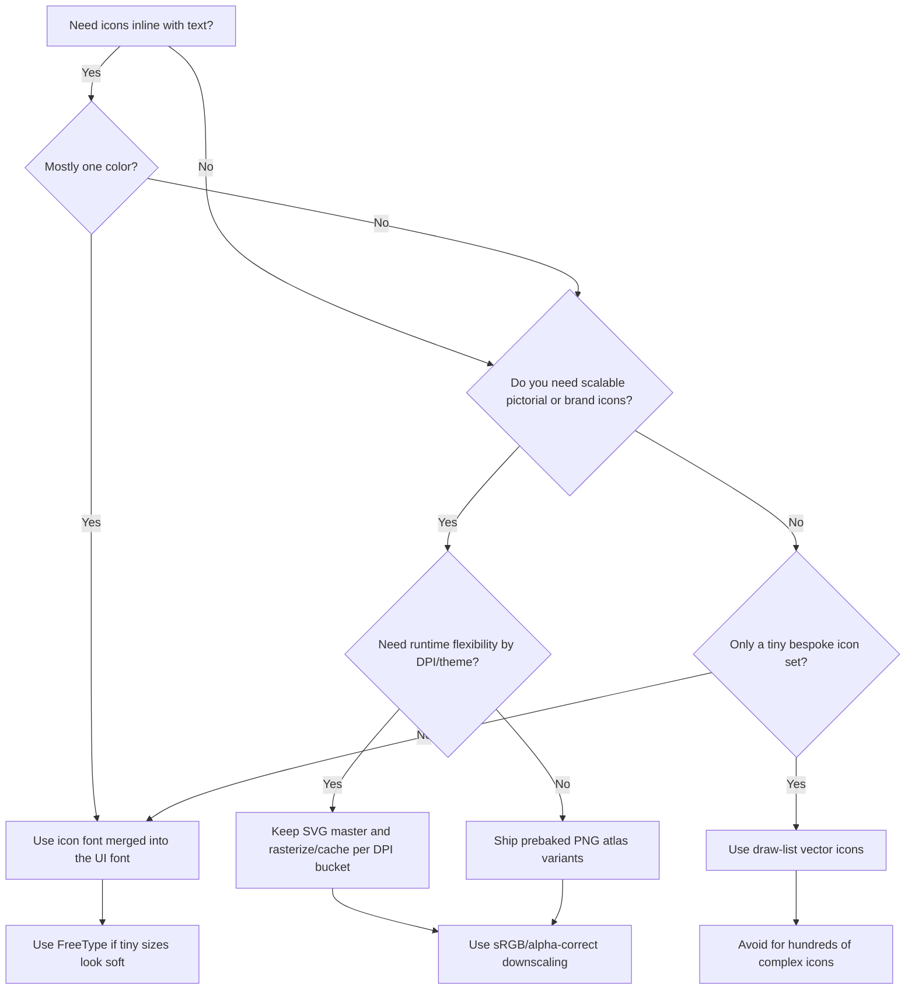
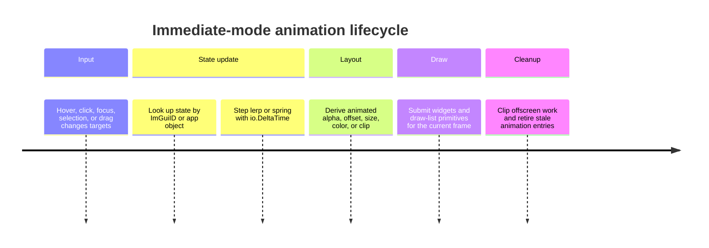

# Dear ImGui Desktop UI Reference

## Executive summary

For most desktop-tool interfaces built with Dear ImGui today, the strongest default stack is a hybrid one: use a merged monochrome icon font for inline actions, keep SVG masters for colorful or brand-specific icons and rasterize/cache them per DPI bucket, animate by storing a few floats per widget and updating them from `io.DeltaTime`, and keep the native platform frame unless the top bar is part of the product identity. Dear ImGui’s current 1.92-era font system removes much of the old glyph-range friction, but the official font docs still make it clear that atlas size, oversampling, and too many baked glyphs can become a texture-memory and upload problem if you are careless. citeturn15view0turn10view0turn10view1turn10view2

Animation is entirely possible in immediate mode, but there is no retained widget tree that animates itself. Dear ImGui expects the application to own state; the library gives you per-frame timing, storage hooks, and draw lists, but not a general-purpose scene graph or timeline system. In practice, this means lerps, springs, and easing functions attached to IDs or app-model objects. citeturn12view3turn13view0turn32view0turn18view0

For custom window bars, the safest-looking solution is usually a custom ImGui toolbar immediately under the native frame. Full frameless windows can look excellent, but then drag regions, resizing, maximize/restore, system menus, active/inactive visuals, text scaling, and accessibility become your job or at least a platform-specific integration problem. GLFW and SDL both expose the basic building blocks, but their docs and issue trackers also show that behavior differs across backends and platforms. citeturn20view2turn21view0turn19view0turn23view0turn24view0turn24view1

## Visual benchmarks

The public references most worth studying are Tracy for dense but disciplined information design, ImThemes for theme polish and live style editing, Dear ImGui Bundle Explorer for documentation-grade layout and ecosystem breadth, and the official gallery threads for the range of real-world editor, profiler, and custom-title-bar experiments. Those sources are not all “beautiful” in the same way, but together they are the clearest evidence of what polished Dear ImGui tooling can look like in practice. citeturn33view3turn9view14turn27view0turn26view1

image_group{"layout":"carousel","aspect_ratio":"16:9","query":["Tracy Profiler screenshot", "ImThemes Dear ImGui screenshot", "Dear ImGui Bundle Explorer screenshot", "Dear ImGui gallery editor screenshot"], "num_per_query": 1}

What these stronger examples tend to share is not ornament but structure: controlled density, consistent spacing, shallow top bars, a small number of accent colors, and iconography that feels like part of the typography rather than a separate asset layer. That pattern is visible in the official examples list, the gallery threads, ImThemes’ live preview workflow, and the Bundle Explorer demos. citeturn33view3turn9view14turn27view0turn26view1

## Icons for desktop ImGui apps

For inline UI iconography, the practical split is simple: icon fonts are best for monochrome toolbar/menu/title-bar actions; SVG-to-raster is best for colorful or brand/file-type icons; pre-baked PNG atlases are best when the artwork is already raster or effect-heavy; draw-list vectors are best for a very small bespoke set of simple symbols. Dear ImGui’s own font docs explicitly document icon-font merging into the main font, while the low-level draw-list API exists precisely so you can generate geometry directly when that is the better trade. citeturn10view0turn18view0turn33view3

The decision flow below reflects current Dear ImGui font handling, the official icon-font merge path, the newer custom font-loader direction for colorful glyphs, and the practical boundaries of SVG, PNG, and draw-list approaches. citeturn15view0turn10view0turn16view1turn9view3turn18view0



The table below synthesizes the documented behavior of Dear ImGui’s font atlas and draw-list APIs with the packaging trade-offs of icon fonts, SVG assets, and raster atlases. citeturn15view0turn18view0turn35view0turn35view1

| Icon method | Quality | Scalability | Color support | Memory cost | Implementation complexity | Best use cases |
|---|---|---:|---:|---:|---:|---|
| Icon font merged into main font | Very good for monochrome UI; often better with FreeType at tiny sizes | High inside the font system | Mostly single-color; multi-color only via color-font/custom-loader paths | Low | Low | Menus, toolbars, title bars, inline labels |
| SVG master rasterized to atlas | Excellent if rasterized at exact target sizes | High at source level | Full color | Low to medium | Medium | Brand marks, file-type icons, scalable pictograms |
| Prebaked PNG atlas | Excellent at native size, weaker under arbitrary scaling | Medium | Full color | Medium | Low to medium | Stable colorful icon sets, fast startup, predictable assets |
| Draw-list vector icons | Excellent for simple geometry; depends on stroke/tessellation tuning | High | Full procedural color | Very low texture cost, but per-frame vertex cost | Medium to high | Overlay glyphs, status marks, node handles, tiny custom symbols |
| Color font / custom atlas glyphs | Good when supported; support varies by font/render path | Medium | Multi-color | Low to medium | High | Emoji, badge-like inline glyphs, niche icon sets |

The best desktop sizes are different for different icon classes. For small interface icons, Windows guidance still centers on 16, 24, and 32 px toolbar sizes, and the title-bar/context-menu/system-tray path scales through 16, 20, 24, 32, 40, 48, and 64 px depending on DPI. For shell/application icons, Windows recommends at least 16, 24, 32, 48, and 256 px so the platform can scale down instead of up. A strong ImGui default is therefore to author logical interface targets at 16, 20, 24, and 32 px, and reserve 48, 64, 128, or 256 px masters for raster export or app-icon packaging. citeturn9view8turn9view7turn19view0

If you like an icon-font workflow, Dear ImGui explicitly supports merging icon fonts into the main UI font via `MergeMode`, and it calls out `GlyphMinAdvanceX` as a good way to make icons feel monospaced for alignment. Font Awesome’s own documentation still describes icon webfonts as the easiest and most established route, while Material Symbols illustrates both the upside and the risk of giant icon fonts: one file can carry thousands of glyphs and variable axes, but subsetting and axis instancing matter dramatically for asset size. In an ImGui desktop app, that translates into a straightforward rule: use icon fonts for one-color inline iconography that should inherit text color, baseline, and font rhythm. citeturn10view0turn10view4turn35view0turn37view3turn37view0

If you want the best-looking colorful icon pipeline, keep vector masters and rasterize exact sizes per DPI bucket. NanoSVG explicitly says its rasterizer is intended for baking icons of different sizes into a texture, but also warns that it only renders flat filled shapes and is not particularly fast or accurate. That makes it very appealing for simple app/tool icons and much less attractive for intricate illustration. SVG source sets such as Lucide are ideal as masters because they are lightweight, scalable SVG assets with tunable size and stroke semantics. citeturn9view3turn34view0

If your assets are already raster or need painterly detail, pre-baked PNG atlases are still perfectly valid. `stb_image` supports PNG across 1/2/4/8/16 bits per channel and can decode from memory or callbacks, which keeps startup and packaging simple. The main quality mistake is not “using PNG” but relying on one arbitrary raster size and scaling it everywhere; small interface icons generally look best when exported or rasterized to the exact target size for each DPI bucket, then packed and cached rather than resized every frame. citeturn30view0turn30view2turn9view7turn25view0

When you must resample raster art, treat filtering as a design choice, not an afterthought. Nearest-neighbor is for intentional pixel-art aesthetics; bilinear is fast but soft; cubic families are the usual general-purpose compromise; Catmull-Rom and Lanczos2 are sharper; Mitchell-Netravali is explicitly valued as a balanced compromise among resize artifacts; and windowed-sinc filters such as Lanczos can introduce ringing on high-contrast edges. The older `stb_image_resize` easy API already downsamples with Mitchell and upsamples with cubic interpolation, while `stb_image_resize2` adds stronger handling for sRGB formats, alpha weighting, premultiplied inputs, and multithreaded execution. In practice, that makes an sRGB/alpha-correct cubic pipeline the safest default for app icons, with sharper filters reserved for icons that can tolerate edge emphasis. citeturn29view1turn29view2turn29view4turn29view5turn38view0

Two Dear ImGui details matter more than many icon guides mention. First, current Dear ImGui recommends `style.FontScaleDpi` and `style.ScaleAllSizes()` for DPI handling, while the I/O and draw-data structures explicitly track framebuffer scale for Retina/high-DPI output. Second, the font atlas remains a single packed texture from the application’s point of view even though 1.92 now builds it incrementally and can resize dynamically. The right mental model is therefore “cache atlases per theme × DPI bucket,” not “resize arbitrary icon textures on the fly.” A 1024×1024 RGBA atlas is about 4 MiB; a 2048×2048 atlas is about 16 MiB; multiply that by dark/light variants, DPI buckets, and optional colorful-glyph pages, and VRAM climbs quickly. citeturn15view0turn14view1turn18view0

For small icon-font sizes, FreeType is often worth the hassle. Dear ImGui’s font docs say the default `stb_truetype` path is not ideal for small sizes, while `imgui_freetype` can improve readability through auto-hinting; the FreeType integration README says small, thin anti-aliased fonts typically benefit a lot from that hinting. Current Dear ImGui docs also support colored glyphs and emojis through FreeType’s `LoadColor` path, but they warn that not all color-font formats and stateful emoji features are supported. That makes FreeType the right upgrade for delicate 13–18 px icon-font UIs or for selective color-font usage, not a blanket requirement for every project. citeturn31view0turn10view7turn31view2turn11view0

## Animation in ImGui

Dear ImGui can animate almost anything you can draw, but it does not keep a retained widget tree for you. The FAQ is explicit that the application remains the single source of truth and that the UI library typically stores minimal amounts of data and does not remember the full widget tree the way retained-mode systems do. The practical consequence is simple: animation state lives in your app model, a per-widget ID map, or `ImGuiStorage`, and every frame you recompute the animated values from `io.DeltaTime` or `GetTime()`. citeturn12view3turn12view5turn13view0turn32view0

The lifecycle below is the one that tends to scale best in immediate mode. It matches Dear ImGui’s timing model, per-frame emission model, and ID-based state ownership. citeturn13view0turn12view3turn32view2



The useful animation palette is broad enough for polished tools: hover fades and press flashes on buttons, selection pills and tab underlines, panel open/close transitions via height or clip interpolation, node-link previews and drag ghosts on custom canvases, toast notifications in overlay space, and zoom/pan smoothing for node editors or large 2D canvases. Dear ImGui’s foreground/background draw lists make these overlay and canvas patterns natural, and the surrounding ecosystem now even includes helper libraries such as ImAnim inside Dear ImGui Bundle for tweening-style animation. citeturn18view0turn13view0turn9view13turn27view0

State management is the real architectural choice. For long-lived animations such as panel expansion, camera smoothing, or toast queues, store the state in your own app structs. For transient widget-local values, an `ImGuiID -> state` map works well. For quick hacks or per-window values, `ImGuiStorage` and its `GetBoolRef` / `GetFloatRef` helpers are often enough, and the API comments explicitly frame them as useful for quick add-on state. The main thing that is not optional is ownership: if the state matters next frame, your code must remember it. citeturn32view0turn32view2turn32view3

A typical time-based easing pattern is tiny. The key idea is to move a stored value toward a target at a speed expressed in seconds, not frames, so behavior survives variable frame rates.

```cpp
struct AnimValue {
    float v = 0.0f;
};

static std::unordered_map<ImGuiID, AnimValue> g_anim;

void StepHoverAnim(ImGuiID id, bool hovered, float dt)
{
    AnimValue& a = g_anim[id];
    float target = hovered ? 1.0f : 0.0f;

    // Exponential smoothing; dt-stable.
    float k = 1.0f - std::exp(-12.0f * dt);
    a.v += (target - a.v) * k;
}
```

For more elastic motion, a damped spring is usually better than a plain lerp because it keeps fast motion feeling responsive without hard snaps.

```cpp
struct Spring1D {
    float x = 0.0f;   // current value
    float v = 0.0f;   // velocity
};

void StepSpring(Spring1D& s, float target, float omega, float zeta, float dt)
{
    float accel = -2.0f * zeta * omega * s.v - omega * omega * (s.x - target);
    s.v += accel * dt;
    s.x += s.v * dt;
}
```

Those code patterns fit Dear ImGui because `GetTime()` advances by `io.DeltaTime` every frame, and the library exposes draw lists, state storage, and item rectangles but leaves behavioral ownership to the application. That is also why these patterns work equally well for hover fades, tab indicators, panel slides, toast motion, or zoom smoothing. citeturn13view0turn18view0turn32view0

The main limitations are structural, not aesthetic. There is no retained scene graph to attach timelines to, so every interesting animation needs explicit state. CPU cost is usually not the interpolation math but the amount of UI you still submit and draw while animating. Dear ImGui’s own API comments recommend coarse clipping with `IsRectVisible()` and `ImGuiListClipper` when large lists are involved, and they explicitly say the clipper can scale to tens of thousands of evenly spaced items. On the rendering side, Dear ImGui still batches into a small list of draw calls rather than issuing one draw per widget, so the usual cost centers are extra geometry, alpha blending, blur-like layers, heavy shadows, and unnecessary offscreen work. citeturn33view0turn33view1turn33view3

## Custom window and top bars

The nicest custom top bars in the Dear ImGui ecosystem usually look more like restrained editor chrome than like themed game launchers. The official gallery threads, the custom-title-bar experiments in issue #6951 and #7185, and examples such as Tracy all point in the same direction: a shallow horizontal structure, strong alignment, a clear left/center/right information hierarchy, and very little decorative noise. Windows title-bar guidance reinforces the same basics: the bar exists to identify the app, move the window, and expose minimize/maximize/close controls, with generous draggable space and clear active/inactive states. citeturn26view1turn26view3turn26view5turn33view3turn19view0

image_group{"layout":"carousel","aspect_ratio":"16:9","query":["I made a Custom Windows Titlebar in ImGui screenshot", "Dear ImGui custom title bar game engine screenshot", "Dear ImGui docking toolbar screenshot", "Tracy Profiler top bar screenshot"], "num_per_query": 1}

**Approach one: native frame, custom ImGui toolbar underneath.** This is the best default for most desktop apps. You keep platform decorations, snap/tiling heuristics, resize behavior, system menus, and accessibility affordances, then place a custom ImGui main menu bar or toolbar directly below. This maps well to the “simple customization” idea in native title-bar guidance and avoids the biggest frameless-window pitfalls. It is also the easiest style to keep consistent across GLFW, SDL, Win32, Cocoa, and X11/Wayland backends. citeturn20view2turn19view0turn21view0

**Approach two: full frameless window with a custom bar drawn inside ImGui.** This is the high-commitment route. GLFW documents that an undecorated window has no standard frame and is not user-resizable through the usual window decoration path; SDL exposes hit testing so regions can be marked draggable or resizable; and Windows custom-title-bar APIs show a middle ground where custom content can coexist with system caption buttons and drag regions. In a pure borderless GLFW/SDL app, however, you should assume you own substantially more behavior yourself. citeturn21view0turn23view0turn23view1turn20view0turn20view3

At minimum, a serious frameless implementation needs draggable empty space, resize borders and corners, double-click maximize/restore, right-click system-menu behavior, active/inactive visual states, caption-button hover/pressed states, DPI-aware spacing, and text scaling. Windows title-bar guidance explicitly calls out draggable non-interactive space, right-click system menu, double-click maximize/restore, active/inactive appearance, high-contrast adaptation, and text scaling that may force the bar to grow taller. Dear ImGui’s own README also notes that higher-level accessibility features are not built in, which matters more when you replace standard non-client chrome. citeturn19view0turn19view1turn20view6turn18view1

There is also a major implementation-quality difference between **delegating** movement/resizing to the OS and **simulating** it yourself. SDL hit testing is the OS-delegation path. Manual `SetWindowPos`-style dragging, such as the code shown in the custom-title-bar issue, can work, but it is the more brittle route because you start owning more edge cases. The SDL issue tracker also shows that even with hit testing, borderless-window behaviors such as resizing and system-menu parity can still have platform quirks, so frameless should be treated as a product decision, not a free cosmetic upgrade. citeturn26view6turn24view0turn24view1

Visually, the best custom bars usually keep a simple three-zone layout. Put identity on the left: logo, app menu, maybe workspace switcher. Put the primary context in the middle-left or center: project title, active document, tabs, search only if the app is search-centric. Put state and system actions on the right: sync/build status, unsaved indicator, connection state, then window controls at the far edge. Native guidance remains useful here: 32 px is still the standard title-bar height, 48 px is justified when you introduce controls such as a search box or person/avatar control, window icons are typically 16 px, and caption controls deserve clear rest/hover/pressed/inactive states. citeturn19view0turn19view1turn20view6

For UX quality, the bar should always keep some guaranteed draggable area even after menus, tabs, and status chips are added. Interactive content in title-bar space has to be explicitly separated from drag regions; native custom-title-bar guidance is very clear on that. In Dear ImGui terms, it means you should think in terms of hit-test ownership: what is draggable, what is clickable, what passes through, and how that changes under docking, focus, and fullscreen/overlay modes. citeturn20view6turn20view3

## Recommendations and trade-offs

**Best overall default.** Use a merged icon font for small monochrome actions, SVG masters rasterized per DPI for anything colorful or branded, `imgui_freetype` only if small-size readability is visibly weak, subtle per-ID animations driven by `io.DeltaTime`, and a native-framed window with a custom toolbar inside the client area. That combination aligns best with Dear ImGui’s documented font system, storage model, and rendering model while minimizing platform-window complexity. citeturn15view0turn10view0turn31view0turn12view3turn20view2

**When icon fonts are the best choice.** Choose them when icons act like punctuation inside text-driven UI: menu items, tab labels, tool buttons, status labels, title-bar actions. Their advantages are alignment, tiny memory cost, and immediate inheritance of text color and scale. Their weaknesses are limited color richness and the fact that huge symbol sets should still be subsetted and tuned rather than dumped wholesale into the app. citeturn10view0turn35view0turn37view0

**When SVG-raster is the best choice.** Choose it for file-type icons, product branding, multi-color pictograms, and any symbol where exact silhouette matters across DPI levels. It gives the best source-of-truth story and the cleanest per-DPI exports, but it does mean you need an asset-build or load-time rasterization path and a caching policy. NanoSVG is fine for simple shapes; more complex SVG art may deserve a stronger rasterizer. citeturn9view3turn34view0

**When draw-list vectors are the best choice.** Use them for a tiny bespoke set of simple symbols: handles, arrows, badges, connector previews, node-link hints, selection indicators, and overlays. They are excellent when you want zero texture memory and full procedural control, but they are the wrong choice for a large library of brand or pictorial icons because then every symbol becomes custom geometry and tuning work. citeturn18view0turn33view3

**When frameless is actually worth it.** Do it when the application’s top bar is central to the brand or workflow: editor-grade tabs integrated into chrome, always-visible project status, or a surface where the default OS title bar truly wastes valuable space. Do not do it just to swap out three caption icons. The behavior, testing, and accessibility surface area is much larger than the visual change suggests. citeturn19view0turn20view6turn21view0turn24view0turn18view1

## Implementation checklist

1. **Split your icon inventory into classes first:** inline monochrome UI icons, colorful pictorial icons, and tiny bespoke overlays. That decision determines whether you should use a merged icon font, SVG-raster atlases, or draw-list vectors. citeturn10view0turn9view3turn18view0  
2. **Author interface targets at 16, 20, 24, and 32 px logical size.** Keep larger masters for export or packaging, and treat shell/app icons separately from inline toolbar icons. citeturn9view7turn9view8turn19view0  
3. **Keep vector masters when possible.** If you only have raster masters, keep them large enough to scale down cleanly and export exact-size variants per DPI bucket instead of resizing one asset everywhere. citeturn9view3turn30view0turn25view0  
4. **Use an sRGB/alpha-correct resize path.** Prefer `stb_image_resize2` over the older header when small-icon edge quality matters; the older easy API is still acceptable for straightforward cubic/Mitchell pipelines. citeturn29view1turn29view4turn29view5turn38view0  
5. **If you use icon fonts, merge them into the main UI font and consider `GlyphMinAdvanceX`.** If tiny sizes still look soft, switch the font rasterizer to FreeType. citeturn10view0turn10view4turn31view0turn10view7  
6. **Store animation state explicitly by app object or `ImGuiID`.** Update it once per frame from `io.DeltaTime`; do not wait for Dear ImGui to remember it for you. citeturn12view3turn13view0turn32view2turn32view3  
7. **Cull aggressively.** Use `IsRectVisible()` and `ImGuiListClipper` for large lists and offscreen animated content, because submission cost often dominates the math. citeturn33view0turn33view1  
8. **Default to the native frame plus an internal toolbar.** Only go frameless if you are willing to reimplement or carefully delegate drag, resize, maximize/restore, system-menu behavior, active/inactive visuals, DPI scaling, and accessibility considerations. citeturn20view2turn19view0turn21view0turn23view0turn18view1  
9. **Test on real scaling conditions:** 100%, 125%, 150%, and 200% UI scale; multi-monitor moves; light/dark themes; active/inactive window states; keyboard navigation; and if frameless, all title-bar hit regions. citeturn25view0turn14view1turn19view0turn20view6  

Useful references to keep open while implementing are Dear ImGui’s `FONTS.md` and FAQ, NanoSVG, `stb_image`, `stb_image_resize` and `stb_image_resize2`, FreeType plus `imgui_freetype`, Font Awesome, Material Symbols, Lucide, ImThemes, Dear ImGui Bundle Explorer and ImAnim, Tracy, and the official gallery threads. citeturn15view0turn12view3turn9view3turn30view0turn29view1turn29view5turn11view0turn35view0turn37view3turn34view0turn9view14turn27view0turn36view2turn26view1