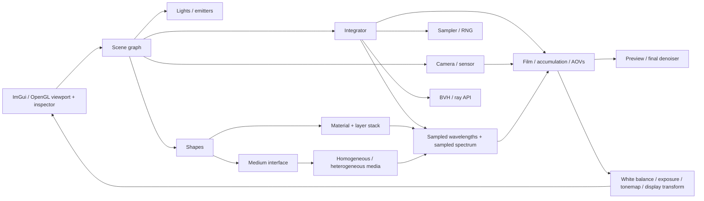
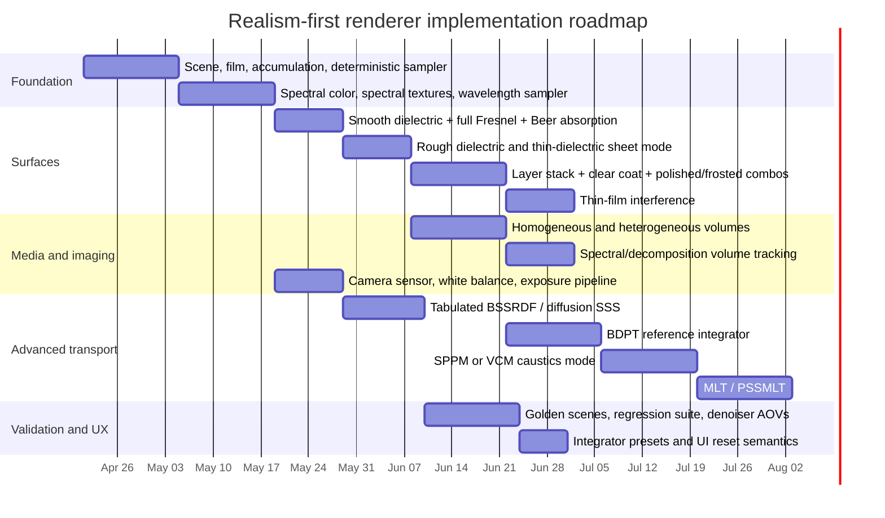

# Technical Companion Plan for RENDER_TECHNICAL_GUIDE.md

## Executive summary

Your companion file should sit next to the existing renderer specification fileciteturn0file0 and turn its realism-first promises into fixed technical contracts: spectral transport is always part of ray state, glass is a true dielectric with rough transmission and absorption, volumes are part of the same transport system as surfaces, materials can be layered physically, and progressive accumulation is deterministic and reset by explicit rules. That approach matches how entity["organization","pbrt","book and renderer"] structures spectral color, film, materials, volumes, and GPU execution, how entity["organization","Mitsuba 3","renderer docs"] separates variants/plugins around color representation and transport, and how entity["people","Eric Veach","rendering researcher"] frames robust light transport in terms of MIS, path-space sampling, and bidirectional techniques. citeturn14view0turn17view0turn17view1turn15view0turn12view0

The most important architectural point is order of implementation. Spectral representation and film/sensor handling come first, because they change how materials, volumes, and output all work. Correct dielectric transport comes next, because it defines the path PDFs and throughput updates that later BDPT, MLT, and photon-based methods rely on. Volumes and layered materials should be added before advanced caustic integrators, because modern volumetric MIS and null-scattering methods also depend on correct path densities. Only after those foundations are stable should you add BDPT, MLT, SPPM, or VCM-class caustic solvers. citeturn14view0turn33view3turn14view2turn14view5turn28view2turn18view0turn18view1turn18view2turn31view1

## Guide structure

Use the companion file as a strict implementation guide, not a tutorial. For each section below, lock down: the equations to implement, the exact algorithm family to use, the data carried per path, the precision and performance compromises you allow, and the scenes that must pass before moving on. For advanced bidirectional and Metropolis sections, favor entity["organization","pbrt","third edition online book"] and the original papers because current entity["organization","Mitsuba 3","renderer docs"] documentation explicitly notes that BDPT, progressive photon mapping, and path-space MCMC are not included there. citeturn1search17turn4search13

| Priority | Section | Why it belongs here | Minimum acceptable implementation | Stretch goal |
|---|---|---|---|---|
| 1 | Spectral rendering and chromatic dispersion | Changes the representation of radiance, textures, IOR, media, sensors, and output | Spectral path state, spectral textures, spectral film/output | Hero-wavelength or equivalent production spectral transport |
| 2 | Glass BSDF/BTDF and absorption | Core realism feature; foundational for later caustics | Smooth + rough dielectric, full Fresnel, Beer absorption | Spectral IOR model with always-on dispersion |
| 3 | Sampling, MIS, accumulation, RNG, denoising | Needed for stable preview, reproducibility, and low-noise development | NEE + MIS + deterministic seeds + accumulation reset rules | Blue-noise screen-space sampling and denoiser-aware AOVs |
| 4 | Volumetric transport and fog volumes | Required for fog-cloud objects and visible beams | Homogeneous + heterogeneous media, HG, delta tracking | Spectral/decomposition tracking and volumetric MIS |
| 5 | Material layering and combination rules | Required for frosted-plus-polished, clear coat, thin film | Ordered layer stack with clear coat | Thin-film interference with spectral phase handling |
| 6 | Camera, film, and exposure pipeline | Prevents “looks wrong even when transport is right” failures | Thin lens, white balance, exposure, scene-linear film | Sensor-profiled camera mode |
| 7 | Subsurface scattering | Important realism class, but can follow the spectral/film core | Tabulated separable BSSRDF | Quantized diffusion and directional dipole |
| 8 | Caustics and advanced integrators | High payoff, high complexity; depends on correct PDFs everywhere | Reference-mode BDPT or SPPM | MLT and VCM |
| 9 | Practical engineering notes | Keeps system extensible across CPU/GPU and UI modes | CPU baseline + clean abstractions | Wavefront GPU path tracer |
| 10 | Test suite and validation scenes | Prevents silent regressions | Golden scenes + reference renders | Statistical validation and convergence dashboards |

The component relationships below are the right level of granularity for the technical guide: spectral state is not a utility class sitting off to the side; it is shared by surface, medium, and film code, while the UI only chooses modes and resets accumulation when renderer state becomes incompatible. citeturn0file0turn11search11turn15view0turn24search3turn15view6



## Core transport and materials

### Spectral rendering and chromatic dispersion

**Purpose.** The guide should treat wavelength as a first-class transport variable so that dispersion, colored absorption, chromatic volumetrics, and camera response arise from the same transport model instead of being faked after the fact. PBRT’s sampled-wavelength pipeline, Mitsuba’s spectral variants, and Hero Wavelength Spectral Sampling all make the same architectural point: spectral rendering is a transport decision, not a post-process. citeturn17view0turn17view1turn15view0turn28view0

**Required equations and algorithms.** Include the tristimulus integral \(v_i=\int S(\lambda)m_i(\lambda)\,d\lambda\), the sensor response integral for converting sampled spectra to sensor RGB/XYZ, a visible-wavelength or sensor-weighted wavelength PDF, and one explicit path-sampling strategy from this set: single-wavelength spectral MIS, hero wavelengths, or a fixed-size sampled-wavelength packet. Also include RGB-to-spectrum upsampling for legacy textures and color inputs, preferably using the Jakob–Hanika low-dimensional model or an equivalent compact spectral uplift. citeturn14view0turn33view3turn28view0turn26view2turn15view7turn17view5

**Implementation notes.** For a realism-first but still practical C++ renderer, the best baseline is either a PBRT-style small packet of sampled wavelengths or a hero-wavelength implementation. The PBRT-style packet is easier to ship early and integrates naturally with a film-driven wavelength sampler; hero wavelengths are more faithful to “always-on” dispersion because they are designed around changing wavelengths along the path. PBRT itself explicitly notes a limitation of its current dielectric implementation: when dispersion causes refracted paths to split, it terminates secondary wavelengths, and reflected-only paths do not get full dispersion treatment. If your requirement is literal always-on chromatic dispersion, your guide should explicitly forbid that shortcut in final-reference mode. citeturn17view0turn17view1turn19view1turn28view0

**Performance and accuracy tradeoffs.** Cramming the renderer back into RGB later will be more expensive than starting spectrally now. Mitsuba’s spectral modes and texture upsampling show how to keep memory manageable by storing compact coefficients instead of tabulating dense spectra, while Jakob–Hanika show that spectral textures can remain as compact as RGB textures and still evaluate efficiently at arbitrary wavelengths. citeturn15view8turn26view2

**Primary sources.** Use PBRT 4e for color, wavelength sampling, film/sensor integration, and output conversion; Mitsuba for spectral variants and spectral texture handling; Wilkie et al. for hero wavelengths; Jakob–Hanika for RGB-to-spectrum uplift. Figure 5.21 in PBRT is especially useful because it shows a practical wavelength-sampling PDF rather than a purely theoretical one. citeturn14view0turn33view3turn15view0turn28view0turn26view2

**Suggested test scenes.** A BK7 prism on a white plane under a narrow sun/area light for angular dispersion; a thick glass sphere and a thin sheet window for path splitting differences; an RGB-textured object under a daylight source to compare spectral uplift behavior; and a colored fog volume to verify that spectral extinction changes the image beyond simple RGB tinting. citeturn16view1turn28view0turn28view2

The spectral sampling choices below are the most useful comparison to keep in the guide. The first two are good for teaching and debugging, while the latter three are the realistic candidates for your renderer. citeturn28view0turn17view0turn26view2turn15view8

| Option | Core idea | Accuracy for dispersion and chromatic media | Runtime cost | Recommendation |
|---|---|---|---|---|
| Single wavelength with spectral MIS | One \(\lambda\) per path, rely on many samples | Lowest practical robustness | Lowest | Debug only |
| Fixed spectral bins | Trace a fixed set of bands every bounce | Good, but representation bias remains if too coarse | Medium to high | Reference/debug mode |
| PBRT-style sampled packet | Small set of wavelengths sampled by film/sensor PDF | Very good practical compromise | Medium | Strong baseline |
| Hero wavelengths | One hero wavelength drives path decisions, others cover visible range | Excellent production tradeoff | Medium | Best long-term target |
| Dense many-\(\lambda\) paths | Carry many wavelengths through every event | Highest | Highest | Offline validation only |

### Glass BSDF and absorption

**Purpose.** This section should lock down a physically correct dielectric implementation for clear glass, rough glass, frosted glass, thick absorbing glass, and thin window-like sheets. Everything that follows—dispersion, caustics, volumetric boundaries, and layered glass—depends on getting this right. citeturn14view2turn14view3turn12view1turn16view1

**Required equations and algorithms.** Include Snell’s law \( \eta_i \sin\theta_i = \eta_t \sin\theta_t \), the full dielectric Fresnel equations \(R_s, R_p\) with unpolarized \(F=\tfrac{1}{2}(R_s+R_p)\), total internal reflection when refraction is impossible, a rough dielectric microfacet BSDF/BTDF using Walter et al.’s generalized transmission half-vector \(h_t\), and Beer–Lambert absorption \(T(\lambda,d)=\exp[-\sigma_a(\lambda)\,d]\). For rough glass, explicitly name the NDF \(D\), masking-shadowing \(G\), and Fresnel \(F\) terms and point to Walter et al. as the transmission reference. citeturn14view3turn12view1turn32view1turn25view1

**Implementation notes.** Use true medium interfaces, not just a “glass material flag.” PBRT’s media system and Mitsuba’s interior/exterior medium model both assume that surfaces carry the boundary information needed for correct transport across air, fog, water, and glass. Also distinguish thin dielectric sheets from closed solids: Mitsuba’s thin dielectric model is the correct approximation for single-sheet windows, while closed geometry needs a regular dielectric interface and interior distance for absorption. citeturn24search3turn15view3turn16view1

**Rough glass detail.** Make roughness drive a rough dielectric transmission model, not a blurred post-effect. Walter et al. showed that rough transmission has measurable off-specular behavior and that GGX can fit measured etched/ground glass better than Beckmann on some samples. Defaulting to a GGX/Trowbridge–Reitz family is a good realism-first call, with anisotropic roughness as a later extension. citeturn12view1turn32view2turn14view4

**Dispersion detail.** If the document says chromatic dispersion is “always on,” then IOR must be treated as \(\eta(\lambda)\), not a scalar. In practice that means a tabulated spectral IOR or a parametric dispersion model such as Cauchy or Sellmeier for common dielectrics, combined with spectral absorption and the chosen wavelength transport scheme. PBRT’s own dielectric material notes are useful here specifically because they document what happens when \(\eta\) is wavelength-varying and why shortcutting secondary wavelengths is only a compromise. citeturn19view1turn17view0turn28view0

**Primary sources.** Use PBRT 4e for dielectric Fresnel and general dielectric implementation structure, Walter et al. for rough transmission and generalized half-vectors, and Mitsuba’s dielectric/thin-dielectric documentation for the crucial “single sheet versus closed shell” distinction. Figure 9.14 in PBRT and Figure 1 in Walter et al. are good visual targets for clear versus rough dielectric rendering. citeturn14view2turn14view3turn12view1turn16view1

**Suggested test scenes.** A thin window pane modeled as a single quad next to a closed glass box; a thick colored glass slab over a checkerboard to validate absorption depth; a frosted sphere with anisotropic highlights to validate rough transmission; and a BK7 prism producing a visible spectrum on white paper. citeturn16view1turn25view1turn12view1

### Caustics and advanced integrators

**Purpose.** This section should document what to do when unidirectional path tracing stops being enough. Small windows, refractive caustics, jewel-like objects, or light paths that only exist through narrow specular chains are exactly the cases that motivated BDPT, MLT, and photon-based methods in the literature. citeturn18view0turn18view1turn18view3turn1search2

**Required equations and algorithms.** Include Veach’s path-space framing, MIS over multiple path construction strategies, BDPT subpath connection, Metropolis acceptance/rejection over path or primary sample space, photon density estimation for photon mapping/SPPM, and vertex connection plus vertex merging for VCM if you want a true hybrid. For practical MLT, include Kelemen-style primary-sample-space mutations with both local and large-step mutations, since that is a much more approachable implementation path than a pure path-space MLT from scratch. citeturn12view0turn18view0turn18view1turn18view3turn31view2turn31view1

**Implementation notes.** The guide should explicitly separate interactive and reference integrators. A good layout is: PT+NEE+MIS as the default interactive integrator; volumetric PT with spectral MIS for fog/smoke; BDPT as the first reference integrator for hard indirect transport; and either SPPM or VCM as the first caustics-specialized mode. MLT should come last, because it reuses all earlier path-generation machinery but adds state mutation, bootstrapping, acceptance logic, and correlation concerns. Since Mitsuba 3 does not ship BDPT, PPM, or MLT, PBRT 3e plus the original papers are the better implementation references here. citeturn1search17turn18view0turn18view1turn18view2turn31view1turn31view2

**Practical hybrid guidance.** If you need one “caustics mode” rather than many expert modes, VCM is the most intellectually complete answer because it combines BDPT-style vertex connection with photon-style vertex merging under MIS. If you need something simpler to implement first, SPPM is a better stepping stone and still gives you an efficient route to glass caustics. citeturn31view1turn18view2

**Primary sources.** Use Veach’s thesis for path-space, MIS, and bidirectional foundations; PBRT 3e for BDPT, MMLT, and SPPM implementation organization; Jensen for photon mapping; Kelemen et al. for primary-sample-space MLT; and Georgiev et al. for VCM/VCM implementation. citeturn12view0turn18view0turn18view1turn18view2turn1search2turn31view2turn31view1

**Suggested test scenes.** A narrow-window interior lit mostly through indirect transport; a gemstone or glass sphere on a diffuse plane under a tight spotlight; a pool-water or lens caustic on a textured floor; and an indoor scene where most energy enters through specular windows. Those are exactly the classes of scenes used in PBRT’s BDPT/MLT comparisons. citeturn18view0turn18view1

The comparison below is the right compact table to include in the companion file. It synthesizes PBRT’s PT/BDPT/MMLT/SPPM chapters, Jensen’s photon mapping, Mitsuba’s path/volumetric path docs, and Georgiev’s VCM notes. citeturn14view9turn15view1turn18view0turn18view1turn18view2turn1search2turn31view1

| Integrator | Unbiased | Strengths | Weaknesses | Best role |
|---|---|---|---|---|
| PT + NEE + MIS | Yes | Simple, robust baseline, good previews | Weak on rare caustic paths | Default interactive mode |
| Volumetric PT with spectral MIS | Yes | Good for fog/smoke/chromatic extinction | Still weak on concentrated SDS caustics | Default volume mode |
| BDPT | Yes | Much better on difficult indirect transport, small openings, complex visibility | More bookkeeping and PDF logic | First reference-quality upgrade |
| MLT / MMLT / PSSMLT | Yes | Excellent on rare but important paths | Correlated samples, harder debugging/tuning | Hard-scene reference mode |
| Photon mapping / SPPM | Progressive, biased but consistent | Strong caustics, intuitive light-space storage | Density-estimation blur and radius schedules | Dedicated caustics mode |
| VCM | Yes in the full framework | Combines BDPT and photon-style strengths | Highest implementation complexity | Long-term “best single caustics solver” |

### Volumetric transport and fog volumes

**Purpose.** This section should define both the transport math and the scene representation for fog, smoke, dust, and your moveable “fog cloud” objects. The guide should make volumes a peer of surfaces, not a post-process overlay, because visible beams depend on surface-to-medium and medium-to-surface coupling through the same transport equation. citeturn25view2turn15view3turn24search3

**Required equations and algorithms.** Include the integral form of the radiative transfer equation, transmittance \(T_r(t)=\exp\!\left(-\int_0^t \sigma_t(s)\,ds\right)\), homogeneous free-flight sampling \(t=-\ln(1-u)/\sigma_t\), Beer/Beer–Lambert for homogeneous attenuation, HG and isotropic phase functions, delta tracking, ratio tracking, and null scattering. For chromatic heterogeneous media, include either spectral MIS over distance sampling or a spectral/decomposition tracking method derived from the null-scattering framework. citeturn25view2turn25view1turn25view3turn16view0turn17view3turn21search0turn28view2

**Implementation notes.** Model a fog cloud as a transformable shape that carries a medium, exactly the way Mitsuba attaches media to shapes and volume grids. For heterogeneous clouds, store density/albedo/extinction in a grid volume and transform that volume with the shape’s object-to-world transform. For purely volumetric shells, the containing surface should have a null or thin dielectric-like boundary behavior so the shell itself does not introduce unwanted surface scattering. Keep ray state aware of the current medium, and enforce coherent interior/exterior medium definitions; PBRT explicitly notes that inconsistent medium assignments make transport results inconsistent. citeturn15view3turn15view4turn24search3turn15view1

**Performance notes.** For a first ship, homogeneous media plus delta tracking in heterogeneous media are enough. For your realism target, the guide should immediately reserve space for majorant grids, decomposition tracking, and spectral tracking, because those are the practical tools for dense, chromatic fog without explosive variance. Mitsuba’s `volpathmis` and the Disney spectral/decomposition tracking paper are the cleanest modern references here. citeturn17view3turn28view1turn28view2turn21search0

**Primary sources.** Use PBRT’s transmittance and volumetric chapters for the base RTE, tracking estimators, and medium interfaces; Mitsuba for transformable medium/volume plugins and phase functions; Miller et al. for null-scattering path PDFs; and Kutz et al. for spectral and decomposition tracking in chromatic heterogeneous volumes. Figure 11.18 in PBRT-style delta tracking pseudocode and Mitsuba’s `volpathmis` notes are especially implementation-friendly. citeturn25view2turn25view3turn15view3turn15view4turn17view3turn21search0turn28view2

**Suggested test scenes.** A spotlight through a homogeneous fog box; a laser-like beam through a localized fog-cloud object; a colored smoke plume with spectrally varying extinction; a foggy room with sun shafts through a window; and a glass object partially immersed in mist to test surface/medium transitions. citeturn15view3turn15view4turn17view3

### Material layering and combination rules

**Purpose.** This section should define how multiple material attributes coexist on a single object without collapsing back into ad hoc mixes. It is the section that turns “rough glass with a polished outer skin,” “clear coat over paint,” and “thin-film iridescence over a base” into ordered, physically meaningful layer stacks. citeturn14view7turn24search0turn15view5

**Required equations and algorithms.** Include a layered BSDF model based on stacked interfaces and a thin inter-layer medium, a thin-dielectric shortcut for infinitesimally thin coats or sheets, clear-coat reflection over a base BSDF, and thin-film interference using optical path difference and Airy summation. For thin film, the minimum formulas worth naming are the optical path difference \( \Delta \phi \propto \frac{4\pi \eta d \cos\theta_t}{\lambda} \) and Airy-style infinite summation of multiply reflected wave contributions. citeturn14view7turn24search0turn16view1turn27view0

**Implementation notes.** Do not let the material system become “a bag of booleans.” The guide should define an ordered layer stack such as: outer interface → optional thin-film → optional clear coat → base BSDF → optional interior scattering/absorption. PBRT’s `LayeredBxDF` is a strong model for real layered transport, while Mitsuba’s coated plastic and rough-plastic models are useful examples of how a thin dielectric coating changes the combined appearance of a base layer. The guide should also be explicit that once the inter-layer thickness becomes optically large, you no longer have a thin layer—you have a volume or a solid, and transport should switch models. citeturn14view7turn24search0turn15view5turn16view1

**Thin-film note.** Belcour and Barla’s work is the right reference for thin-film interference because it explicitly ties the view-dependent color to wave-optical phase and shows why naive RGB rendering aliases this effect. Even if your renderer is spectral, that paper is still the clearest source for what the layer should conceptually do and what parameters should be exposed, especially thickness. citeturn27view0

**Primary sources.** Use PBRT 4e layered scattering for the stack concept, Mitsuba’s coated BSDF plugins for practical examples of thin dielectric over a base, and Belcour–Barla for thin-film interference. The Mitsuba docs are especially helpful for the “what does a thin coat over a diffuse or rough base do visually?” question. citeturn14view7turn24search0turn15view5turn27view0

**Suggested test scenes.** A polished-frosted glass block with a sharp reflective skin and blurred transmission; a car-paint sphere with a colored base plus clear coat; an oil-on-water patch or soap-bubble shell for iridescence; and a varnished wood or polished stone material to validate coat-plus-base energy behavior. citeturn14view7turn15view5turn27view0

### Subsurface scattering

**Purpose.** This section should cover the realism class that BSDFs alone cannot: wax, marble, skin, milk, jade, leaves, and any material where light enters and exits at different points. The guide should clearly separate true subsurface transport from simple transmission blur. citeturn23view0turn22search19

**Required equations and algorithms.** Include the BSSRDF equation \(L_o=\int_A\int_{\Omega} S(\mathbf{p}_o,\omega_o,\mathbf{p}_i,\omega_i)L_i|\cos\theta_i|\,d\omega_i\,dA\), a separable BSSRDF approximation, and at least one diffusion-family model from Jensen’s dipole/beam-diffusion lineage. For higher realism, include quantized diffusion and the directional dipole as the next references after the classic Jensen model. citeturn23view0turn23view1turn1search3turn12view4turn22search2turn22search12

**Implementation notes.** The most practical first ship is a tabulated separable BSSRDF integrated into the path tracer exactly the way PBRT samples an incident point and then reuses BSDF infrastructure to sample the incident direction. Keep internal parameters physical—\(\sigma_s\), \(\sigma_a\), \(g\), \(\eta\), mean free path—even if the UI exposes friendlier controls like “radius” or “albedo.” If you later add a random-walk subsurface reference mode, keep it as a separate high-quality option rather than replacing the tabulated model. citeturn23view2turn23view1turn23view0

**Model choice guidance.** Jensen’s original model is still the right conceptual starting point. Quantized diffusion is a strong upgrade when the classical dipole looks too waxy or too low-frequency, and the directional dipole is the right reference when directionality of incident illumination matters more than the old dipole approximations can capture. citeturn1search3turn12view4turn22search2turn22search12

**Primary sources.** Use PBRT 3e for the BSSRDF equation, separable/tabulated implementation, and path-tracer integration; Jensen et al. for the classic practical model; d’Eon and Irving for quantized diffusion; and Frisvad/Hachisuka/Kjeldsen for the directional dipole. citeturn23view0turn23view1turn23view2turn1search3turn12view4turn22search2

**Suggested test scenes.** A skin bust under soft key lighting; a wax candle with internal emission; a marble or jade figurine with rim lighting; and a thin leaf with strong backlighting. These scenes reveal whether the model is too surface-like, too waxy, or lacking directionality. citeturn1search3turn12view4turn22search2

## Sampling and imaging

### Sampling, MIS, accumulation, RNG, and denoising interaction

**Purpose.** This section should define how the renderer becomes usable: low-variance sampling, stable progressive accumulation, reproducibility, and denoiser-compatible auxiliary data. It is also the section that prevents subtle quality regressions when the viewport restarts sampling after scene edits. citeturn14view9turn19view5turn29view0

**Required equations and algorithms.** Include direct-light MIS with either the balance or power heuristic \(w_i=\frac{n_i p_i^\beta}{\sum_j n_j p_j^\beta}\), Russian roulette after a documented depth threshold, and a sampler policy covering independent random, stratified image/lens/time sampling, a low-discrepancy sequence such as Halton or Sobol, and an optional blue-noise permutation strategy for interactive previews. PBRT’s better path tracer, sampler chapters, and the blue-noise Sobol papers are the right references here. citeturn14view9turn19view4turn19view3turn19view2turn27view1turn27view2

**Implementation notes.** Deterministic seeding should be part of the guide. PBRT’s independent sampler is a simple example: hash pixel coordinates with a global seed, then advance by sample index and dimension. Your guide should add renderer-specific reset rules: reset accumulation on any camera move, integrator change, geometry/topology edit, material-layer-graph change, wavelength-mode change, or environment/light edit; keep accumulation if only the viewport tonemapper is changed. A scene-state version counter or hash should be documented explicitly. citeturn19view5turn17view2

**Denoising interaction.** The guide should say plainly that denoising belongs to preview/final-image infrastructure, not to transport. Keep the beauty buffer scene-linear and HDR. If you use OIDN, store albedo and normal AOVs with the same reconstruction filter as the beauty image, and for transparent/mirror-heavy scenes follow perfect specular paths to the first diffuse or glossy event when generating auxiliary features. OIDN explicitly notes that first-hit albedo/normal are not sufficient for reflections and transmission, and that noise-free auxiliary features plus `cleanAux` give the highest quality. citeturn29view0turn29view1

**Primary sources.** Use PBRT 4e for MIS, stratified/Halton/Sobol sampling, deterministic RNG patterns, and filter importance sampling; Belcour/Heitz for blue-noise error distribution on top of low-discrepancy sequences; and the OIDN documentation for albedo/normal handling around reflections, refractions, and tiled filtering. citeturn14view9turn19view4turn19view3turn19view2turn19view5turn27view1turn27view2turn29view0

**Suggested test scenes.** A low-spp glossy interior for MIS quality; a depth-of-field scene for lens/time/image stratification; a deterministic rerender test where restarting from the same seed reproduces identical noisy pixels; and a glass-and-mirror scene to validate denoiser AOV generation through delta paths. citeturn19view4turn29view0

The sampling strategy table below is compact enough to keep near the implementation notes in the guide. It captures the practical difference between good theory and a renderer that converges pleasantly in the viewport. citeturn19view5turn19view4turn19view3turn19view2turn27view1turn27view2

| Strategy | Variance behavior | Cost | Best use |
|---|---|---|---|
| Independent RNG | Highest noise, simplest baseline | Lowest | Debug and correctness baselines |
| Stratified | Large win for image/lens/time domains | Low | Default CPU baseline for low spp |
| Halton | Better asymptotic behavior than independent/stratified in PBRT tests | Low to medium | Offline reference and CPU preview |
| Sobol / Owen-scrambled Sobol | Strong low-discrepancy performance and efficient base-2 implementation | Low to medium | Best general default |
| Blue-noise permuted Sobol | Better perceptual noise distribution in screen space | Medium | Interactive viewport mode |

### Camera, film, and exposure pipeline

**Purpose.** This section should define how physically correct transport becomes a believable image on screen or in an EXR. A large fraction of “the render looks wrong” bugs are film/sensor/display-pipeline bugs, not transport bugs. citeturn14view10turn12view8

**Required equations and algorithms.** Include thin-lens camera behavior for DOF, the sensor response integral from sampled spectra to sensor RGB/XYZ, white balance via a chromatic adaptation transform such as the von Kries/LMS method, exposure scaling in scene-linear space, spatial film filtering, and tone mapping only as the final display step. PBRT’s camera/film chapters and PhysLight are the cleanest primary references for this whole chain. citeturn14view11turn16view3turn16view5turn33view3turn12view8turn7search1

**Implementation notes.** The guide should specify the order of operations unambiguously: accumulate scene-linear spectral radiance in film tiles; convert to sensor RGB/XYZ using the camera/sensor model; apply white balance and exposure in linear space; optionally denoise the linear HDR image or AOVs; then tone map and convert to the display color space for the viewport. Never accumulate or denoise in tone-mapped space. PBRT’s film pipeline and OIDN’s HDR handling both support this ordering. citeturn33view3turn16view5turn29view0

**Sensor realism note.** PBRT’s film chapter explicitly models exposure controls, sensor RGB response curves, and white balance, and its “Further Reading” notes that the sensor model is drawn from PhysLight. If your application wants “pro-level realism, easy UI,” this is exactly the right compromise: physically serious imaging without exploding the control surface. citeturn16view3turn16view5turn6search5turn12view8

**Primary sources.** Use PBRT 4e for camera models, film filtering, sensor-response wavelength sampling, white balance, output RGB conversion, and exposure structure; PhysLight for the production rationale linking spectral rendering to real camera settings; and Mitsuba’s sensor/film plugins as a second reference for clean API separation. Figure 5.20 and Figure 5.21 in PBRT are especially worth bookmarking. citeturn14view11turn33view3turn12view8turn15view6

**Suggested test scenes.** A focus chart with bright circular highlights to validate bokeh and focus distance; a gray card under warm and cool illuminants to validate white balance; an exposure bracket scene with missed highlights and deep shadows; and a camera-profile comparison scene using measured sensor curves versus XYZ matching functions. citeturn33view2turn12view8

## Engineering guidance

### Practical engineering notes

**Purpose.** This section should stop the implementation from becoming unmaintainable. It should describe the renderer’s long-lived data structures, precision rules, CPU/GPU split, and how integrator switching appears in the UI without corrupting accumulation or introducing hidden state. citeturn11search11turn14view12turn14view14turn30view0

**Core data structures.** The companion file should define explicit structs or classes for at least: `SampledWavelengths`, `SampledSpectrum`, `RayState`, `SurfaceHit`, `MediumState`, `MediumInterface`, `BSDFContext`, `LayerStack`, `SamplerState`, `FilmTile`, and `AOVTile`. Mitsuba’s `Float`/`Spectrum` templating and PBRT’s scene/integrator separation are both good models for keeping the codebase retargetable without entangling UI logic with transport logic. citeturn30view0turn11search11

**Precision and correctness.** Use robust geometric conventions around normal orientation, ray offsets, and medium transitions; these matter more around glass and layered boundaries than almost anywhere else. On CPU, a pragmatic compromise is float-heavy transport state with carefully chosen higher-precision accumulators and transforms where instability shows up. On GPU, follow PBRT’s advice and treat CPU/GPU divergence as normal; even the same renderer architecture need not match bit-for-bit between the two backends. citeturn14view13turn10search5turn24search3

**CPU, SIMD, and GPU.** Start with a clean CPU renderer first, ideally using a mature ray kernel library if available. Embree exists precisely to provide high-performance CPU ray tracing for complex scenes and incoherent secondary rays, which is exactly the workload of a path tracer. If you later target GPU, a wavefront design is the safer long-term architecture than a giant megakernel for a renderer that wants diverse materials, volumes, and integrators; PBRT’s GPU chapters explain that choice directly. citeturn30view1turn14view12turn14view14

**Multithreading and memory.** Use immutable scene data plus per-thread or per-tile render state. Keep samplers thread-local, accumulation tile-based, and AOV storage separate from the display buffer. For future photon/VCM modes, define a dedicated light-vertex/photon storage layer instead of retrofitting it into the path tracer state later. For heterogeneous volumes, reserve a place for a majorant grid or volume acceleration structure early. citeturn31view1turn15view4turn25view3

**Integrator switching UI.** The guide should define switching semantics explicitly: one active integrator at a time; an “interactive” preset that exposes PT/volumetric PT; a “reference” preset for BDPT/SSS validation; and a “caustics” preset for SPPM/VCM or MLT. Switching integrator, spectral mode, or denoiser model should always invalidate accumulation and any cached AOVs that depend on differing path semantics. That is more important than making the toggle feel inexpensive. citeturn0file0turn15view1turn18view0turn18view2

## Validation and milestones

### Test suite and validation scenes

The test suite should be treated as part of the renderer, not as a later clean-up task. PBRT, Mitsuba, Walter et al., PhysLight, Jensen’s BSSRDF work, and the Disney volumetric papers all illustrate canonical scenes that naturally become your gold scenes: prisms and thick slabs for dispersion/absorption, etched/rough glass for BTDF validation, hard indirect interiors for BDPT/MLT, spotlight-through-fog scenes for phase and free-flight sampling, and skin/wax/marble for BSSRDF quality. citeturn12view1turn18view0turn18view1turn28view2turn1search3turn12view4turn12view8

A good default suite is the following:

| Scene | Validates | Typical failure sign |
|---|---|---|
| BK7 prism on white plane | Dispersion and spectral splitting | Weak rainbow, RGB fringing instead of spectral spread |
| Thick colored glass slab over checkerboard | Beer absorption and thickness awareness | Same tint regardless of thickness |
| Thin quad window vs closed glass box | Thin-dielectric vs solid behavior | Window bends like a solid or solid behaves like a sheet |
| Frosted glass sphere | Rough dielectric BTDF | Blur looks like post-filtering, not angle-dependent transmission |
| Polished shell over frosted base | Layer ordering | Reflections and transmission are both blurred or both sharp |
| Small-window interior | BDPT advantage | PT remains unusably noisy long after BDPT converges |
| Jewel/caustic on diffuse floor | Caustic transport | Missing or mushy caustic detail |
| Spotlight through homogeneous and heterogeneous fog | Phase function and free-flight sampling | No visible beam, or over-bright milky bias |
| Colored fog cloud object | Spectral media | Fog behaves like flat RGB tint |
| Skin bust / wax candle / jade dragon | BSSRDF quality | Too surface-like or too waxy/low-frequency |
| Glass + mirror + emissive room | MIS/AOV/denoiser handling | Denoiser smears transmission or reflections |

The validation procedure should also be written down. For each gold scene, record: a reference render from your own highest-quality mode or from PBRT/Mitsuba when the feature exists; a fixed-spp and fixed-time convergence comparison; a checksum or hash for deterministic seed tests; and a short list of expected qualitative cues such as “grazing-angle Fresnel grows,” “fog beam brightens under higher density but saturates under absorption,” or “thin-film hue shifts with view angle and thickness.” OIDN preview tests should be run separately from transport correctness tests. citeturn29view0turn14view9turn15view1

The implementation timeline below is the safest staged rollout for your renderer because it front-loads architectural decisions that would otherwise force rewrites later. citeturn17view0turn14view2turn28view2turn14view14



The following URLs are the minimum “source pack” worth embedding directly in the future `RENDER_TECHNICAL_GUIDE.md` bibliography:

```text
https://pbr-book.org/4ed/
https://www.pbr-book.org/3ed-2018/Light_Transport_III_Bidirectional_Methods/Bidirectional_Path_Tracing
https://www.pbr-book.org/3ed-2018/Light_Transport_III_Bidirectional_Methods/Metropolis_Light_Transport
https://www.pbr-book.org/3ed-2018/Light_Transport_III_Bidirectional_Methods/Stochastic_Progressive_Photon_Mapping
https://graphics.stanford.edu/papers/veach_thesis/thesis-bw.pdf
https://graphics.stanford.edu/papers/metro/metro.pdf
https://www.graphics.cornell.edu/~bjw/microfacetbsdf.pdf
https://cgg.mff.cuni.cz/publications/hero-wavelength-spectral-sampling/
https://rgl.epfl.ch/publications/Jakob2019Spectral
https://cs.dartmouth.edu/~wjarosz/publications/miller19null.pdf
https://disneyanimation.com/publications/spectral-and-decomposition-tracking-for-rendering-heterogeneous-volumes/
https://www.graphics.stanford.edu/papers/bssrdf/bssrdf.pdf
https://naml.us/paper/deon2011_subsurface.pdf
https://people.compute.dtu.dk/jerf/papers/dirsss.pdf
https://belcour.github.io/blog/slides/2017-brdf-thin-film/slides.html
https://www.openimagedenoise.org/documentation.html
https://cseweb.ucsd.edu/~ravir/274/15/papers/a143-wald.pdf
https://mitsuba.readthedocs.io/en/stable/
```