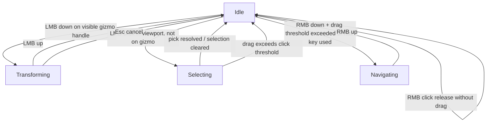

# Viewport, State, and Pipeline Specification

This specification turns the uploaded PRD and technical companion into a concrete runtime contract for a docked ImGui-based viewport that supports real-time path-traced accumulation, object editing with W/E/R gizmos, RMB-first viewport navigation, and a realism-first renderer with spectral, layered, and volumetric transport. It intentionally does **not** restate shading math or UI goals; it defines the software architecture, state ownership, invalidation rules, and OpenGL orchestration needed to make those documents behave predictably in C++ and OpenGL 4.6. fileciteturn0file0 fileciteturn0file1

## Input Routing & Interaction State Machine

The viewport must be implemented as a **hierarchical state machine**, not as scattered booleans. The root split is simple: either the viewport is eligible to consume input this frame, or it is not. Eligibility requires that the mouse is over the viewport content region, the viewport window is active, and no higher-priority non-viewport ImGui widget is currently owning the relevant input. Raw platform events must still be forwarded to Dear ImGui first every frame, because the official FAQ explicitly requires that, and `io.WantCaptureMouse` / `io.WantCaptureKeyboard` are the correct backend-level capture hints. ImGuizmo then sits one level below ImGui and above camera movement: it exposes `BeginFrame()`, `SetDrawlist()`, `SetRect()`, `IsOver()`, `IsUsing()`, and `Manipulate()` specifically for viewport-scoped manipulation. citeturn2view0turn2view1turn2view2

For this application, input ownership must be resolved in this exact order:

| Priority | Consumer | Consumes | Rule |
|---|---|---|---|
| Highest | Non-viewport ImGui UI | Mouse + keyboard | Menus, popups, text fields, sliders, inspector widgets, and dock controls win first. |
| High | Visible gizmo capture | LMB + transform hotkeys | If a visible gizmo handle is active or already latched, transform wins over selection and camera. |
| Medium | Viewport navigation | RMB + mouse delta + WASD/QE | While RMB navigation is active, camera movement owns those inputs exclusively. |
| Low | Viewport selection | LMB click | Selection only happens if no ImGui widget and no gizmo consumed the click. |
| Lowest | Hover-only feedback | Cursor movement | Hover highlight and cursor state update only when nothing else captured. |

The hotkey conflict between **W/E/R** and **WASD/QE** is resolved by state, not by key. When **RMB is not held**, a fresh key-down on **W**, **E**, or **R** changes gizmo mode to Translate, Rotate, or Scale. When **RMB is held and navigation becomes active**, the keyboard mapping switches to navigation mode immediately: **W/A/S/D** move the camera horizontally, **Q/E** move it vertically, and **W/E/R** gizmo mode switching is completely suppressed. Those hotkeys are also **not buffered** across the transition; if the user was already holding `W` while navigating, releasing RMB must **not** cause a delayed “switch to translate” on the next frame. That rule is necessary to prevent accidental mode switches after camera motion, and it directly matches the PRD’s requested control model. fileciteturn0file0

RMB must be treated as a **navigation candidate** first and a **context-menu click** second. On RMB-down inside the viewport, store `pressPos`, `pressTime`, and set `navConsumed = false`. If cursor travel exceeds a drag threshold, or any navigation key is used while RMB is down, transition to `Navigating` and set `navConsumed = true`. On RMB-up, if `navConsumed` is still false, open the context menu for the hovered object or empty space. This is the only robust way to support both “hold RMB to fly” and “right-click for scene/object actions” without conflicts. Popups and menus stay above the viewport in the priority stack, which is consistent with Dear ImGui’s capture rules and popup behavior. citeturn2view0turn12search14

`Transforming` is entered **only** by `LMB-down` on a visible gizmo handle while RMB is not active. Once entered, it remains exclusive until `LMB-up` or explicit cancel. Pressing RMB during an active transform does **not** start navigation; transform stays latched until it finishes. Conversely, if RMB is already active, gizmo hover/use is ignored until navigation ends. This removes the most common editor failure mode: starting camera motion while the object is halfway through a transform. citeturn2view2

Do **not** rely on `ImGuizmo::IsOver()` alone as the sole truth source for interaction ownership. The public API documents what `IsOver()` and `IsUsing()` mean, but open upstream issues show that `IsOver()` can report true after the gizmo is hidden and can miss bounds-adjustment handles in some cases. The state machine therefore needs its own explicit `gizmoVisible` and `gizmoCaptured` latches: only trust `IsOver()` if the gizmo is actually rendered this frame, and once a transform starts, the latched capture state is authoritative until release. citeturn2view2turn9view0turn9view1

The required viewport state flow is:



## Render Loop & Accumulation Lifecycle

The baseline threading model must be **single GL thread, multi-threaded scene preparation**. The **main/UI thread** owns the window, current OpenGL context, Dear ImGui frame lifecycle, overlay drawing, and all GL calls. A **scene compiler worker** prepares immutable snapshots of the edited scene: flattened instance data, material/light tables, CPU-side BVH for picking, and GPU upload payloads. The GPU itself is the third execution domain, running asynchronously after command submission. This baseline is the most robust fit for OpenGL because a context can be current on only one thread at a time, moving it between threads requires detaching and reattaching, and shared-context visibility requires explicit synchronization and rebinding. The OpenGL wiki explicitly warns that the application should design around avoiding these races rather than depending on them. citeturn5view4turn5view5turn5view6turn10view0

That means the application should **not** use a separate GL render thread in the baseline implementation. Instead, `RenderDelegator` submits one bounded amount of compute work from the main thread each frame, then immediately returns to UI work. GPU completion is tracked with fences, not `glFinish()`. Khronos explicitly states that sync objects are a finer-grained alternative to `glFinish()`, and `glClientWaitSync(..., timeout = 0)` can be used as a non-blocking poll. This is the key to keeping the UI responsive while the GPU continues refining the image. citeturn10view0turn5view0turn5view1

The frame loop should be:

1. Poll OS/window events and forward them to Dear ImGui.
2. Start a new ImGui frame.
3. Run `ViewportController`, producing zero or more scene edits and viewport actions.
4. Apply those edits to the mutable editor scene.
5. Coalesce changes into a `SceneChangeSet`.
6. If structural work is needed, hand the scene to the worker or consume the newest ready snapshot.
7. Let `AccumulationManager` classify the invalidation.
8. Upload any pending GPU snapshot deltas on the **main GL thread**.
9. Dispatch one bounded compute pass for the current accumulation slot.
10. Insert memory barriers and a fence.
11. Present the latest completed texture in the ImGui viewport.
12. Draw editor overlays.
13. Render Dear ImGui draw data and swap buffers. fileciteturn0file0 fileciteturn0file1 citeturn5view0turn5view1turn5view2

The accumulation contract needs **three reset classes**:

- **Full reset**: discard the current epoch immediately and start from sample 0. Use this when keeping stale imagery around is more misleading than helpful.
- **Partial reset**: keep the last completed image visible while a fresh epoch begins in another slot. Show the new slot as soon as its first completed sample arrives.
- **No reset**: preserve the current epoch.

The technical companion already establishes the core principle behind this: transport-affecting changes must invalidate accumulation, while display-only changes should not. This specification makes that rule practical and explicit. fileciteturn0file1

The reset table is:

| Change | Reset class | Structural rebuild | Exact behavior |
|---|---|---|---|
| Camera position/orientation changed | Full | No | Drop accumulation immediately; during continuous motion run in 1-spp interactive preview mode. |
| Camera lens changed (`FOV`, aperture, focus distance) | Full | No | Start a new epoch immediately. |
| Object transform drag | Full while drag is active | No | Reset every changed frame; no history carried across motion. |
| Light transform drag | Full while drag is active | No | Same rule as object transform. |
| Material numeric tweak (`roughness`, `IOR`, color, density, emission power) | Partial | No | Keep old image visible until first finished sample of the new epoch. |
| Light intensity/color tweak | Partial | No | Same as material tweak. |
| Volume density/albedo/extinction tweak | Partial | No | Same as material tweak. |
| Object added/removed, primitive added/removed, mesh topology changed | Full | Yes | Rebuild snapshot/BVH and start new epoch. |
| Material layer graph changed | Full | Yes | Rebuild material tables and start new epoch. |
| Light set changed | Full | Yes | Rebuild light tables and start new epoch. |
| Volume object added/removed or topology changed | Full | Yes | Rebuild volume data and start new epoch. |
| Integrator / render mode changed | Full | Yes | Do not preserve accumulation across mode changes in v1. |
| Viewport extent changed during active dock/resize drag | No | No | Keep showing the last completed image, scaled to the temporary viewport rectangle. |
| Viewport extent commit after drag settles | Full | Yes | Reallocate images and start a new epoch. |
| Inspector drag that does not resize viewport | No | No | Pure UI interaction. |
| Selection change, gizmo mode change, popup/menu open/close | No | No | Editor-only state. |
| Exposure / white balance / tonemap change | No | No | Apply in display pass only; transport history stays valid. |

The important nuance is viewport resizing. A changing pixel grid cannot preserve physically correct sample history forever, but it is still a bad user experience to nuke the image continuously while the dock splitter is being dragged. Therefore the rule is: **no reset during transient resize**, **full reset on resize commit**. A resize is committed once the extent is stable for a short debounce interval or once the resizing mouse button is released. fileciteturn0file1

The API contract between the scene graph and renderer should combine a **bitmask** and a **version hash**. The bitmask is for fast routing; the hash is for structural equivalence. Concretely:

- `DirtyFlags`: `CameraPose`, `CameraLens`, `ObjectTransform`, `ObjectTopology`, `MaterialParams`, `MaterialLayout`, `LightParams`, `LightTopology`, `VolumeParams`, `VolumeTopology`, `Environment`, `Integrator`, `ViewportExtent`, `DisplayOnly`, `SelectionOnly`.
- `SceneVersionHash`: hash of all **structural** data that changes GPU resource layout or the pick BVH.
- `TransportEpoch`: incremented for any change that can affect transport.
- `DisplayEpoch`: incremented only for post/overlay changes.

`DirtyFlags` may flip many times per frame; `SceneVersionHash` should only change when a structural snapshot actually changes. Edits are coalesced once per frame before the renderer classifies the reset. This is the simplest way to keep the UI immediate while stopping redundant rebuilds. fileciteturn0file1

## OpenGL Pipeline & Overlay Strategy

The GL resource layout should use **two accumulation slots** and a **separate presentation path**. Each slot represents a render epoch and contains:

- `radianceAccum`: `GL_RGBA32F` image, scene-linear.
- `displayTex`: `GL_RGBA16F` or `GL_RGBA8`, post-display view for the viewport.
- Optional denoiser AOVs such as `albedo` and `normal`.
- `GLsync completionFence`.
- CPU-side `sampleIndex`, `epochId`, and `sceneVersionHash`.

The scene itself should be uploaded as immutable-or-slow-changing SSBOs and textures: flattened instances, transforms, materials, lights, BVH nodes, emissive distributions, environment maps, and any volume grids. Per-frame state such as camera matrices, frame seed, epoch id, and viewport extent belongs in a small UBO or push-style parameter block. Compute shaders do not have output variables; they write through images and SSBOs, and the OpenGL docs make it explicit that shader-written data requires the correct memory barriers before later texture fetches, framebuffer operations, or shader-storage reads can safely see it. citeturn2view3turn5view2turn5view3turn3search17

The accumulation strategy should be **epoch ping-pong**, not fixed-function blending. Path-traced accumulation is HDR, sample-count aware, and transport-driven; it belongs in compute, not in OpenGL blend state. A steady-state frame looks like this:

1. Bind `renderSlot.radianceAccum` and scene SSBOs/images.
2. Dispatch compute for the current viewport extent.
3. Call `glMemoryBarrier(GL_SHADER_IMAGE_ACCESS_BARRIER_BIT | GL_TEXTURE_FETCH_BARRIER_BIT | GL_SHADER_STORAGE_BARRIER_BIT)`.
4. Run a lightweight display pass that tone-maps or otherwise converts `radianceAccum` into `displayTex`.
5. Insert `glFenceSync`.
6. If the fence for the newly rendered slot is complete by the next frame, promote that slot to `visibleSlot`; otherwise keep presenting the last completed slot.

This scheme is what makes **partial reset** practical. On a partial reset, the old `visibleSlot` stays on screen while the cleared inactive slot becomes the new `renderSlot`. The viewport never flashes black just because a roughness slider moved. On a full reset, the renderer flips immediately and starts from a cleared slot, which is the correct behavior for camera motion and other continuously changing view transforms. citeturn5view0turn5view1turn5view2

Presentation into the ImGui viewport should be done by handing the current `displayTex` to `ImGui::Image()` using the backend’s `ImTextureID` path. Dear ImGui’s own documentation is explicit that `ImGui::Image()` is the standard way to display a GPU texture in a Dear ImGui window, that an `ImTextureID` is just an opaque backend-owned texture identifier, and that foreground/background draw lists can be layered over the image afterward. citeturn14view0turn14view1

The required draw order is:

1. Path trace into `radianceAccum` for `renderSlot`.
2. Barrier.
3. Build/update `displayTex`.
4. Fence.
5. Begin the ImGui viewport window.
6. Emit the viewport image item with `ImGui::Image(displayTex, viewportSize)`.
7. Draw gizmos and editor overlays over that image.
8. End the viewport window.
9. Render the rest of ImGui.

Editor overlays must **never** write into the accumulation image. They are editor state, not transport state. Gizmos should be drawn through ImGuizmo into the viewport draw list or the viewport foreground draw list by calling `ImGuizmo::SetDrawlist(...)` and `ImGuizmo::SetRect(...)` for the viewport rectangle before `Manipulate()`. That keeps gizmos visually on top of the path-traced image but totally outside the accumulation path. citeturn2view2turn14view1

Selection highlights, light icons, and frusta should follow the same rule. The baseline implementation should draw them as editor overlays, using either projected draw-list primitives or a small transparent `OverlayFBO` that is composited over the viewport image after the path-traced pass. They must not share the accumulation render target. Khronos explicitly warns that reading from textures that are simultaneously attached for framebuffer writes is undefined, so the safe rule is simple: the accumulation image is write-only for the path tracer and read-only for presentation; editor overlays use a different target or draw list. citeturn2view5turn5view2

If depth-aware overlay occlusion is desired later, the depth source should come from a cheap **editor proxy raster pass** into the overlay target, not from the path tracer. Transparent and refractive objects should still default to X-ray-style editor overlays, because the PRD and technical companion require path-traced glass, internal reflection, and volumetrics, which do not map to a single trustworthy raster depth buffer. fileciteturn0file0 fileciteturn0file1

## Object Picking in a Path Tracer

The authoritative picking path should be a **CPU-side ray cast against an immutable pick BVH**, built from the same scene snapshot that the renderer uses. This is the correct baseline for this project because the viewport is path-traced and the project explicitly requires physically meaningful transparent glass, layered transmission, and volumetrics. A standard raster depth or ID buffer only knows about a rasterized first-surface pass; it is not a reliable ownership oracle for a path-traced editor viewport. PBRT’s scene model is a good architectural reference here: the scene exposes a closest-hit ray intersection query, and BVHs exist precisely to make those queries cheap enough for interactive use. fileciteturn0file0 fileciteturn0file1 citeturn2view6turn7search5turn7search6turn7search2

The click-to-selection flow must be:

1. `ViewportController` recognizes an LMB click release in `Selecting`.
2. Convert the viewport-relative mouse pixel to normalized viewport coordinates.
3. Generate an **editor pick ray** from the active viewport camera. This is **not** the stochastic render ray: no lens jitter, no pixel jitter, and no aperture sampling.
4. Intersect that ray against `SceneSnapshot.pickBVH`.
5. Return the nearest hit as `ObjectID`, `InstanceID`, optional `SubObjectID`, hit distance, and hit point.
6. Apply the selection to `SelectionModel`.
7. Inspector reads `SelectionModel`.
8. Gizmo anchor updates from the newly selected object transform.

The snapshot used for picking must be immutable for the whole frame. The worker thread may prepare a newer snapshot, but the click uses whichever snapshot was active when the frame began. That rule prevents race conditions where the inspector selects geometry from a snapshot that is not the one the viewport is currently showing. citeturn5view6turn2view6turn7search5

Transparent and refractive objects must be pickable by their **geometric shell**, not by trying to invert transport. In practice that means clicking on a glass sphere selects the sphere, not the refracted object visible behind it. This is the only stable editor rule for a physically based path tracer. A future “pick through transparent” modifier can be added later, but the baseline behavior should be deterministic shell picking. Volumetric fog clouds should also be pickable, but through their explicit editor proxy shape or bounds, not through stochastic medium scattering. PBRT’s medium interface model is a useful reminder here: media are bounded by geometry, so the editor should pick the boundary/proxy, not the random scattering event. fileciteturn0file0 fileciteturn0file1 citeturn7search9turn7search12

A Primitive ID AOV can exist as an optional debug view, but it must **not** be the authoritative selection source in Path Trace mode. At best it is a convenience signal for opaque debug modes. It is not robust enough for the baseline path-traced editor.

## Core C++ Interface Stubs

The following stubs are the minimum surface area needed to enforce the architecture described above. The important invariants are: all GL calls stay on the main thread, scene compilation produces immutable snapshots, and viewport input routing is centralized in one controller instead of being spread across ImGui callbacks, gizmo code, and camera code. Those invariants directly follow from the OpenGL context/threading rules and the ImGui/ImGuizmo capture model. citeturn5view4turn5view6turn2view0turn2view2

```cpp
#pragma once

#include <cstdint>
#include <memory>
#include <optional>
#include <span>
#include <string>
#include <vector>

using ObjectID   = std::uint64_t;
using InstanceID = std::uint64_t;
using EpochID    = std::uint64_t;
using VersionID  = std::uint64_t;

//------------------------------------------------------------------------------
// Shared enums / flags
//------------------------------------------------------------------------------

enum class ViewportState : std::uint8_t
{
    Inactive,     // Viewport not eligible to consume input this frame
    Idle,         // Viewport active, no action latched
    Selecting,    // LMB click candidate; awaiting pick/commit
    Transforming, // Gizmo is actively manipulating a transform
    Navigating    // RMB camera navigation is active
};

enum class ResetClass : std::uint8_t
{
    None,     // Preserve accumulation
    Partial,  // Start new epoch, keep old visible until new slot completes
    Full      // Drop history immediately and start new epoch now
};

enum DirtyFlags : std::uint64_t
{
    Dirty_None            = 0,
    Dirty_CameraPose      = 1ull << 0,
    Dirty_CameraLens      = 1ull << 1,
    Dirty_ObjectTransform = 1ull << 2,
    Dirty_ObjectTopology  = 1ull << 3,
    Dirty_MaterialParams  = 1ull << 4,
    Dirty_MaterialLayout  = 1ull << 5,
    Dirty_LightParams     = 1ull << 6,
    Dirty_LightTopology   = 1ull << 7,
    Dirty_VolumeParams    = 1ull << 8,
    Dirty_VolumeTopology  = 1ull << 9,
    Dirty_Environment     = 1ull << 10,
    Dirty_Integrator      = 1ull << 11,
    Dirty_ViewportExtent  = 1ull << 12,
    Dirty_DisplayOnly     = 1ull << 13,
    Dirty_SelectionOnly   = 1ull << 14
};

inline DirtyFlags operator|(DirtyFlags a, DirtyFlags b)
{
    return static_cast<DirtyFlags>(static_cast<std::uint64_t>(a) |
                                   static_cast<std::uint64_t>(b));
}

inline bool Any(DirtyFlags value, DirtyFlags mask)
{
    return (static_cast<std::uint64_t>(value) &
            static_cast<std::uint64_t>(mask)) != 0;
}

//------------------------------------------------------------------------------
// Lightweight data carriers
//------------------------------------------------------------------------------

struct ViewportRect
{
    float x = 0.0f;
    float y = 0.0f;
    float width = 0.0f;
    float height = 0.0f;
};

struct ViewportInputFrame
{
    ViewportRect rect{};
    bool viewportHovered = false;
    bool viewportFocused = false;
    bool imguiWantsMouse = false;
    bool imguiWantsKeyboard = false;

    bool lmbPressed = false;
    bool lmbReleased = false;
    bool rmbPressed = false;
    bool rmbReleased = false;
    bool rmbDown = false;

    bool keyWPressed = false;
    bool keyEPressed = false;
    bool keyRPressed = false;
    bool keyQDown = false;
    bool keyWDown = false;
    bool keyADown = false;
    bool keySDown = false;
    bool keyDDown = false;
    bool keyEDown = false;
    bool keyEscapePressed = false;

    float mouseX = 0.0f;
    float mouseY = 0.0f;
    float mouseDeltaX = 0.0f;
    float mouseDeltaY = 0.0f;
};

struct PickRequest
{
    float viewportX = 0.0f;
    float viewportY = 0.0f;
};

struct PickHit
{
    ObjectID objectId = 0;
    InstanceID instanceId = 0;
    bool hit = false;
    float distance = 0.0f;
    // Hit point / normal omitted here; add as needed.
};

struct SceneChangeSet
{
    DirtyFlags dirty = Dirty_None;
    VersionID structuralVersion = 0; // Hash / version of structural scene state
    EpochID transportEpoch = 0;      // Increments on any transport-affecting edit
    EpochID displayEpoch = 0;        // Increments on display-only changes

    bool viewportResizeInteractive = false;
    bool viewportResizeCommit = false;
};

struct RenderBudget
{
    std::uint32_t maxSamplesPerFrame = 1; // Interactive default
    double maxGpuSubmitMilliseconds = 0.0;
};

struct SceneSnapshot
{
    VersionID structuralVersion = 0;
    // Flattened immutable data for renderer + picker:
    // instances, materials, lights, BVH nodes, volume descriptors, etc.
};

struct AccumulationSlot
{
    EpochID epoch = 0;
    VersionID structuralVersion = 0;
    std::uint32_t sampleIndex = 0;
    void* radianceAccumHandle = nullptr; // GLuint texture/image stored by engine
    void* displayTextureHandle = nullptr;
    void* albedoHandle = nullptr;
    void* normalHandle = nullptr;
    void* completionFence = nullptr;     // GLsync stored as opaque pointer
};

//------------------------------------------------------------------------------
// ViewportController
// Central owner of viewport interaction state. No GL calls here.
//------------------------------------------------------------------------------

class ViewportController
{
public:
    void beginFrame(const ViewportInputFrame& input);

    // Routes one frame of input and returns high-level viewport actions.
    void update();

    ViewportState state() const noexcept;
    bool wantsContextMenu() const noexcept;
    bool wantsCameraNavigation() const noexcept;
    bool wantsTransform() const noexcept;
    bool wantsPick() const noexcept;

    // Current one-shot actions
    std::optional<PickRequest> consumePickRequest();
    bool consumeOpenContextMenuFlag();

    // Gizmo mode is persistent editor state even when no object is selected.
    enum class GizmoMode : std::uint8_t { Translate, Rotate, Scale };
    GizmoMode gizmoMode() const noexcept;

    // Called by gizmo layer each frame after Manipulate()/IsUsing() results are known.
    void setGizmoVisible(bool visible);
    void setGizmoHovered(bool hovered);
    void setGizmoActive(bool active);

    // Cancels transient interaction state after selection loss, popup takeover, etc.
    void forceIdle();

private:
    ViewportInputFrame m_input{};
    ViewportState m_state = ViewportState::Inactive;
    GizmoMode m_gizmoMode = GizmoMode::Translate;

    bool m_gizmoVisible = false;
    bool m_gizmoHovered = false;
    bool m_gizmoActive = false;

    bool m_openContextMenu = false;
    std::optional<PickRequest> m_pickRequest{};

    float m_rmbPressX = 0.0f;
    float m_rmbPressY = 0.0f;
    bool m_rmbNavigationConsumed = false;
};

//------------------------------------------------------------------------------
// AccumulationManager
// Owns reset classification, epoch ping-pong, and visible/render slot promotion.
// GL resource creation/clearing happens on the main GL thread only.
//------------------------------------------------------------------------------

class AccumulationManager
{
public:
    void initialize(std::uint32_t width, std::uint32_t height);
    void shutdown();

    ResetClass classify(const SceneChangeSet& changes) const noexcept;
    void applyInvalidation(const SceneChangeSet& changes);

    // Called during transient dock/resize dragging.
    void noteInteractiveViewportResize(std::uint32_t width, std::uint32_t height);

    // Called once resize is committed; reallocates textures and starts a new epoch.
    void commitViewportResize(std::uint32_t width, std::uint32_t height);

    AccumulationSlot& renderSlot() noexcept;
    const AccumulationSlot& visibleSlot() const noexcept;
    const AccumulationSlot& pendingSlot() const noexcept;

    // Called immediately after compute/display submission.
    void markSubmitted(void* glFenceOpaque);

    // Non-blocking promotion: returns true if a newly completed slot became visible.
    bool tryPromoteCompletedSlot();

    // Sample lifecycle
    void incrementSampleIndex();
    void clearRenderSlot();
    void beginNewEpoch(ResetClass resetClass, VersionID structuralVersion);

    std::uint32_t width() const noexcept;
    std::uint32_t height() const noexcept;

private:
    AccumulationSlot m_slots[2]{};
    int m_visibleIndex = 0;
    int m_renderIndex = 0;

    std::uint32_t m_width = 0;
    std::uint32_t m_height = 0;
    EpochID m_nextEpoch = 1;
};

//------------------------------------------------------------------------------
// RenderDelegator
// The only class allowed to touch GL for scene upload, compute dispatch,
// texture presentation, fences, and editor overlay composition.
// Must live on the main/UI/GL thread.
//------------------------------------------------------------------------------

class RenderDelegator
{
public:
    void initialize();
    void shutdown();

    // Receives immutable snapshots prepared by the worker thread.
    void enqueueReadySnapshot(std::shared_ptr<const SceneSnapshot> snapshot);

    // Main-frame entry point. Does not block on GPU completion.
    void tickFrame(const SceneChangeSet& changeSet,
                   const RenderBudget& budget,
                   bool pathTraceEnabled);

    // Viewport/UI integration
    void drawViewportImage(const ViewportRect& rect);
    void drawViewportOverlays(const ViewportRect& rect);

    // Picking support uses the same immutable snapshot family as rendering.
    std::shared_ptr<const SceneSnapshot> activeSnapshot() const noexcept;

private:
    void uploadPendingSnapshotIfNeeded();
    void dispatchPathTrace(const RenderBudget& budget);
    void dispatchDisplayResolve();
    void submitFenceForRenderSlot();
    void cleanupRetiredSyncObjects();

private:
    std::shared_ptr<const SceneSnapshot> m_activeSnapshot;
    std::shared_ptr<const SceneSnapshot> m_pendingSnapshot;

    AccumulationManager m_accumulation;
};

//------------------------------------------------------------------------------
// Suggested worker-thread helper interface
// Not a GL owner. Builds immutable snapshots and CPU pick BVHs.
//------------------------------------------------------------------------------

class SceneCompiler
{
public:
    std::shared_ptr<const SceneSnapshot> compile(/* const EditorScene& scene */);
};
```

The enforceable rules attached to these stubs are simple: `ViewportController` owns all viewport interaction state and emits high-level actions only; `AccumulationManager` owns epoch changes and visible/render slot policy; `RenderDelegator` is the sole GL submission boundary; and worker-built snapshots are immutable once published. That separation is what allows the PRD’s viewport behavior and the technical companion’s renderer behavior to coexist without input conflicts, accumulation corruption, or OpenGL threading hazards. fileciteturn0file0 fileciteturn0file1 citeturn5view4turn5view6turn10view0turn2view0turn2view2