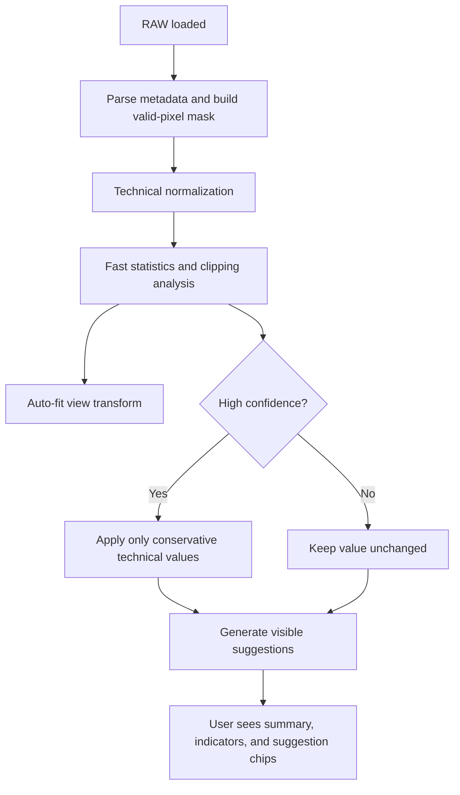
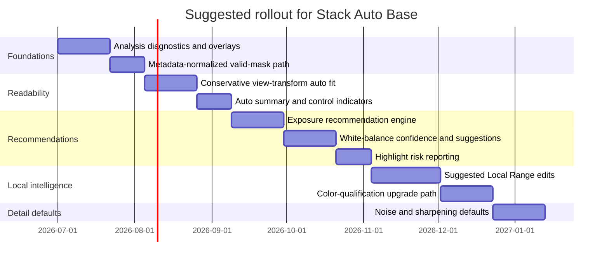

# Stack Auto Base for RAW Development

## Executive summary

This report recommends that Stack’s first-generation **Auto Base on Load** should behave like a transparent technical assistant, not a one-click “enhance” filter. The system should always apply **technical metadata normalization** immediately on load, including active-area handling, black/white level normalization, camera/as-shot white-balance ingestion, and camera baseline exposure normalization where metadata explicitly defines the exposure-control zero point. It should also run a **conservative Auto Fit on the View Transform** by default, because that is the safest way to make dark, HDR, and backlit RAW files readable without destroying highlight headroom or silently imposing a creative look. The report therefore recommends that **content-derived RAW exposure lifts usually be suggested, not auto-applied**, unless confidence is high and highlight/headroom risk is low. This lines up with Stack’s scene-referred design, editable local-range recipes, and the project requirement that any automation remain visible, explainable, and overridable. citeturn12view0turn13view0turn15view0turn16view0turn23view1turn5view0 fileciteturn0file0

The strongest evidence base comes from current implementation-oriented documentation and standards: the Adobe DNG specification for black level, white level, active area, masked areas, as-shot neutral, baseline exposure, baseline noise, and baseline sharpness; LibRaw’s API structures for camera white-balance coefficients, black levels, maxima, DNG levels, ISO, shutter, and related metadata; darktable’s current scene-referred documentation for exposure, filmic rgb, highlight reconstruction, color calibration, sigmoid, and AgX; and ACES/OpenColorIO documentation for modern view-transform structure, tone mapping, gamut compression, white limiting, and display/view architecture. Those sources consistently support a pipeline in which **scene-linear corrections come before display rendering**, while the display transform is responsible for mapping broad scene dynamic range into the device’s range using a monotonic S-shaped curve with explicit handling for highlights, shadows, and out-of-gamut color. citeturn15view1turn15view0turn16view0turn17view1turn23view1turn5view0turn24view0turn25view3turn27view0turn26view0turn9view0turn18view0turn38view1turn19view0

The central design recommendation is therefore:

- **Auto-apply:** technical metadata normalization, invalid-area masking, robust statistics, conservative view-transform fitting, and very small metadata-backed exposure normalization.
- **Suggest, but do not auto-apply by default:** content-derived RAW exposure lifts, alternate white balance, highlight reconstruction mode, local-range edits, stronger denoise, and creative tone/look presets.
- **Never auto-change without clear confirmation:** strong local edits, strong sharpening, aggressive saturation or dehaze, skin-targeted adjustments, or anything that materially changes image intent beyond “make the RAW readable and technically sane.” citeturn23view1turn5view0turn24view0turn25view3turn28view0 fileciteturn0file0

A practical implementation plan is to split analysis into a **fast load-time pass** and a **background recommendation pass**. The fast pass should parse metadata, build a valid-pixel mask, compute raw clipping/headroom metrics, estimate noise risk, build a low-resolution scene-linear analysis texture, and fit the view transform. The background pass can then evaluate white-balance alternatives, classify whether the image is sky-dominant/backlit/shadow-heavy/foliage-rich, and generate suggested editable Local Range anchors. This architecture maps well to a C++/OpenGL/LibRaw stack because it uses metadata and low-resolution readbacks first, keeps the UI responsive, and stores all actions as recipe values and visible suggestions rather than hidden processing. citeturn17view1turn19view0turn35view0turn36view2turn21view0turn21view1

## Assumptions and design constraints

The recommendations below assume that Stack already has a **scene-referred RAW pipeline**, stores a persisted development recipe, exposes a **scene-linear RAW Exposure EV**, supports editable **Local Range** luminance adjustments with optional color qualification, and has a **View Transform** that functions as a true display rendering transform rather than a simple output color-space conversion. They also assume that the project goal is a technically correct, explainable “Auto Base” that changes visible controls or creates visible suggestions instead of hiding magic. Those assumptions come from the project brief and are treated here as hard product constraints. fileciteturn0file0

A second assumption is that Stack can obtain, either directly from LibRaw or from DNG-compatible metadata, the technical inputs needed for a correct RAW baseline: black level, per-channel black corrections, white level or per-channel maxima, as-shot white balance coefficients or neutral coordinates, active-area or crop metadata, ISO/shutter/aperture, and camera model identifiers. LibRaw exposes core fields such as `black`, `cblack`, `linear_max`, `maximum`, `cam_mul`, `pre_mul`, ISO, shutter, and DNG level/color data; the DNG spec defines `BlackLevel`, `WhiteLevel`, `ActiveArea`, `MaskedAreas`, `AsShotNeutral`, `AsShotWhiteXY`, `BaselineExposure`, `BaselineNoise`, `BaselineSharpness`, `LinearResponseLimit`, and related tags. citeturn17view1turn17view0turn15view1turn15view0turn16view0turn34view0

The last critical assumption is about product priorities. This design optimizes for **strong technical starts, explainability, and editability**, not maximum machine autonomy. Where the evidence suggests that automation is fragile or intent-dependent—especially white balance in stylized lighting, highlight reconstruction in large clipped areas, or local edits that change subject emphasis—the report deliberately prefers **confidence-gated suggestions** over automatic application. That tradeoff is consistent with the project brief and with the practical limits described in current RAW-processing documentation: clipped RAW data is irrecoverably lost, white-balance assumptions can fail in non-neutral scenes, and display transforms can be tuned for different intents even when the image is technically valid. citeturn24view0turn25view3turn5view0turn27view1turn26view0 fileciteturn0file0

## Auto Base policy

### What Stack should auto-set on RAW load

The first class of operations should be **technical, deterministic, and non-controversial**:

| Operation | Recommendation | Why |
|---|---|---|
| Active/invalid area mask | Auto-apply | Statistics must ignore masked margins, black borders, and sensor dead margins. |
| Black/white normalization | Auto-apply | Required for technically correct scene-linear values. |
| Camera/as-shot white-balance ingest | Auto-apply as the default starting point | It is camera metadata, not a creative guess. |
| Metadata baseline exposure normalization | Auto-apply if explicitly provided by metadata | It defines the “zero point” of exposure compensation across camera models. |
| Raw clipping / near-clipping analysis | Auto-compute and surface | Needed for highlight-safe decisions. |
| Conservative View Transform Auto Fit | Auto-apply, but visibly | Best first step for readability in dark/HDR scenes without forcing RAW exposure lifts. |
| Mild highlight-safe shoulder / hue-preservation defaults | Auto-apply inside the view transform | Prevent obvious display clipping and color breakage. |
| Minimal denoise default for very high ISO only | Optional auto-apply if visibly marked | Technical comfort feature, but must remain conservative. |

The strongest case here is for metadata normalization and view fitting. The DNG spec explicitly defines active area, masked areas, black and white levels, as-shot neutral, and baseline exposure; LibRaw exposes matching decoded structures; and darktable’s scene-referred workflow documentation clearly separates exposure correction from display rendering, while its display-transform modules are designed to map scene range to display range using explicit scene white/black and midtone controls. ACES and OCIO make the same separation at a system level: a scene-linear working image is transformed to a display/view representation, rather than being “fixed” only by changing exposure. citeturn16view0turn15view1turn15view0turn34view0turn17view1turn17view0turn23view1turn5view0turn27view0turn26view0turn9view0turn19view0

The key product decision is that **Stack should auto-fit the View Transform on load by default**. In practice, this is the most defensible automatic action because it leaves the scene-referred image data intact while making the image legible for human judgment. darktable’s filmic rgb, sigmoid, and AgX documentation all reinforce the same concept: display-transform modules sit at the boundary between scene-referred and display-referred editing, and are responsible for compressing scene dynamic range to the display while preserving useful tonal relationships. ACES 2’s output transform documentation similarly uses a structured tone-scale plus chroma compression, gamut compression, and white limiting in a display-oriented transform. citeturn5view0turn27view0turn26view0turn9view0turn18view0turn38view1

### What Stack should suggest but not auto-apply

The second class of actions should be **confidence-rated recommendations**:

| Operation | Default behavior | Rationale |
|---|---|---|
| Content-derived RAW exposure lift | Suggest unless confidence is high and headroom is safe | Global exposure can easily over-brighten HDR and backlit scenes. |
| Alternate auto white balance | Suggest when camera WB confidence is low | Non-neutral scenes often break statistical AWB. |
| Highlight reconstruction mode | Suggest when clipping is detected | Reconstruction choice is image-dependent and can introduce artifacts. |
| Local Range edits | Suggest as visible editable chips | Good for usability, but too intent-sensitive for silent application. |
| Stronger denoise / sharpening changes | Suggest | Noise/detail preference is highly subjective. |
| Look presets | Suggest only | They encode taste, not technical correction. |

This boundary is supported by the sources. darktable’s exposure module can automatically shift a chosen histogram percentile to a target, but that feature is documented as useful for batch consistency and deflickering, not as a universally correct scene-level exposure decision. darktable’s highlight reconstruction documentation repeatedly warns that reconstruction is method-dependent and, for large blown areas, often only “plausible” rather than truly recovered. Its sigmoid and filmic documentation also show that hue preservation and highlight behavior are intent-specific, with sunsets and fire often looking better with different preservation strengths. For white balance, current darktable documentation starts from camera metadata and allows gray-world sampling, while contemporary computer-vision references still distinguish between transparent statistics-based methods and more accurate but less transparent learning-based illuminant estimation. citeturn23view1turn24view0turn27view1turn37view1turn25view3turn21view0turn21view1turn20academia2turn22academia1turn6academia1

### What Stack should never auto-change without user confirmation

The final class is everything that meaningfully changes artistic intent:

| Operation | Policy |
|---|---|
| Strong local dodging/burning | Never auto-apply silently |
| Skin-targeted edits | Never auto-apply silently |
| Strong sharpening | Never auto-apply silently |
| Saturation or color-style presets | Never auto-apply silently |
| Aggressive highlight “repair” on large clipped regions | Never auto-apply silently |
| White-balance override in clearly stylized scenes | Never auto-apply silently |

This is the right cutoff because neither RAW metadata nor low-level statistics can reliably infer artistic intent. The highlight-reconstruction docs explicitly state that large fully clipped regions can only be disguised plausibly, not magically repaired. Semantic white-balance literature shows that semantics can improve illuminant estimation, but it also implies model dependence and dataset assumptions. For Stack’s stated UX philosophy, these higher-level edits belong in a suggestion layer that the user can inspect, apply, reject, or modify. citeturn24view0turn22academia1turn6academia1 fileciteturn0file0

### Decision model



The practical rule is simple: **automaticity should be proportional to technical certainty**. Metadata-backed normalization and view fitting are high-certainty; scene-interpretive edits are medium- or low-certainty and therefore belong in suggestions.

## Pipeline and algorithms

### Recommended RAW pipeline ordering

A robust Stack ordering for analysis and Auto Base is:

1. **Decode RAW and metadata**
2. **Apply active-area / masked-area / invalid-region mask**
3. **Black subtraction, per-channel black correction, white normalization**
4. **Technical white-balance stage for analysis and demosaic stability**
5. **Demosaic low-resolution analysis image**
6. **Input color transform into a stable scene-linear working space**
7. **Compute analysis statistics**
8. **Apply conservative RAW exposure only if confidence is high**
9. **Run Local Range suggestions on the pre-local-range scene-linear working image**
10. **Apply view-transform Auto Fit**
11. **Perform display rendering / view transform / gamut handling**
12. **Apply display-referred finishing controls** citeturn15view1turn16view0turn23view1turn25view3turn19view0turn27view0turn26view0

The placement matters. darktable’s exposure module is explicitly scene-referred and linear; its color-calibration workflow explains that a basic technical white balance is needed early, while more perceptual chromatic adaptation can occur after the input profile; and its scene-to-display modules sit later in the pipe, marking the transition to display-referred processing. Highlight reconstruction that truly works on RAW clipping belongs very early—before full color meaning is established—while display-transform shoulder behavior belongs late as part of view rendering. ACES and OCIO match that architecture: scene-linear input is mapped to a display/view transform, not globally “fixed” only by changing scene exposure. citeturn23view1turn25view3turn24view0turn5view0turn27view0turn26view0turn19view0turn9view0

### RAW exposure recommendations

#### Policy

Stack should treat **RAW Exposure** as a technical scene-linear scaling control and therefore be conservative. The report recommends:

- Always apply **metadata baseline exposure normalization** if available.
- Do **not** blindly auto-lift RAW exposure from image darkness alone.
- Auto-apply only small content-derived shifts when:
  - sensor clipping is negligible,
  - estimated highlight headroom is safe,
  - the scene is not strongly HDR/backlit/sky-dominant,
  - and the recommended shift is small, such as within about **±0.5 EV**.
- Otherwise, show a suggestion like **“Raise RAW Exposure +0.4 EV”** and let the view transform carry most of the readability load. citeturn15view0turn34view0turn23view1turn5view0

This policy is grounded in the DNG spec’s `BaselineExposure`, which exists precisely because camera models place the exposure-control zero point differently due to highlight headroom versus shadow-noise tradeoffs. It is also consistent with darktable’s guidance that midtones are adjusted in exposure but highlight handling is part of downstream tone mapping and reconstruction. The Stack-specific design concern in the brief—that a dark image with a bright sky should not simply receive a large RAW exposure lift—is therefore correct. citeturn15view0turn34view0turn23view1turn5view0 fileciteturn0file0

#### Technical normalization

For RAW-domain technical normalization, use:

\[
r_c(x,y)=\frac{\max(0,\;raw_c(x,y)-black_c(x,y))}{\max(\epsilon,\;white_c-black_c(x,y))}
\]

where \(black_c(x,y)\) incorporates both the base black level and any row/column or per-channel corrections. In DNG terms, this corresponds to `BlackLevel`, `BlackLevelDeltaH`, `BlackLevelDeltaV`, and `WhiteLevel`; in LibRaw terms it maps naturally to `black`, `cblack`, `linear_max`, and `maximum`. If `LinearResponseLimit` is present, treat values above that fraction of the normalized range as **near-nonlinear** even before full clipping. citeturn15view1turn17view1turn34view0

#### Analysis statistics

Compute stats on a low-resolution scene-linear working image **after technical WB and input profile, but before user RAW exposure, Local Range, and View Transform**. Use luminance \(Y\) from the working-space-to-XYZ matrix rather than assuming sRGB coefficients if Stack’s working space differs from Rec.709. Then compute:

\[
e_i=\log_2\big(\max(Y_i,\epsilon)\big)
\]

and robust percentiles on \(e_i\): \(p_{0.1}, p_1, p_5, p_{50}, p_{95}, p_{99}, p_{99.9}\). Also compute:

\[
Y_{\text{logavg}}=\exp\left(\frac{1}{N}\sum_i \ln(\epsilon+Y_i)\right)
\]

and channel clipping ratios from normalized RAW values. darktable’s exposure module and Stack’s own current Auto Fit philosophy both point toward percentile-based rather than naïve max/min behavior, because max/min are unstable in the presence of specular peaks, noise, and borders. citeturn23view1turn5view0 fileciteturn0file0

#### Recommended RAW exposure formula

A practical Stack recommendation is:

\[
EV_{\text{raw,base}} = EV_{\text{metadata-baseline}}
\]

\[
EV_{\text{raw,suggested}} = EV_{\text{raw,base}} + \Delta EV_{\text{content}}
\]

with

\[
\Delta EV_{\text{content}} = \operatorname{clamp}(T_m - m_s,\,-0.5,\,+1.0)\cdot C
\]

where:

- \(m_s\) is the weighted median log-luminance of a **subject-biased mask**,
- \(T_m\) is a conservative target median, such as a scene middle around **2.3–3.0 EV below fitted scene white**,
- \(C\) is a confidence term in \([0,1]\).

Use confidence penalties such as:

\[
C = 1 - \max(P_{\text{clip}},\;P_{\text{hdr}},\;P_{\text{sky-backlit}},\;P_{\text{stylized}})
\]

with example gates:

- \(P_{\text{clip}}=1\) if any-channel raw clipping exceeds about **0.05%** of valid pixels,
- \(P_{\text{hdr}}\) grows when \(p_{99}-p_{1}\) exceeds about **10 EV**,
- \(P_{\text{sky-backlit}}\) grows when a top-connected sky region exceeds about **12%** of the frame and the central/bottom subject region is more than **2.5–3 EV** darker,
- \(P_{\text{stylized}}\) grows when color evidence suggests sunset, concert/stage lighting, underwater, or other strongly colored environments. This is a design recommendation inferred from the interaction between metadata headroom, highlight clipping, and display-transform roles. It is not a published standard formula, but it is consistent with modern scene-referred pipelines and current display-transform practice. citeturn15view0turn24view0turn5view0turn27view1turn26view0

#### Pseudocode

```cpp
float RecommendRawExposureEV(const AnalysisStats& s,
                             const HighlightRiskReport& h,
                             const SceneClassReport& cls,
                             float metadataBaselineEV)
{
    float confidence = 1.0f;

    if (h.anyChannelClipPct > 0.0005f) confidence -= 0.45f;
    if (h.allChannelClipPct > 0.00005f) confidence -= 0.30f;
    if (cls.isBacklitSky)               confidence -= 0.35f;
    if (s.dynamicRangeEV > 10.0f)       confidence -= 0.20f;
    if (cls.intentLightingRisk > 0.5f)  confidence -= 0.30f;

    confidence = std::clamp(confidence, 0.0f, 1.0f);

    float targetMedianEV = s.fittedSceneWhiteEV - 2.7f;
    float delta = std::clamp(targetMedianEV - s.subjectMedianEV, -0.5f, 1.0f);

    if (confidence < 0.75f || std::abs(delta) > 0.5f)
        return metadataBaselineEV; // keep auto-apply conservative

    return metadataBaselineEV + delta;
}
```

### View Transform recommendations

#### Strategic recommendation

Stack should treat the View Transform as the **primary automatic readability control**. That is the deepest product recommendation in this report. The reason is not merely ergonomic. It is technically coherent with scene-referred workflows: RAW exposure alters scene-linear values, while the View Transform maps scene-linear values into display-referred output. darktable’s filmic rgb, sigmoid, and AgX are all explicit about this transition, and ACES 2’s tone-mapping structure makes the separation even more formal through tone scale, chroma compression, gamut compression, white limiting, and display encoding. citeturn5view0turn27view0turn26view0turn9view0turn18view0turn38view1turn19view0

#### Parameter fitting

For Stack’s parameters—`exposure`, `black EV`, `white EV`, `middle grey`, `contrast`, `toe`, `shoulder`, `preserve hue`, and saturation/gamut handling—the recommended fitting procedure is:

\[
m = \operatorname{weightedPercentile}(e, 0.50)
\]
\[
b = \operatorname{percentile}(e, 0.01)
\]
\[
w = \operatorname{percentile}(e_{\text{unclipped}}, 0.995)
\]

Then:

\[
middleGrey = 2^m
\]

\[
whiteEV = \operatorname{clamp}(w - m + M_w,\;2.5,\;10.0)
\]

\[
blackEV = \operatorname{clamp}(m - b + M_b,\;4.0,\;14.0)
\]

with conservative margins \(M_w \approx 0.2\) to \(0.6\) EV and \(M_b \approx 0.2\) to \(0.5\) EV depending on clipping/noise risk. Use a larger \(M_w\) when clipped or near-clipped highlight fractions are high; use a larger \(M_b\) when the shadow floor is noisy and you want less aggressive shadow extraction. This is conceptually close to darktable’s scene white/black mapping and AgX input exposure range controls, but adapted to Stack’s implementation. citeturn5view0turn26view0turn27view2

An effective parameterization for the remaining controls is:

\[
contrast = \operatorname{clamp}(1.15 - 0.04\cdot((whiteEV+blackEV)-10),\;0.9,\;1.2)
\]

\[
shoulder = \operatorname{lerp}(0.20,\;0.60,\;H)
\]

\[
toe = \operatorname{lerp}(0.15,\;0.45,\;S)
\]

where \(H\) is a highlight/HDR risk score and \(S\) is a shadow-compression score. In plain terms:

- A more HDR image gets a **stronger shoulder**.
- A more shadow-heavy image gets a **slightly stronger toe**.
- Larger scene dynamic range lowers effective contrast a little to keep the curve monotonic and readable. This is consistent with ACES’ explicit curve requirements—S-shaped, monotonic, continuous, defined over all floats—and with the flexibility exposed in filmic rgb, sigmoid, and AgX. citeturn9view0turn5view0turn27view2turn26view0

#### Hue and gamut handling

The default should be:

- **Hue preservation on**
- **Gamut compression on**
- **White limiting on** if Stack supports a display-white adaptation step
- **Highlight desaturation only as needed**, not aggressively by default

darktable’s sigmoid documentation explicitly notes that hue preservation is useful but image-dependent, with sunsets and fire often benefiting from reduced preservation. darktable’s AgX documentation aims for a more graceful path to white via primary manipulations rather than naïve per-channel clipping. ACES 2 goes further and formalizes gamut compression in a perceptual polar JMh space while preserving hue as much as possible, then applies white limiting to avoid chromatic shifts as channels approach device maximum at different points. For Stack, the practical translation is: **turn the safety systems on by default, but keep them continuous and mild**. citeturn27view1turn26view0turn18view0turn38view1

#### Comparison of display-transform families

| Family | Strength | Weakness | Best use in Stack |
|---|---|---|---|
| Filmic-style | Explicit scene white/black and strong scene-to-display logic | Requires careful tuning; can flatten local contrast | Strong default reference for Auto Fit |
| Sigmoid-style | Smooth, robust global compression around middle gray | Color handling varies with mode and hue-preservation setting | Good “simple neutral” preset |
| AgX-style | Better highlight color path and graceful desaturation toward white | More complex primaries/look interactions | Good optional “soft highlight / film-like” preset |
| ACES-style output transform | Most rigorous separation of tone, chroma, gamut, and white limiting | More system complexity than many RAW editors want | Strong reference for future gamut/white-limiting behavior |

This table summarizes the current documentation rather than implying that Stack should duplicate any one system exactly. The recommendation is to keep Stack’s native View Transform, but borrow the strongest ideas: filmic-like white/black bounds, sigmoid-like robustness, AgX-like graceful path-to-white behavior, and ACES-like gamut/white limiting. citeturn5view0turn27view0turn26view0turn9view0turn18view0turn38view1

### White balance recommendations

#### Default behavior

Stack should default to **camera/as-shot white balance** on load, not to an inferred auto-WB replacement. The DNG specification defines `AsShotNeutral` and `AsShotWhiteXY` as capture-time white-balance metadata, and LibRaw exposes `cam_mul` and `pre_mul` fields that correspond to as-shot and daylight/default balance data. darktable’s modern color-calibration workflow likewise initializes illuminant/chromatic adaptation from the RAW Exif “as set in camera,” while using a gray-world-style picker as an alternative, not as the universal default. citeturn15view0turn17view0turn25view3turn25view2

#### Candidate algorithms

A practical Stack implementation should evaluate several AWB candidates but auto-apply only under confidence:

| Candidate | Formula | Strength | Weakness |
|---|---|---|---|
| As-shot camera WB | metadata | Usually suitable and intent-aware | Can be biased by vendor rendering assumptions |
| Gray world | average channels should be gray | Fast and transparent | Fails in strongly non-neutral scenes |
| Shades of Gray | Minkowski-p norm channel average | Often more robust than plain gray world | Still statistics-based |
| Grey-Edge | channel statistics on gradients | Better when edge information is informative | More compute and more tuning |
| Learning-based WB | trained illuminant estimator | Best accuracy class on many benchmarks | Sensor/domain dependence; lower explainability |

For a scene-linear implementation, a good candidate set is:

\[
g_c^{GW}=\frac{\bar{\mu}}{\mu_c},
\qquad
\bar{\mu} = (\mu_R \mu_G \mu_B)^{1/3}
\]

with \(\mu_c\) computed over eligible pixels only, and a Shades-of-Gray variant:

\[
\mu_c^{(p)}=\left(\frac{1}{N}\sum_i I_{c,i}^p\right)^{1/p}, \quad p \approx 6
\]

\[
g_c^{SoG}=\frac{\bar{\mu}^{(p)}}{\mu_c^{(p)}}
\]

For Grey-Edge, replace \(I_c\) with a smoothed gradient magnitude \(|\nabla I_c|\). OpenCV’s current white-balance docs provide implementation-oriented references for gray-world and learning-based AWB, including saturation-threshold handling and feature extraction. Recent color-constancy literature still describes learning-based methods as the most accurate general class, but with greater dependence on training/calibration; semantic methods can improve results further. citeturn21view0turn21view1turn20academia2turn22academia1turn6academia1

#### Eligibility mask and confidence

Compute AWB only from a mask of pixels that are:

- valid and within active area,
- not clipped or near-clipped,
- not too dark and not too bright,
- not too saturated,
- and preferably not inside detected intentional-lighting regions.

OpenCV’s gray-world reference explicitly uses a saturation threshold to exclude saturated pixels, with saturation for RGB defined as:

\[
sat = \frac{\max(R,G,B)-\min(R,G,B)}{\max(R,G,B)}
\]

Use a similar threshold in Stack, such as `sat < 0.5–0.7`, on the scene-linear working preview after a temporary normalization. Then score each candidate by how well it reduces residual chroma on low-chroma, medium-luminance pixels in a perceptual space such as Oklab, and reject automatic replacement when the scene looks intentionally colored. Recent semantic white-balance work and modern learning-based AWB both support the idea that scene semantics matter; the proper Stack use of that fact is not to hide a neural color cast behind the user’s back, but to **down-weight confidence** in sunsets, concert lighting, neon scenes, underwater scenes, and similar cases. citeturn21view0turn21view1turn31view0turn22academia1turn6academia1

A practical decision rule is:

- If camera WB exists and gray evidence is weak, **keep camera WB**.
- If camera WB exists and a computed candidate materially improves neutral residual with high confidence, **show “Suggested WB”**, not an automatic replacement.
- If camera WB is absent or obviously invalid, auto-apply the best high-confidence candidate and visibly mark it as **Auto WB**. citeturn15view0turn17view0turn25view3turn21view0turn21view1

### Highlight recovery and protection recommendations

#### Distinguish three different problems

Stack should explicitly distinguish:

1. **Sensor/channel clipping in RAW**
2. **Scene-linear values above display white but not clipped in RAW**
3. **Display clipping created only by the current View Transform**

Those are not the same problem. The DNG spec defines `WhiteLevel` as the fully saturated encoding level and `LinearResponseLimit` as the fraction above which sensor response may become significantly non-linear. darktable’s highlight-reconstruction documentation stresses that clipped data is irrecoverably lost and that reconstruction methods use surrounding information or unclipped channels to build a plausible result; its filmic documentation separately discusses display-transform highlight reconstruction and shoulder behavior. This distinction should be visible in Stack’s UI. citeturn15view1turn34view0turn24view0turn37view1

#### Recommended staged design

**Stage one:** detect RAW clipping, per channel and all-channel.  
Use normalized RAW values and metadata white levels. Define:

\[
clip_c = [r_c \ge 1 - \delta]
\]

with \(\delta\) based on bit depth and metadata precision, for example \(\delta \approx 0.002\) to \(0.01\). Also classify **near-nonlinear** pixels as:

\[
nearNL_c = [r_c \ge LinearResponseLimit_c - \delta_{nl}]
\]

when `LinearResponseLimit` exists. Per-channel clipping matters because partial clipping plus white balance is exactly the situation that produces magenta highlights in practice. darktable’s documentation explains this failure mode directly. citeturn15view1turn34view0turn24view0

**Stage two:** protect headroom via exposure and view choices.  
If clipping exists, prohibit any automatic positive RAW exposure shift. Increase the View Transform shoulder strength and widen highlight roll-off first. This is where Stack’s Auto Fit can do the most good with the least risk. citeturn24view0turn37view1turn5view0

**Stage three:** suggest reconstruction if warranted.  
Recommend a reconstruction mode only when the clipped area exceeds a small threshold or when partial channel clipping creates visible color errors. Prefer suggestions like **“Reconstruct clipped highlights”** or **“Use achromatic highlight mode”**. Do not silently enable heavy inpainting on load. darktable’s reconstruction methods vary from clip-to-achromatic to adjacent-pixel estimates to guided Laplacians, and the docs repeatedly caution that the outcome depends strongly on the image. citeturn24view0

**Stage four:** expose clear warnings.  
Stack should expose:

- `RAW clipped highlights`
- `Near sensor saturation`
- `Display white clipping`
- `Highlight reconstruction recommended`

That model explains to the user what is physically lost, what is just out of display range, and what is a view-transform issue rather than a sensor issue. citeturn24view0turn37view1

### Local Range and suggestion generation

#### Policy

Stack should **not auto-create Local Range edits in the first version** of Auto Base unless the user opts into a “Sugged edits on load” mode. Instead, it should create visible suggestion chips that instantiate editable local adjustments when accepted. This best matches the project brief’s emphasis on editable recipe controls instead of hidden processing. fileciteturn0file0

#### Suggested classes

Start with only a few high-value suggestions:

| Suggestion | Trigger |
|---|---|
| Open shadows | large shadow mass, small highlight risk |
| Protect sky | top-connected sky region + high brightness contrast |
| Open backlit subject | sky/background much brighter than central subject region |
| Recover highlights | RAW clipping or strong display highlight compression |
| Brighten foliage | large green cluster with low-to-mid luminance and adequate chroma |

A small suggestion vocabulary is better than many fragile micro-edits. That design keeps the automation explainable and reduces patchwork masks. It is also compatible with darktable’s display-transform advice that broader scene compression should happen in the view transform and not all contrast management should be delegated to downstream local tools. citeturn5view0turn27view0turn26view0

#### Sky detection

A practical heuristic sky detector does not need a neural network in v1. Work on the downsampled, WB-applied, input-profiled scene-linear image, and compute a sky score from:

- **position prior:** touching the top edge, biased toward upper rows,
- **luminance prior:** above the frame median,
- **color prior:** blue/cyan hue in a perceptual hue space,
- **texture prior:** relatively low local variance,
- **connectivity prior:** one or a few large connected components.

A sample score:

\[
Score_{sky}(i)=0.30\,P_{top}(i)+0.25\,P_{bright}(i)+0.25\,P_{bluecyan}(i)+0.20\,P_{smooth}(i)
\]

Threshold, then keep only large connected components touching the top edge. Use connected components and simple morphological cleanup to stabilize the mask; OpenCV’s connected-components and morphological operations are sufficient references for this style of implementation. The recommendation to work in a perceptual space is supported by Oklab’s explicit separation of lightness, hue, and chroma for image processing, which is preferable to raw HSV on display-referred pixels. citeturn35view0turn36view2turn36view0turn36view1turn31view0

#### Foliage and chromatic cluster detection

For foliage, detect medium-to-high chroma clusters whose perceptual hue lies in a broad green range, for example approximately **100°–170° in OKLCh**, excluding the detected sky and excluding neutral regions. Require both minimum area and moderate texture so flat green walls or color casts do not trigger the suggestion too easily. If triggered, create a suggestion whose Local Range anchor is based on that component’s median luminance EV and whose optional color qualifier is locked to the cluster’s hue/chroma centroid. This is not a standard published foliage detector; it is a product heuristic informed by the desirability of a perceptual hue/chroma representation and by Stack’s existing editable luminance-plus-color qualification model. citeturn31view0 fileciteturn0file0

#### Backlit subject detection

Use a simple scene classifier:

- valid sky region present, or large bright background region present,
- central or lower-central region is **2.5–4 EV** darker than the bright background,
- the bright region occupies a substantial area, such as **> 10–15%**.

If true, generate a suggestion **“Open backlit subject”** that proposes a broad shadow-side Local Range lift instead of a global RAW exposure lift. That directly addresses the design problem in the brief where the “correct” first move is often view fitting plus a selective lift rather than a global exposure change. fileciteturn0file0

#### Suggested Local Range parameter synthesis

For a shadow-lift suggestion:

- `targetEV = percentile(componentEV, 0.50)`
- `deltaEV = +0.3 to +1.0` depending on shadow severity
- `widthEV = 1.5 to 3.0`
- `feather = 0.5 to 0.8`
- `protectHighlights = yes`

For a sky-protect suggestion:

- `targetEV = percentile(skyEV, 0.70)`
- `deltaEV = -0.3 to -1.0`
- `widthEV = 1.0 to 2.0`
- `feather = 0.4 to 0.7`
- optional color qualifier toward blue/cyan
- neutral guard enabled so white clouds are not over-selected

For foliage-brighten:

- `targetEV = median(foliageEV)`
- `deltaEV = +0.2 to +0.6`
- `widthEV = 1.0 to 2.0`
- perceptual hue qualifier with moderate width
- neutral guard high

Those numbers are design defaults, not published constants. The important architectural point is that they remain **visible, editable recipe values**. fileciteturn0file0

### Color qualification math

#### Recommendation

Stack’s current **normalized scene-linear RGB direction plus chroma guard** is a good first-generation approach. It is fast, exposure-invariant, and already aligned with Stack’s editable Local Range model. However, for the next generation, Stack should move toward **qualification in a perceptual working-space representation such as Oklab/OKLCh after technical white balance and input profile, but before display rendering**. That gives a far better mapping between “Color Width,” “Feather,” and what users actually perceive as hue/chroma distance. citeturn31view0turn25view3 fileciteturn0file0

#### Current acceptable method

Let \(rgb\) be a scene-linear working RGB triplet and \(u = rgb / \|rgb\|_2\). Let \(u_0\) be the sampled target direction. Then define an angular similarity:

\[
d = \arccos(\operatorname{clamp}(u\cdot u_0,-1,1))
\]

and a soft qualifier:

\[
q_h = smoothstep(\theta_{outer}, \theta_{inner}, d)
\]

with \(\theta_{inner} < \theta_{outer}\). Pair it with a neutral guard based on a simple chroma estimate, for example:

\[
C_n = \frac{\max(R,G,B)-\min(R,G,B)}{\max(\max(R,G,B),\epsilon)}
\]

\[
q_n = smoothstep(C_{min}, C_{max}, C_n)
\]

\[
q_{color}=q_h \cdot q_n
\]

Then multiply by the luminance/range mask. This works because the RGB direction is invariant to exposure scaling, so it is naturally compatible with scene-linear editing and Local Range anchors expressed in EV. fileciteturn0file0

#### Better future method

Convert from the scene-linear working space to Oklab, then use OKLCh hue/chroma:

\[
C = \sqrt{a^2+b^2}, \qquad h=\operatorname{atan2}(b,a)
\]

Let \((h_0, C_0)\) be the sampled target. Use angular hue distance \(\Delta h\) and a chroma guard:

\[
q_h = smoothstep(w_{outer}, w_{inner}, |\Delta h|)
\]

\[
q_c = smoothstep(C_{min}, C_{min}+\Delta C, C)
\]

\[
q_{color}=q_h \cdot q_c
\]

with optional chroma-centroid weighting if you want to favor colors close to the sampled colorfulness:

\[
q_{chromaMatch} = \exp\left(-\frac{(C-C_0)^2}{2\sigma_C^2}\right)
\]

This gives much more stable user semantics:

- **Color Width** → inner/outer hue angles in degrees
- **Feather** → difference between inner and outer hue thresholds
- **Neutral Guard** → minimum chroma threshold before selection grows

Oklab is especially attractive here because it was designed for image processing, is simple to compute, and better separates lightness/hue/chroma than HSV while staying more practical than heavier appearance models. Björn Ottosson’s implementation notes also include compact C++ code for linear-sRGB↔Oklab conversion. citeturn31view0

#### Storage recommendation

Store the sampled target for future versions as either:

- **OKLCh hue/chroma in the scene-linear working space after technical WB**, or
- **working-space chromaticity plus a chroma guard threshold**

Do not store it in display-referred HSV/HSL. The qualifier should operate before the View Transform, because the View Transform intentionally bends hue/chroma toward display constraints and would make the masks unstable. That recommendation is supported by the role separation in darktable’s scene-referred modules and display transforms. citeturn25view3turn27view0turn26view0

### Noise, denoise, and detail defaults

Stack should set noise/detail defaults from **metadata first** and **image statistics second**. LibRaw gives ISO, shutter, camera model, and camera color metadata; the DNG spec defines `BaselineNoise`, `BaselineSharpness`, `AntiAliasStrength`, and related hints; darktable’s profiled denoise documentation shows why sensor-profiled noise handling keyed by camera and ISO is so effective and why white-balance-aware noise handling matters. citeturn17view1turn34view0turn28view0

A practical effective-noise model is:

\[
NoiseRel \approx BaselineNoise \cdot \sqrt{\frac{ISO}{100}} \cdot 2^{\max(0,\;EV_{lift}/2)}
\]

where \(EV_{lift}\) includes any automatic shadow-opening choice that effectively exposes noise. This follows the DNG specification’s statement that noise tends to vary approximately with the square root of ISO. Use `BaselineSharpness` and `AntiAliasStrength` as modest priors for capture sharpening, but keep sharpening conservative whenever effective noise is high. citeturn34view0

Recommended default policy:

- Below about **ISO 800** and low measured shadow noise: no automatic luma NR, only minimal chroma cleanup if needed.
- Around **ISO 800–3200**: mild chroma denoise, very mild luma denoise.
- Above about **ISO 3200** or when the image is strongly underexposed/shadow-lifted: moderate chroma denoise and low-to-moderate luma denoise, still visible and marked as auto.
- Reduce capture sharpening as effective noise increases; never auto-apply strong creative sharpening. darktable’s profiled denoise docs explicitly show camera/ISO-based profile lookup and white-balance-adaptive denoising, both of which are strong implementation references for Stack. citeturn28view0

### Border and invalid-area detection

Invalid pixels should be excluded from **all analysis**. The best approach is layered:

1. **Use metadata first**: `ActiveArea`, `MaskedAreas`, crop metadata, alpha if present. The DNG spec is explicit that active-area and masked-area rectangles define sensor-active pixels and masked black-measurement regions. LibRaw also exposes inset crop information. citeturn16view0turn17view1
2. **Then detect residual invalid borders** on the low-res analysis image:
   - very low max RGB,
   - very low local variance,
   - connected to a frame edge,
   - optionally near-uniform color/alpha.
3. **Use connected components** to keep only edge-connected invalid regions.
4. **Stabilize with morphology** such as opening/closing. OpenCV’s shape and morphology docs are sufficient implementation references for this part. citeturn35view0turn36view2turn36view0turn36view1

Example pseudocode:

```cpp
Mask BuildAnalysisValidMask(const RawMeta& m, const FloatImage& preview)
{
    Mask valid = Mask::AllTrue(preview.w, preview.h);

    // Metadata-backed exclusions
    valid &= InsideActiveArea(m.activeArea);
    for (auto rect : m.maskedAreas) valid &= !InsideRect(rect);
    if (preview.hasAlpha())
        valid &= (preview.alpha() > 0.001f);

    // Residual border detection
    Mask nearZero = (preview.maxRGB() < 0.0005f);
    Mask lowVar   = (LocalVariance(preview.luma(), 5) < 1e-6f);
    Mask candidate = nearZero & lowVar;

    // Keep only components touching an image edge
    auto comps = ConnectedComponents(candidate);
    Mask edgeInvalid = KeepEdgeTouching(comps, preview.w, preview.h);

    // Morphological cleanup
    edgeInvalid = MorphOpen(edgeInvalid, 3);
    edgeInvalid = MorphClose(edgeInvalid, 5);

    valid &= !edgeInvalid;
    return valid;
}
```

A crucial guard is to avoid misclassifying legitimate low-key images as invalid. The conjunction of **edge-connected + near-zero + low-variance + metadata support** is what prevents that failure.

## Architecture and data model

### Analysis-pass architecture

A good Stack architecture is a **two-texture, two-phase analysis system**:

| Stage | Texture / source | Purpose | Timing |
|---|---|---|---|
| Technical analysis stage | low-res image after black/white normalization, technical WB, input profile | WB candidates, RAW exposure suggestion, clipping/noise stats, local-suggestion classification | async on load |
| Current-frame stage | low-res image immediately before View Transform | View Transform Auto Fit and frame readability stats | every load and when relevant scene controls change |

This separation matters because the View Transform should fit the **current scene-linear image**, while exposure/WB/highlight suggestions should reason from a technically normalized stage rather than from an already tone-mapped or locally edited preview. The approach is also consistent with Stack’s existing note that Auto Fit currently operates on the texture immediately before the View Transform. fileciteturn0file0

In implementation terms, the fast load-time pass should be:

- metadata parse from LibRaw,
- active-area and invalid mask generation,
- clipped/near-clipped RAW map,
- low-res demosaic for analysis,
- technical working-space conversion,
- histogram/percentile reduction,
- fast View Transform fit.

Then, on a background worker, run:

- WB candidate evaluation,
- shadow/backlit/sky/foliage classifiers,
- noise and sharpening recommendations,
- suggestion generation. This architecture is intentionally modest in compute cost and should fit well into a render-worker model with GPU downsampling and CPU histogram/connected-component passes. citeturn17view1turn17view0turn35view0turn36view2

### Suggested data structures

```cpp
struct PercentileStats {
    float p001, p01, p05, p50, p95, p99, p999;
    float logAverageY;
    float dynamicRangeEV;
    float subjectMedianEV;
};

struct HighlightRiskReport {
    float anyChannelClipPct[4];
    float allChannelClipPct;
    float nearNonlinearPct[4];
    float displayClippedPct;
    bool severeSensorClip;
    bool partialClipMagentaRisk;
};

struct WhiteBalanceSuggestion {
    enum Method { CameraAsShot, GrayWorld, ShadesOfGray, GreyEdge, LearningBased };
    Method method;
    float gains[4];
    float confidence;
    float neutralResidual;
    bool autoApplied;
    std::string rationale;
};

struct ViewTransformFitStats {
    float middleGrey;
    float blackEV;
    float whiteEV;
    float contrast;
    float toe;
    float shoulder;
    float huePreserve;
    float gamutCompression;
    float confidence;
};

struct SuggestedLocalAdjustment {
    enum Kind { OpenShadows, ProtectSky, OpenBacklitSubject, RecoverHighlights, BrightenFoliage };
    Kind kind;
    float targetEV;
    float deltaEV;
    float widthEV;
    float feather;
    bool colorQualifierEnabled;
    float targetHue;
    float targetChroma;
    float colorWidth;
    float neutralGuard;
    float confidence;
    std::string rationale;
};

struct RawImageAnalysis {
    PercentileStats technicalStats;
    PercentileStats currentFrameStats;
    HighlightRiskReport highlight;
    WhiteBalanceSuggestion wb;
    ViewTransformFitStats viewFit;
    std::vector<SuggestedLocalAdjustment> suggestions;
    float effectiveNoiseScore;
    float borderInvalidPct;
    uint64_t analysisHash;
};

struct AutoSetDecision {
    bool appliedViewFit;
    bool appliedMetadataBaselineExposure;
    bool appliedCameraWB;
    bool appliedNoiseDefaults;
    std::vector<std::string> messages;
};
```

That split keeps analysis, recommendation, and decision state separate, which is important for UI explanation and for invalidation logic.

### Invalidation and recomputation

Use cheap invalidation rules:

- Recompute **technical analysis** when RAW file, demosaic mode, input profile, technical WB, or invalid-area mask changes.
- Recompute **current-frame view-fit stats** when RAW exposure, Local Range, or earlier scene-linear controls change.
- Do **not** recompute every suggestion when only the View Transform changes.
- Freeze any auto-set values once the user manually edits a control; do not let the analyzer “fight” the user afterward. This interaction rule is a product recommendation, but it is essential if Auto Base is to feel assistant-like rather than paternalistic. fileciteturn0file0

## UX, roadmap, and validation

### UI and workflow proposal

The cleanest UX is to separate **analysis** from **application**, while still providing a useful default on load. Recommended behavior:

- On image load, Stack performs fast analysis and applies only the safe baseline:
  - technical normalization,
  - camera/as-shot WB,
  - metadata baseline exposure,
  - View Transform Auto Fit.
- A small banner appears:
  - **“Auto Base applied: View fit, Camera WB, Technical baseline exposure. 3 suggestions available.”**
- Each affected control gets a subtle **Auto** indicator.
- A compact **Suggestions** panel appears with chips such as:
  - **Open shadows**
  - **Protect sky**
  - **Suggested WB**
  - **Recover highlights** fileciteturn0file0

Recommended labels and copy:

| UI element | Suggested copy |
|---|---|
| Button | **Analyze Image** |
| Button | **Apply Auto Base** |
| Mode preset | **Camera Default** |
| Mode preset | **Auto Base** |
| Mode preset | **Technical Neutral** |
| Mode preset | **Bright Start** |
| Mode preset | **Highlight Safe** |
| Tooltip on RAW Exposure | **Changes scene-linear exposure before display rendering. Best for technical exposure correction, not just making the preview brighter.** |
| Tooltip on View Transform | **Maps scene-linear values to the display. Use this to fit scene range for viewing without changing sensor exposure.** |
| Tooltip on suggestion chip | **Creates a visible editable Local Range adjustment. Nothing is hidden.** |

That wording teaches the user the difference between exposure and rendering without simplifying away the underlying concepts. It also stays faithful to the project brief’s requirement that the UI preserve technical meaning. fileciteturn0file0

### Implementation roadmap



A good stage breakdown is:

| Stage | Benefit | Main algorithm | Main risk | Validation focus |
|---|---|---|---|---|
| Analysis diagnostics | Immediate technical visibility | metadata + robust stats | low | masks, clip maps, percentiles |
| View Transform Auto Fit | Biggest UX win | percentile-based fit | over-compression | readability, highlight safety |
| Exposure suggestion | Better starting exposure | confidence-gated median target | HDR false positives | backlit and sky scenes |
| WB confidence/suggestions | Better color starts | candidate ranking | sunset/stage failure | gray card and stylized scenes |
| Highlight risk detection | Protects headroom | raw clip map + near-linear limit | threshold tuning | specular and cloud clips |
| Local suggestions | Faster serious editing | scene classification + editable anchors | fragile masks | landscapes, foliage, backlit |
| Noise/detail defaults | Better high-ISO starts | ISO + noise priors | oversoften | night/high-ISO sets |

### Test and validation plan

Use both **synthetic** and **real RAW** sets.

For synthetic tests:

- controlled clipped-channel ramps,
- synthetic borders and alpha holes,
- scene-linear gradients with inserted bright sky slabs,
- color-cluster images for qualifier testing,
- known-noise injections at multiple ISO-equivalent levels.

For real RAW categories, build a curated corpus matching the product brief:

- dark foreground / bright sky,
- HDR landscapes,
- low-key portraits,
- snow scenes,
- sunset and golden hour,
- concert/stage lighting,
- indoor tungsten,
- high-ISO night,
- macro foliage,
- ocean/sky,
- backlit subject,
- black borders and panorama edges,
- clipped speculars,
- underexposed RAW. fileciteturn0file0

Use these metrics:

- **View-fit readability:** median displayed lightness falls in a target band without excessive highlight clipping.
- **Exposure recommendation precision:** percentage of images where reviewers accept the suggested RAW exposure within a tolerance, such as ±0.3 EV.
- **WB quality:** angular illuminant error on gray-card / ColorChecker subsets, plus user-acceptance rate on natural scenes.
- **Suggestion precision:** fraction of local suggestions users judge useful.
- **Clip detection precision/recall:** on annotated clipped highlight sets.
- **Serialization/regression:** golden recipe outputs and versioning checks for newly added suggestion structures. The DNG and LibRaw metadata references make the technical parts highly testable because the expected fields and normalization behaviors are explicit. citeturn16view0turn17view1turn15view0turn34view0

## Evidence quality, risks, and bibliography

### Evidence quality and conflicting viewpoints

The **highest-confidence** recommendations in this report are the ones grounded in standards and mature implementation docs: metadata normalization, active/masked area handling, black/white normalization, use of as-shot WB metadata, the camera-model-dependent meaning of baseline exposure, and the separation between scene-linear corrections and display rendering. Those are strongly supported by Adobe DNG, LibRaw, darktable’s scene-referred documentation, and ACES/OCIO. citeturn16view0turn15view1turn15view0turn34view0turn17view1turn17view0turn23view1turn25view3turn19view0turn9view0

The **middle-confidence** recommendations are the white-balance candidate formulas, perceptual color-qualification upgrade, and denoise/detail policy. These are well supported conceptually by OpenCV’s implementation docs, Oklab’s documented properties, darktable’s camera-profiled denoise model, and modern color-constancy papers, but product-specific thresholds still need Stack-side tuning. citeturn21view0turn21view1turn31view0turn28view0turn20academia2turn22academia1turn6academia1

The **lowest-confidence** recommendations are the scene classifiers for sky, backlit subject, foliage, and intent detection. They are reasonable engineering heuristics, but they are not canonical industry standards, and they should be validated on a broad corpus before any silent automation is enabled. That is why this report places them in the suggestion layer rather than in automatic edits. fileciteturn0file0

A real tension exists between two schools of thought:

- **Exposure-first workflows**, where the user is encouraged to set midtones with exposure before tone mapping.
- **View-fit-first workflows**, where the display transform is fitted first so the image becomes readable before exposure judgment.

darktable’s documentation leans exposure-first for manual editing, especially with filmic and sigmoid. However, Stack’s observed UX problem—very dark images becoming much easier to judge after view-transform fitting—makes a strong case for view-fit-first in an Auto Base context. The synthesis recommended here is: **use view-fit-first for automatic readability, but keep RAW exposure conservative and explicit**. That is an inference by design, not a direct quote from any one source, but it follows from the system role separation in the scene-referred literature and Stack’s own product goals. citeturn23view1turn5view0turn27view0 fileciteturn0file0

### Principal risks and open questions

The biggest product risk is that a good Auto Base can slowly turn into a hidden image-style engine. Prevent that by keeping every applied value visible, marking auto-set controls, and logging an **Auto Base summary** that can be reverted in one action. fileciteturn0file0

The biggest technical risk is false confidence in **global RAW exposure**. If Stack gets that wrong, dark scenes with important highlights will be damaged immediately. That is why the report strongly prefers view-transform fitting first and confidence-gated RAW exposure suggestions second. citeturn15view0turn23view1turn5view0

The main color-science risk is **white-balance override in intentionally colored scenes**. Statistics-based AWB is transparent but brittle; learning-based AWB can be more accurate, but at the cost of generalization risk and explainability. For Stack, a ranked-candidate suggestion system is the right compromise. citeturn21view0turn21view1turn20academia2turn22academia1turn6academia1

The main future research question is whether Stack should eventually adopt a heavier **appearance-model-based view transform** or a **learned suggestion ranker**. ACES 2’s JMh-based output transform is a strong reference for future gamut and white-limiting sophistication, while recent AWB and chroma-compression literature suggests that learning can help when carefully bounded. But neither is required for a strong first implementation. citeturn9view0turn18view0turn38view1turn32academia1turn6academia1

### Bibliography

The following sources were the most important for this design and are the first ones worth keeping close during implementation.

- **Adobe Digital Negative page and DNG 1.7.1.0 specification** — primary reference for `AsShotNeutral`, `BaselineExposure`, `BaselineNoise`, `BaselineSharpness`, `BlackLevel`, `WhiteLevel`, `ActiveArea`, `MaskedAreas`, `LinearResponseLimit`, and related RAW metadata behavior. citeturn12view0turn13view0turn15view1turn15view0turn16view0turn34view0
- **LibRaw API data structures** — practical C/C++ reference for camera WB multipliers, black levels, channel maxima, DNG color/level data, ISO, and other metadata that Stack can directly consume. citeturn5view3turn17view1turn17view0
- **darktable exposure documentation** — strong reference for scene-referred exposure semantics and histogram-percentile auto exposure. citeturn23view1
- **darktable filmic rgb documentation** — strong reference for scene white/black fitting, tone mapping, and the separation between scene-referred input and display rendering. citeturn5view0turn37view1turn37view0
- **darktable highlight reconstruction documentation** — practical reference for clipped-channel behavior, reconstruction modes, and the boundary between true RAW reconstruction and plausible inpainting. citeturn24view0
- **darktable color calibration documentation** — practical reference for modern chromatic adaptation, camera-default illuminant handling, CAT selection, and gray-world behavior. citeturn23view2turn25view3turn25view1turn25view2
- **darktable sigmoid and AgX documentation** — practical references for alternate display-transform philosophies, hue-preservation tradeoffs, and “path to white” behavior. citeturn27view0turn27view1turn26view0
- **ACES 2 output-transform documentation** — strong reference for structured tone mapping, gamut compression in perceptual polar space, and white limiting. citeturn9view0turn18view0turn38view1
- **OpenColorIO documentation** — practical system reference for scene-linear to display/view transform architecture and GPU/CPU processing roles. citeturn19view0turn19view2turn19view3
- **OpenCV white-balance documentation** — practical implementation reference for gray-world and learning-based AWB. citeturn21view0turn21view1
- **Björn Ottosson’s Oklab article** — practical implementation reference for a perceptual space well suited to color qualification and UI semantics. citeturn31view0
- **OpenCV connected components and morphology docs** — practical references for border/invalid-area cleanup and region extraction. citeturn35view0turn36view2turn36view0turn36view1
- **Recent color-constancy papers** — useful evidence that learning-based and semantic methods can outperform simple statistics, but should be introduced carefully in a pro RAW workflow. citeturn20academia2turn22academia1turn6academia1

Overall recommendation: **ship Auto Base in Stack as a conservative technical starter centered on View Transform Auto Fit, metadata-backed normalization, and confidence-gated suggestions.** That is the highest-value, lowest-regret first implementation for the product described in the brief. citeturn15view0turn16view0turn17view1turn23view1turn5view0turn25view3turn9view0 fileciteturn0file0