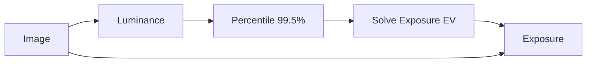

# 08 — Global, Regional, Histogram, and Statistical Operations

> **Reference status:** Formulas and sources are technical reference. Any Stack
> status in this file is a 2026-07-12 snapshot, not current state or a release
> backlog.

## Scope

These operations first summarize an image or region, then use the result. The key reusable building block is not “Auto Exposure”; it is a typed reduction such as minimum, maximum, sum, mean, variance, percentile, histogram, or cumulative distribution.

Stack already performs specialized analysis for scopes and RAW auto routines, but it does not expose general reduction values that can travel through graph wires. A future system should separate:

1. **Measurement:** produce a scalar, vector, histogram, covariance matrix, palette, transform, or mask.
2. **Decision:** convert that measurement into parameters.
3. **Application:** use ordinary pointwise, color, filter, or geometry operations.

This separation makes automatic tools inspectable without pretending the entire auto routine is one pixel formula.

## Canonical reductions

| ID | Operation | Canonical formula/algorithm | Scope | Output | Common uses | Cautions | Stack status, 2026-07-12 |
|---|---|---|---|---|---|---|---|
| `STAT.MIN` | Global/region minimum | $m=\min_{p\in R}x_p$ | `G` | Scalar/vector | Range analysis, black point | Outliers and NaN policy | **Missing** generic reduction |
| `STAT.MAX` | Global/region maximum | $M=\max_{p\in R}x_p$ | `G` | Scalar/vector | Peak, white point, normalization | One hot pixel can dominate | **Missing** generic reduction |
| `STAT.SUM` | Sum | $s=\sum_{p\in R}x_p$ | `G` | Scalar/vector | Mean, energy, integral metrics | Accumulator precision and overflow | **Missing** generic reduction |
| `STAT.MEAN` | Arithmetic mean | $\mu=\frac1N\sum x_p$ | `G` | Scalar/vector | Gray-world, normalization | Not robust to outliers | **Specialized/partial:** internal routines only |
| `STAT.GEOMEAN` | Geometric/log-average mean | $\exp(\frac1N\sum\log(\epsilon+x_p))$ | `G` | Scalar | Tone mapping and exposure statistics | Requires positive-domain and epsilon policy | **Missing** |
| `STAT.VARIANCE` | Variance | $\sigma^2=\frac1N\sum(x_p-\mu)^2$ | `G` | Scalar/vector | Noise/contrast estimation | Population vs sample convention; stable accumulation | **Missing** |
| `STAT.COVARIANCE` | Covariance | $\Sigma=\frac1N\sum(x_p-\mu)(x_p-\mu)^T$ | `G+V` | Matrix | Color matching, PCA, whitening | Color space and regularization matter | **Missing** matrix/value types |
| `STAT.MEDIAN` | Median | $Q_{0.5}(x)$ | `G` | Scalar/vector | Robust exposure/center | Exact vs approximate GPU selection | **Missing** |
| `STAT.PERCENTILE` | Percentile/quantile | $Q_q=F^{-1}(q)$ | `G` | Scalar/vector | Auto levels, robust peaks | Interpolation, ties, masked population | **Missing** |
| `STAT.HISTOGRAM` | Histogram | $h_k=\#\{p:x_p\in B_k\}$ | `G` | Histogram value | Scopes, levels, equalization | Bins, range, domain, channels, weighting | **Specialized:** Histogram scope; not reusable graph data |
| `STAT.CDF` | Cumulative distribution | $F_k=\sum_{j\le k}h_j/N$ | `G` | Curve/table | Equalization and matching | Discrete plateaus and masked pixels | **Missing** first-class curve/histogram value |
| `STAT.ENTROPY` | Entropy | $H=-\sum_kp_k\log p_k$ | `G` | Scalar | Texture/information metrics | Depends on binning and log base | **Missing** |
| `STAT.MOMENTS` | Image moments | $m_{pq}=\sum_{x,y}x^py^qI(x,y)$ | `G+C` | Scalars/vectors | Centroid, orientation, shape analysis | Coordinate origin and weight definition | **Missing** |
| `STAT.INTEGRAL` | Integral image | $S(x,y)=\sum_{i\le x,j\le y}I(i,j)$ | `G/I` | Image/data | Fast box statistics, local methods | Precision and tile boundaries | **Missing** |

## Global and local statistical tools

| ID | Operation | Canonical formula or staged algorithm | Scope | Required domain/data | What it does/common uses | Composition cautions | Stack status, 2026-07-12 |
|---|---|---|---|---|---|---|---|
| `STAT.NORMALIZE_RANGE` | Min–max normalize | $y=(x-m)/(M-m)$ then optional output remap | `G+P` | Scalar/RGB with chosen population | Fits values to a range | $M=m$ policy; outliers; per-channel vs linked | **Partial:** DataMath Remap uses supplied constants, not measured min/max |
| `STAT.NORMALIZE_MEAN` | Mean normalization | $y=x-\mu$ or $x\mu_t/\mu$ | `G+P` | Declared space | Center/scale image statistics | Additive and multiplicative forms differ | **Missing** generic measurement link |
| `STAT.STANDARDIZE` | Standardization | $z=(x-\mu)/\max(\sigma,\epsilon)$ | `G+P` | Scalar/vector | Analysis, model preprocessing | Produces signed/unbounded data; $\sigma=0$ policy | **Missing** |
| `STAT.HIST_STRETCH` | Histogram/percentile stretch | Remap chosen low/high percentiles to output endpoints | `G+P` | Luma or channels | Auto contrast/levels | Percentiles, clipping, channel coupling, encoding | **Missing** generic; RAW auto has private logic |
| `STAT.HIST_EQ` | Histogram equalization | $y=(L-1)F(x)$ using normalized CDF | `G+P` | Usually scalar/luma encoded range | Redistributes tones for contrast | Per-channel RGB equalization causes color shifts; bins/domain matter | **Missing** |
| `STAT.CLAHE` | Contrast-limited AHE | Tile histograms → clip/redistribute bins → CDF LUTs → interpolate mappings | `G+N+P` | Scalar/luma | Local contrast in uneven lighting | Tile grid, normalized clip limit, interpolation and borders are semantic | **Missing** |
| `STAT.OTSU` | Otsu threshold | Choose threshold maximizing between-class variance | `G` | Scalar histogram | Automatic binary segmentation | Assumes roughly separable histogram classes | **Missing** |
| `STAT.AUTO_EXPOSURE` | Auto exposure | Measure a named statistic and solve EV, e.g. $EV=\log_2(t/Y_{ref})$ | `G+P` | Scene-linear luminance and target policy | Automatic global brightness | Metering mask, highlight protection, target gray, and clipping are product decisions | **Specialized:** RAW auto routines; no reusable reduction/result node |
| `STAT.AUTO_CONTRAST` | Auto contrast | Select robust black/white points and remap/curve | `G+P` | Declared tone domain | Automatic range use | Not one formula; clipping percentiles and curve shape define it | **Missing** general node |
| `STAT.AUTO_LEVELS` | Automatic levels | Per-channel or linked percentile black/white plus midpoint policy | `G+P+V` | Encoded or chosen working space | Quick tonal/color correction | Per-channel form changes color balance; linked form does not neutralize casts | **Missing** |
| `STAT.GRAY_WORLD` | Gray-world correction | Channel gains $g_c=\mu_{target}/\mu_c$ | `G+V+P` | Linear or named RGB, scene assumption | Simple automatic white balance | Fails when average scene reflectance is not neutral | **Missing** generic; auto RAW may use other logic |
| `STAT.WHITE_PATCH` | White-patch correction | Scale channels from a selected/robust brightest neutral estimate | `G+V+P` | Linear sensor/RGB | White balance estimate | Brightest pixels may be colored, clipped, or specular | **Missing** |
| `STAT.AUTO_WB` | Automatic white balance | Estimate illuminant using a named method, then apply gains/adaptation | `G+V+P`, sometimes `L` | Scene RGB/RAW and method | Neutralizes illumination cast | Family name only; gray-world, gamut, statistics, metadata, and learned methods differ | **Specialized:** RAW workflows; not a reusable transparent algorithm |
| `STAT.CAST_DETECT` | Color-cast detection | Compare robust channel/chromaticity statistics to a neutral model | `G+V` | Named color space | Analysis and auto correction | Scene content can mimic an illuminant cast | **Missing** |
| `STAT.PEAK_SCENE` | Scene-referred peak detection | Robust max/percentile in scene luminance or EV | `G` | Scene-linear + exposure/reference scale | Tone-map parameter estimation | Speculars, hot pixels, and absolute vs relative scale | **Specialized:** View/RAW routines use private anchors |
| `STAT.GLOBAL_TONEMAP` | Global tone mapping | Compute global exposure/peak statistics then apply named monotone curve | `G+P` | Scene-linear HDR | HDR-to-display rendering | “Tone mapping” is a family; output transform also needs gamut/display encoding | **Partial:** View Transform is a compound with missing display OETF |
| `STAT.LOCAL_TONEMAP` | Local tone mapping | Decompose base/detail or estimate local adaptation, compress base, reconstruct | `G+N+I` | Scene-linear luminance/chroma | HDR compression with local detail | Halo, color restoration, scale selection, temporal stability | **Missing** general facility |
| `STAT.DYN_RANGE` | Dynamic-range compression | Apply global/local compressive mapping to a luminance measure | `G/P` or `N` | HDR scene values | Fit wide range into output | Broad umbrella; must name the curve/method | **Needs fix:** current HDR Compressor darkens shadows rather than meaningfully compressing highlights |
| `STAT.DEHAZE` | Dark-channel-prior dehaze | Estimate atmospheric light $A$ and transmission $t$; recover $J=(I-A)/\max(t,t_0)+A$ | `G+N+I` | Encoded/linear choice declared; outdoor-scene prior | Reduces atmospheric haze | Can fail on bright/sky regions; requires guided/refinement stage and assumptions | **Missing** |
| `STAT.PALETTE_KMEANS` | K-means palette | Alternate assignment to nearest centroid and centroid recomputation | `G+I+V` | Named color-distance space | Palette extraction, quantization | Seed, $k$, convergence, empty clusters, perceptual metric | **Partial:** Palette Rebuild uses a supplied palette; no true extraction |
| `STAT.PALETTE_DOM` | Dominant-color detection | Histogram peaks, clustering, or mixture model | `G+V` | Named color space | UI themes, palette summaries | Method determines result; transparent/background weighting | **Missing** |
| `STAT.PALETTE_REDUCE` | Automatic palette reduction | Estimate palette then map pixels, optionally dither | `G+I+P` | Output color space/code range | GIF/indexed output, stylization | Palette optimization and mapping are separate; dither last | **Partial:** fixed user palette reconstruction |
| `STAT.PERCENT_CLIP` | Percentile clipping | $y=\operatorname{clamp}(x,Q_l,Q_h)$ or remap after clipping | `G+P` | Scalar/vector | Robust normalization, auto levels | Clipping destroys data; channel policy | **Missing** generic |
| `STAT.HIST_MATCH` | Histogram matching | Univariate ideal $y=F_{ref}^{-1}(F_{src}(x))$ | `G+M+P` | Source/reference in chosen scalar/color basis | Match tone distributions | Discrete bins/ties and per-channel color artifacts; reference input required | **Missing** |
| `STAT.COLOR_MATCH` | Statistical color match | Named method; e.g. transfer mean/std in an opponent space or match covariance | `G+M+V+P` | Source/reference + named space | Make images share a global color character | Not universal; may need covariance regularization and gamut handling | **Missing** |
| `STAT.AUTO_CROP` | Automatic crop | Analyze borders/content/edges, select a rectangle, then crop | `G+C` | Image plus rule | Remove scanner borders or empty canvas | Analysis and geometry application should be separate | **Missing**; current Crop is fixed-canvas anyway |
| `STAT.SALIENCY` | Saliency estimation | Handcrafted contrast/region model or learned estimator | `G/N`, sometimes `L` | Image | Attention masks, crop/retarget guidance | “Saliency” is method-dependent and may be learned | **Missing** |
| `STAT.CONTENT_SCALE` | Content-aware scale | Energy/saliency analysis followed by seam/warp geometry | `G+C+I` | Image + optional protect masks | Retarget while preserving subjects | Cross-reference `GEO.CONTENT_SCALE`; global analysis is only one stage | **Missing** |
| `STAT.NOISE_EST` | Global noise estimation | Estimate variance/noise curve from flat/high-frequency regions | `G+N` | Scene-linear/raw plus noise model | Denoise parameter selection | Signal-dependent shot/read noise cannot be summarized by one scalar | **Specialized:** RAW/denoise routines have private estimates |
| `STAT.SHARPNESS` | Sharpness/focus score | Named metric such as gradient energy, Laplacian variance, or high-frequency power | `G+N` | Luma/scalar | Autofocus, stack selection, QA | Scale, noise, exposure, and metric affect ranking | **Missing** generic; FFT/scopes could support pieces |
| `STAT.FOCUS_SCORE` | Focus scoring | Region-weighted sharpness metric | `G+N` | Image + optional ROI | Focus stacking and capture selection | Overlaps sharpness; declare metric and ROI | **Missing** |

## Recommended graph model

Reductions should output typed values rather than hiding inside an Auto node:

That graph is inspectable, but the runtime may execute the reduction and exposure as optimized passes. The user should be able to wrap it in an Auto Exposure compound with only target gray, highlight percentile, and strength exposed.

## Stack-specific consequence

Stack needs first-class scalar/vector/histogram/curve outputs and a reduction scheduler. Reusing the current scope readback privately inside every new Auto node would recreate the same opacity the project is trying to remove. The reduction result and its population/domain must enter cache fingerprints and compound interfaces.

## Primary sources

- [OpenCV histogram functions](https://docs.opencv.org/4.x/d6/dc7/group__imgproc__hist.html)
- [Pizer et al., Adaptive Histogram Equalization and Its Variations](https://doi.org/10.1016/S0734-189X(87)80186-X)
- [Zuiderveld CLAHE reference implementation](https://www.realtimerendering.com/resources/GraphicsGems/gemsiv/clahe.c)
- [Otsu, A Threshold Selection Method from Gray-Level Histograms](https://doi.org/10.1109/TSMC.1979.4310076)
- [Reinhard et al., Photographic Tone Reproduction for Digital Images](https://doi.org/10.1145/566570.566575)
- [He, Sun, and Tang, Single Image Haze Removal Using Dark Channel Prior](https://doi.org/10.1109/TPAMI.2010.168)
- [Reinhard et al., Color Transfer between Images](https://doi.org/10.1109/38.946629)
