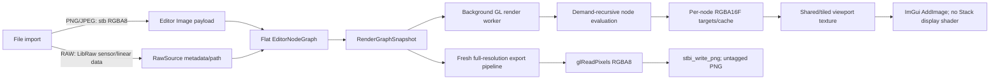

# Stack Image Math and Pipeline Audit

Audit date: 2026-07-12  
Repository: `D:\Program Development\Stack`  
Audited state: current working tree, including pre-existing modified, deleted, and untracked files

## Method and evidence notation

This is a behavior audit, not an implementation proposal. It traces registrations, call sites, serialization, graph snapshots, renderer dispatch, shaders, readback, and UI routes. The working tree was already substantially dirty before this audit; no pre-existing change was reverted or reformatted. The only repository file created by the audit is this report. Consequently, all findings describe the working tree on the date above, not necessarily clean `HEAD`.

Status tags mean:

- **[VERIFIED]** established from active code, build selection, a safe diagnostic, or an official API contract.
- **[INFERRED]** the evidence strongly implies the conclusion, but a runtime observation or external condition is missing.
- **[DOCUMENTED ONLY]** stated in project documentation but not independently proved here.
- **[UNKNOWN]** the repository does not establish the fact.
- **[CONTRADICTED]** two active surfaces disagree, or a name/documented behavior conflicts with implementation.

Citation path convention: paths are repository-relative. To keep large tables readable, an unqualified unique basename expands to its canonical location: graph model files are under `src/Editor/NodeGraph`; graph UI files under `src/Editor/NodeGraph/UI`; editor snapshot/render/persistence helpers under `src/Editor/Internal`; layer files under `src/Editor/Layers`; graph-renderer programs/evaluators/caches/resources/readback under `src/Renderer/Internal`; `GLHelpers.cpp` and `RenderPipeline.h` are under `src/Renderer`; RAW files are under `src/Raw`; and `GpuFft.cpp` is `src/Renderer/Frequency/GpuFft.cpp`. The compact source index in Section 22 gives the full paths for every primary owner. **[VERIFIED]**

Read-only verification used the already-built `build\Stack.exe --validate-layer-registry` and `build\StackGraphBehaviorTests.exe`; both exited successfully. **[VERIFIED]** The binaries were newer than the registry and frequency sources inspected, but the application was not rebuilt, so those runs do not certify every later dirty-working-tree edit. `docs/stack-documentation/Current/raw-tab-ui-overhaul/auto-starting-point/implementation-progress.md:120-139` also records earlier successful checks, but that is **[DOCUMENTED ONLY]**.

## Section 1 — Executive ground truth

Stack today is a C++17 Windows desktop image editor with a GLFW/OpenGL 4.3 core renderer, Dear ImGui docking UI, a flat typed node graph, stb-based ordinary image I/O, and LibRaw-based RAW decoding. **[VERIFIED]** The executable is assembled from recursively globbed `src` files (`cmake/StackSources.cmake:4-15`, `CMakeLists.txt:153-156`), starts at `src/main.cpp:35-57`, initializes the app/UI/renderer at `src/App/AppShell.cpp:1178-1342`, and enters the editor through `src/Editor/EditorModule.cpp:860-894`.

The ordinary default numerical/color path is: stb decodes PNG/JPEG to bottom-left-origin RGBA8 channel values; OpenGL uploads those bytes to an unsized, normalized, non-sRGB `GL_RGBA` texture; graph nodes render separate full-canvas passes into `GL_RGBA16F`; no automatic sRGB decode, ICC transform, color-state descriptor, or general display encoding is applied; the viewport submits the resulting texture directly to ImGui; export rerenders, reads it as RGBA8, flips it, and writes an untagged 8-bit RGBA PNG. **[VERIFIED]** RAW differs: LibRaw supplies sensor/linear data, Stack normalizes/demosaics and converts camera RGB toward linear-sRGB primaries in `GL_RGBA16F`, and a View Transform compresses values to display range but still emits display-mapped *linear* values without an sRGB OETF. **[VERIFIED]** These paths then share the same untyped `Image` socket.

Current support for “math Legos” is mixed:

- **[VERIFIED / supported]** Flat DAG connections, cycle prevention, demand evaluation, fan-out reuse, scalar/image broadcasting rules, pointwise Data Math variants, channel split/combine, masks, multi-input operations, reusable copied presets, node-specific multipass work, and GPU FFT machinery already exist.
- **[VERIFIED / partial]** Five coarse socket types, topology-inferred channel/scene state, a selection of reusable shader programs, curves stored inside layer payloads, and visual node groups cover part of the model but do not form a semantic shader graph.
- **[VERIFIED / absent]** There is no edge descriptor for color/alpha/range/resolution, general vector/matrix/curve value type, executable or nested compound graph, shared compound definition/instance model, general pass fusion, general target pool, version-enforced graph migration, or generic reduction/convolution facility.

Highest-risk findings:

| Severity | Ground truth |
|---|---|
| CRITICAL | **[VERIFIED]** Encoded ordinary RGB and scene-linear RAW RGB travel through the same `SocketType::Image` with no color-state descriptor (`NodeGraphTypes.h:297-324`, `NodeGraphPayloads.h:18-63`). |
| HIGH | **[VERIFIED]** View Transform range-maps RAW but does not apply a display OETF, while the viewport has no Stack display shader or sRGB framebuffer conversion (`ToneLayerRendering.cpp:313-400`, `EditorViewport.cpp:2167-2229`). |
| HIGH | **[VERIFIED]** Imported ICC/gAMA/cHRM/sRGB metadata is not retained, and export emits no such metadata (`stb_image.h:5078-5256`, `stb_image_write.h:1180-1207`). |
| HIGH | **[CONTRADICTED]** Mix “Alpha Over” is neither correct straight-alpha nor premultiplied-alpha source-over because the backdrop RGB contribution omits backdrop alpha (`RenderPipelinePrograms.cpp:185-221`). |
| HIGH | **[VERIFIED]** Alpha convention is nowhere declared; View Transform can change transparent non-black pixels to alpha 1 (`ToneLayerRendering.cpp:396-400`). |
| HIGH | **[VERIFIED]** RAW-workspace preview quantizes through RGBA8 readback/re-upload while ordinary preview can stay RGBA16F (`EditorRenderWorker.cpp:2188-2195`, `EditorModuleRendering.cpp:1159-1186`). |
| MEDIUM | **[VERIFIED]** Each normal layer is a full-image pass and target; masks add another pass, with no generic fusion (`RenderPipelineGraphLayerNode.cpp:13-93`). |
| MEDIUM | **[VERIFIED]** Persistent graph textures have no byte budget/LRU and disconnected-but-present nodes remain cached (`GraphTextureCache.cpp:81-109`). |
| MEDIUM | **[CONTRADICTED]** Several visible nodes are placeholders or semantically misleading: MFSR passes through, Spectrum Analyzer has no evaluator, HDR Compressor darkens shadows, and “Error Diffusion” is not recursive diffusion. |
| MEDIUM | **[CONTRADICTED]** Graph JSON writes version 3 but does not enforce it; unknown kinds fall back to Layer and invalid links can be silently discarded (`EditorNodeGraphSerializer.cpp:132-272,591-672`). |

## Section 2 — Repository and runtime architecture map

### Active targets and modules

| Area | Active responsibility and evidence |
|---|---|
| `src/main.cpp` | **[VERIFIED]** Process entry, executable working directory, validation CLI, `AppShell` lifetime (`:35-57`). |
| `src/App` | **[VERIFIED]** GLFW/OpenGL 4.3 context, ImGui docking/viewports, application run loop and module lifecycle (`AppShell.cpp:1178-1342,1481,3640-3675`). |
| `src/Editor` | **[VERIFIED]** Project/editor state, graph mutation/snapshot, UI, async render submission, import/export (`EditorModule.cpp:739-894`). |
| `src/Editor/NodeGraph` | **[VERIFIED]** Flat graph model, node definitions/catalog, compatibility, layout, JSON serialization and copied presets. |
| `src/Editor/Layers` | **[VERIFIED]** Registry-backed editing layers, parameters/UI/serialization, embedded GLSL, and occasional CPU preprocessing. |
| `src/Renderer` | **[VERIFIED]** GL resources, recursive graph evaluator, shader programs, node dispatch, caches, readback, and legacy sequential pipeline. |
| `src/Raw` | **[VERIFIED]** LibRaw decode, RAW metadata/recipe, demosaic/camera-to-working transforms, RAW workspace support. |
| `src/Persistence` | **[VERIFIED]** MSTK v2 sectioned project container (`StackBinaryFormat.cpp:21-36,808-915`). |
| `tools` | **[VERIFIED]** Validation and graph-behavior executables; they are built explicitly but not registered with CTest (`CMakeLists.txt:363-413`). |

The main `Stack` target uses C++17, GLFW 3.4, Dear ImGui docking, OpenGL, and optional pinned LibRaw (`CMakeLists.txt:1-7,34-105,311-354`). **[VERIFIED]** Current `build/CMakeCache.txt` has LibRaw, custom titlebar, and graph tests enabled. stb_image/stb_image_write decode/write ordinary raster files; stb_truetype rasterizes generated text; nlohmann-style JSON payloads are embedded in project sections. **[VERIFIED]** LibRaw is opened/unpacked directly rather than using `dcraw_process` (`LibRawDecoder.cpp:1021-1077`).

Node creation is split: registry layer descriptors/factories live at `src/Editor/LayerRegistry.cpp:59-177`; non-layer catalog variants are hard-coded in `src/Editor/NodeGraph/EditorNodeGraphDefinitions.cpp:629-739`; the browser dispatches creation in `src/Editor/NodeGraph/UI/EditorNodeGraphUINodeBrowser.cpp:278-371`; graph payloads are snapshotted in `src/Editor/Internal/EditorModuleGraphSnapshot.cpp:254-343`; recursive renderer dispatch is in `src/Renderer/Internal/RenderPipelineGraphExecution.cpp:922-1373`; graph JSON is written/read in `src/Editor/NodeGraph/EditorNodeGraphSerializer.cpp:132-672`. **[VERIFIED]** The UI uses generic graph controls plus layer-specific `RenderUI` implementations (`src/Editor/Layers/LayerBase.h:45-78`, `src/Editor/NodeGraph/UI/EditorNodeGraphUINodes.cpp:714-1353`).

Renderer resource ownership is split between the background worker/context and UI context. **[VERIFIED]** The worker creates a hidden shared OpenGL context (`EditorRenderWorker.cpp:1501-1536`); ordinary output is copied to a shared RGBA16F texture (`RenderPipelineResources.cpp:330-365`), while caches and temporary targets are owned by `RenderPipeline` (`RenderPipeline.h:188-194`). FBOs are generally created/deleted per pass and graph targets freshly allocated (`GraphRenderTargets.cpp:5-30`).

Preview and export are parallel executions, not one retained final raster. **[VERIFIED]** The worker publishes preview results (`EditorRenderWorker.cpp:2059-2203`); export constructs a new pipeline and executes the graph at full resolution (`EditorModuleRendering.cpp:335-404`).

Legacy/confusing paths:

- **[VERIFIED]** `RenderPipeline::Execute`/`ExecuteMasked` remain as sequential ping-pong compatibility/fallback (`RenderPipeline.cpp:3-195`), used when a snapshot graph is empty (`EditorModuleRendering.cpp:770-780`).
- **[VERIFIED]** Nine old aggregate layer file pairs are excluded, while split layer sources are active (`cmake/StackSources.cmake:13-15`).
- **[CONTRADICTED]** `BUILDING.md:157-170` refers to `bake_shaders` and `src/RenderTab/Shaders`; the active build bakes assets/icons/fonts and shaders are C++ string literals.
- **[VERIFIED]** `Composite` is a serialized `NodeKind` but has no palette entry/sockets; a separate legacy CPU composite module remains.

## Section 3 — End-to-end image pipeline traces

### Ordinary PNG/JPEG

| Transition | Owner / processor | Implemented contract and loss |
|---|---|---|
| File → CPU | `RequestLoadSourceImage`, `DecodeImageFromFile`; CPU | **[VERIFIED]** `stbi_load(...,4)` gives interleaved bottom-left RGBA8; absent alpha becomes 255; source channel count is recorded. A 16-bit PNG through this API is reduced to 8-bit (`EditorModuleGraphImageNodes.cpp:20-47`, `stb_image.h:1190-1203,1260-1273`). Transfer/primaries/white point/alpha convention are unrecorded. |
| CPU → graph | `ImagePayload`; CPU | **[VERIFIED]** Stores path, encoded PNG bytes, RGBA bytes, dimensions/channels, runtime preview bytes/fingerprint; no color/range/alpha descriptor (`NodeGraphPayloads.h:18-41`). Values remain exactly the decoded encoded channel values. |
| Snapshot → GPU | `BuildGraphSnapshotForTimelineFrame`, `evalImage` | **[VERIFIED]** Shared byte payload uploads with external RGBA/`GL_UNSIGNED_BYTE` to unsized internal `GL_RGBA`, normalized sampling, linear filter, clamp-to-edge (`EditorModuleGraphSnapshot.cpp:275-288`, `GLHelpers.cpp:124-155`). **[UNKNOWN]** exact GPU component allocation because the internal format is unsized and never queried. |
| Node passes | recursive evaluator; GPU | **[VERIFIED]** Each generic image node renders to RGBA16F/float full-canvas target; values can preserve negative/>1 until a shader clamps (`GLHelpers.cpp:158-183`, `RenderPipelineGraphLayerNode.cpp:13-60`). The representation remains undeclared. |
| Graph output | `ExecuteGraphImpl`; GPU | **[VERIFIED]** requested output is recursively evaluated/cached, and its texture becomes `m_OutputTexture` (`RenderPipelineGraphExecution.cpp:1080-1139,1335-1353`). |

**[VERIFIED]** There is no confirmed nonlinear-to-linear conversion in this default path. Imported RGB remains encoded from stb decode through source upload and through any pass that merely copies or performs numeric math. It stops being meaningfully classifiable as the same encoding when a nonlinear edit changes the values, but Stack never changes or records its semantic tag. Explicit LUT transfer modes are the only ordinary-image encode/decode operations found.

### RAW import and development

| Transition | Owner / processor | Implemented contract and loss |
|---|---|---|
| File → RAW node | `AddGraphRawChainFromFile`; CPU | **[VERIFIED]** LibRaw metadata/path are retained in `RawSource`; ordinary imported chain is `RawSource → RawDecode → ToneCurve → ViewTransform → Output` (`EditorModuleGraphImageNodes.cpp:393-408`, `EditorModuleGraphProcessingNodes.cpp:542-585`). |
| Decode/unpack | `LibRawDecoder`; CPU | **[VERIFIED]** `open_file` + `unpack`; mosaic is one `uint16_t` sensor sample/location; linear DNG may be 3/4-channel uint16 or float; camera/CFA/level/WB/matrix metadata is captured (`LibRawDecoder.cpp:793-867,1021-1209`). |
| Mosaic upload | `RawGpuPipeline`; GPU | **[VERIFIED]** `GL_R16UI`, nearest/clamp; normalization is `(sample-channelBlack)/max(1,white-channelBlack)` without clamp (`RawGpuPipeline.cpp:122-145,1155-1189`). |
| RAW processing | `RawGpuPipeline::Render`; GPU | **[VERIFIED]** demosaic/highlight work → WB multiplication → cleanup → camera transform → `2^EV` exposure → optional per-channel curve → alpha 1; output RGBA16F (`RawGpuPipeline.cpp:573-617,1484-1518,1705-1744`). DNG matrices compose toward linear sRGB; LibRaw `rgb_cam` is fallback (`:913-1092`). **[CONTRADICTED]** renderer always uploads Bilinear demosaic mode regardless of stored setting (`:1748`). |
| Tone/view | Tone Curve and View Transform; GPU | **[VERIFIED]** Tone Curve may preserve scene values; View Transform compresses/clamps to `[0,1]` but does not sRGB-encode (`ToneLayerRendering.cpp:86-257,313-400`). The RAW workspace calls its result `display-mapped-linear-srgb` (`RenderPipelineGraphRawDevelopmentNode.cpp:785-805`). |

**[VERIFIED]** Confirmed linear/nonlinear conversions are limited to RAW camera-to-linear-sRGB matrix work and optional LUT sRGB/gamma encode/decode. A matrix changes primaries, not transfer encoding. There is no later general linear-sRGB-to-display-sRGB OETF in the active RAW path.

### Multi-node branch and intermediate

For `Image → Brightness → Gaussian Blur → masked Contrast → Output`: **[VERIFIED]** the evaluator recursively requests Output, then Contrast, its image/mask, Blur, Brightness, and source; each layer allocates an RGBA16F target and fullscreen FBO pass (`RenderPipelineGraphExecution.cpp:1080-1353`, `RenderPipelineGraphLayerNode.cpp:13-60`). Gaussian Blur dynamically samples a `(2r+1)^2` neighborhood into one target (`SplitBlurLayers.cpp:19-66`). Contrast makes another target, and its connected mask triggers a separate RGBA interpolation pass (`RenderPipelineGraphLayerNode.cpp:81-93`). Per-run maps share upstream results across fan-out; persistent fingerprints reuse unchanged results (`RenderPipelineGraphExecutionHelpers.h:85-102`, `RenderPipelineGraphExecution.cpp:1111-1139`). There is no fusion or target aliasing. Aspect/extent is the single reference canvas; native-size mismatch is implicitly resampled by normalized texture sampling. **[VERIFIED]**

### Viewport

**[VERIFIED]** Ordinary output is shared as RGBA16F or tiled RGBA16F; RAW-workspace output instead goes through `GetOutputPixels` RGBA8 and re-upload (`EditorRenderWorker.cpp:2060-2203`, `EditorModuleRendering.cpp:1159-1186`). `EditorViewport` calls ImGui `AddImage`/`AddImageRounded` directly with vertically inverted UVs (`EditorViewport.cpp:2167-2229`). No Stack viewport shader, `GL_SRGB*` source format, or `GL_FRAMEBUFFER_SRGB` enable exists. **[UNKNOWN]** The OS/driver/window-system monitor interpretation is not represented or queried.

### Export

**[VERIFIED]** Export builds a fresh full-resolution pipeline, resolves the timeline graph/reference source, executes the graph, then calls `glReadPixels(GL_RGBA, GL_UNSIGNED_BYTE)` and vertically flips to top-left (`EditorModuleRendering.cpp:335-404`, `RenderPipelineReadback.cpp:167-228`). That readback is the definitive float/HDR-to-RGBA8 clamp/quantization point under the OpenGL conversion contract ([Khronos glReadPixels](https://registry.khronos.org/OpenGL-Refpages/gl4/html/glReadPixels.xhtml)). `stbi_write_png` emits an 8-bit RGBA PNG with IHDR/IDAT/IEND but no ICC/gAMA/cHRM/sRGB chunk (`EditorModulePersistence.cpp:845-966`, `stb_image_write.h:1180-1207`). Export reproduces graph math but not proxy/tiled/preview resource handling. **[CONTRADICTED]** Preview and export are therefore not bit-identical contracts.

## Section 4 — Current image-buffer contract (as implemented)

| Contract | CPU/GPU representation | Range/color/alpha/origin | Ownership and transition |
|---|---|---|---|
| Ordinary source | CPU RGBA8 interleaved; GPU normalized unsized `GL_RGBA` from `GL_UNSIGNED_BYTE` | **[VERIFIED]** `[0,255]`/`[0,1]`; encoded/primaries/white point unknown; straight-looking but undeclared alpha; CPU rows bottom-left after stb flip | `ImagePayload`/shared bytes; source texture cached. Exact GPU precision **[UNKNOWN]** (`GLHelpers.cpp:124-155`). |
| Generic image intermediate | GPU `GL_TEXTURE_2D`, `GL_RGBA16F`, float sampling, linear/clamp-edge | **[VERIFIED]** binary16 can represent negative/>1; semantics and alpha undeclared; bottom-left GL convention | Per-node persistent cache plus per-run maps; target/FBO created per pass (`GLHelpers.cpp:158-183`, `GraphTextureCache.cpp:81-109`). |
| RAW mosaic | CPU uint16; GPU `GL_R16UI` integer/nearest | **[VERIFIED]** sensor code values and CFA metadata; no alpha | Reloaded/cached `RawImageData`; normalized/demosaiced into RGBA16F (`RawGpuPipeline.cpp:1155-1189`). |
| RAW linear RGB | CPU uint16/float for linear DNG; GPU RGBA16F | **[VERIFIED]** intended linear-sRGB primaries after camera matrix; D50 DNG conversion/fallback; alpha 1; negative/>1 possible | RAW stage cache; then indistinguishable from generic Image wire (`RawGpuPipeline.cpp:913-1092,1392-1518`). |
| Mask | Most GPU masks are RGBA16F with scalar copied to RGB, alpha 1; custom raster uploads R32F | **[VERIFIED]** consumers use/clamp `.r`; CPU custom-mask values are floats | Same graph texture machinery; no distinct range descriptor (`RenderPipelinePrograms.cpp:76-159`, `RenderPipelineCustomMaskPass.cpp:281`). |
| Frequency | GPU complex `GL_RG32F` scratch/spectrum; graph shell still advertises Image/Mask | **[VERIFIED]** zero-padded complex data; luma/default channel; alpha/color often lost | Node-specific `GpuFft` scratch/cache, not generic RGBA16F contract (`GpuFft.cpp:313-445`). |
| Ordinary viewport | Shared/tiled RGBA16F texture | **[VERIFIED]** direct numeric sampling by ImGui; no declared display transform | Worker → shared UI context. |
| RAW-workspace viewport | CPU top-left RGBA8 readback, flipped back, GPU byte texture | **[VERIFIED]** clipped/quantized before display | Worker → CPU → UI upload. |
| Export | CPU top-left RGBA8 → PNG | **[VERIFIED]** untagged, ambiguous transfer/primaries/alpha | Fresh pipeline; asynchronous stb writer. |

The graph owns one global/reference width and height (`EditorModuleRendering.cpp:691-769`); generic targets use that extent. **[VERIFIED]** There is no edge resolution descriptor or explicit mismatch policy. Linear sampling and clamp-to-edge provide implicit resampling/border behavior. Coordinate conventions vary by boundary: stb is flipped on load to bottom-left, GL works bottom-left, viewport reverses UV Y, and readback flips to top-left. **[VERIFIED]**

Metadata is attached to source/node payloads, not image resources or links. **[VERIFIED]** `SocketDefinition` has only endpoint/type/label/optional/visible (`NodeGraphTypes.h:316-324`), and `Link` has integer node/socket endpoints (`NodeGraphModelTypes.h:60-65`). The viewport interpretation is not a separate stored state: a View Transform is an ordinary graph layer and output texture interpretation is implicit. **[VERIFIED]**

OpenGL specifies that normalized unsigned-byte uploads map to normalized values, while sRGB decode requires an sRGB internal format; Stack uses neither a sized nor sRGB source format ([Khronos glTexImage2D](https://wikis.khronos.org/opengl/GLAPI/glTexImage2D)). **[VERIFIED]** The exact bit allocation chosen for unsized `GL_RGBA` remains **[UNKNOWN]** because Stack does not query it.

## Section 5 — Color management and display behavior

| Question | Finding |
|---|---|
| PNG/JPEG interpretation | **[VERIFIED]** Treated as untagged RGBA8 channel values. The bundled stb decoder does not retain ICC/gAMA/cHRM/sRGB state in Stack’s payload ([official stb_image](https://github.com/nothings/stb/blob/master/stb_image.h); `NodeGraphPayloads.h:18-41`). |
| Automatic linearization | **[VERIFIED]** None for ordinary images. Nonlinear values remain numerical inputs to edits. |
| Primaries/white point/transfer separation | **[VERIFIED]** Absent from generic image/wire types. RAW camera transforms and LUT options are isolated exceptions. |
| Explicit transfer math | **[VERIFIED]** LUT supports None, sRGB Encode/Decode, Gamma 2.2 Encode/Decode with explicit shader formulas (`LutData.h:20-59`, `RenderPipelinePrograms.cpp:241-364`). |
| Matrix/gamut/chromatic adaptation | **[VERIFIED]** RAW DNG/camera matrices target linear sRGB; View Transform contains heuristic gamut compression. No general RGB color transform or ICC engine exists. **[UNKNOWN]** Whether every camera fallback is colorimetrically accurate. |
| LUT domain/color expectation | **[VERIFIED]** `.cube` domain min/max and 1D/3D data are honored; domain lookup clamps. UseMode and pre/post transfer defaults exist, but execution order is not forced and LUT files do not declare input/output primaries/white point (`LutData.h:20-165`, `RenderPipelinePrograms.cpp:314-364`). |
| sRGB OpenGL state | **[VERIFIED]** No `GL_SRGB*` texture or `GL_FRAMEBUFFER_SRGB` call was found in active `src`. Such framebuffer conversion would only apply when enabled for an sRGB-capable destination ([Khronos framebuffer behavior](https://wikis.khronos.org/opengl/Framebuffer)). |
| Viewport transform | **[VERIFIED]** None beyond whatever nodes produced; ImGui samples the output directly. |
| HDR/negative survival | **[VERIFIED]** RGBA16F can retain it, but many shaders clamp locally; View Transform clamps, and readback/export quantizes. |
| Export color conversion | **[VERIFIED]** None: it writes processed numeric values as untagged RGBA8 PNG. |
| CPU/GPU equivalence | **[CONTRADICTED]** Main edits are GPU; CPU preview/readback/composite/denoise paths use separate math and precision. No parity suite proves equivalence. |

Terms are local rather than system-wide contracts. **[VERIFIED]** “linear” in RAW code means camera-transformed scene values in linear-sRGB primaries; “sRGB” appears in RAW matrices or explicit LUT transfer options; “display” in View Transform means range-mapped linear RGB, not necessarily encoded framebuffer-ready RGB; “gamma” is an explicit LUT option or an operation-local exponent. No generic buffer records these meanings.

The View Transform uses Rec.709/sRGB-primary luma, black/white EV anchors, exposure, contrast/toe/shoulder range mapping, hue preservation, gamut compression, saturation, and final clamp (`ToneLayerRendering.cpp:313-400`). **[VERIFIED]** It is a tone/view curve but not an output encoding. Thus an ordinary encoded image can look plausible when copied unchanged, while RAW range-mapped linear values are fed through the same unmanaged viewport. **[INFERRED / HIGH]** The visible RAW result will be inconsistent with a correct sRGB OETF unless an external framebuffer/OS behavior happens to compensate; Stack does not request or record such compensation.

Silent assumptions, separate from declarations:

- **[VERIFIED]** Rec.709 luma coefficients are applied to whichever numeric RGB arrives, even when ordinary RGB is likely encoded.
- **[VERIFIED]** Blend modes and most edits operate in an undeclared space; no automatic conversion surrounds them.
- **[VERIFIED]** RAW linear-sRGB state is lost when represented as a generic Image texture.
- **[UNKNOWN]** Default framebuffer format, OS compositor behavior, monitor profile, and actual display calibration.
- **[VERIFIED]** Export consumers must guess the PNG’s transfer/primaries because no chunks are emitted.

## Section 6 — Complete current node inventory

### Inventory reconciliation and common contracts

**[VERIFIED]** `LayerType` defines 57 values, the registry has 55 descriptors, and the browser exposes 52: 36 Stable, 13 NeedsFix, and 3 Experimental. AlphaHandling (Deprecated), ToneEqualizer (Hidden), and TextOverlay (Hidden) are registered but not browser-visible; `ToneMapper` and `ShadowsHighlights` are compiled/serializable classes with enum values but have no registry descriptor/factory/browser route (`LayerRegistry.h:11-71`, `LayerRegistry.cpp:59-123`). The catalog has 115 discoverable entries: 52 visible layers plus 63 explicit utility/variant entries (`EditorNodeGraphDefinitions.cpp:629-739`).

All registry layer rows below have `Image` input, optional `Mask`, and `Image` output; channel-stream topology can replace the image input with R/G/B/A `Mask` pins. **[VERIFIED]** They are mixed CPU/UI + GPU, normally one RGBA16F fullscreen pass; a connected graph mask adds a second blend pass. “Layer color” means the UI’s hard-coded Layer-family header/link styling, not a distinct color per registry category. Category strings are descriptor data, but visual family colors are selected by `NodeKind` (`src/Editor/NodeGraph/UI/EditorNodeGraphUIVisuals.cpp:36-79`). Parameter defaults not explicitly listed below remain **[UNKNOWN]** here rather than guessed; their serialized class payload is authoritative.

### Registry-backed layers (complete)

| UI / internal ID | Category; lifecycle | Source; parameters/defaults and controls | Implemented algorithm / classification |
|---|---|---|---|
| Crop / `Crop` | Transform / Canvas; NeedsFix | `SplitTransformLayers.{h,cpp}`; crop sides, sliders | **[VERIFIED]** Fixed-canvas coordinate crop/mask, not raster resize; geometry convenience; one sampling pass. |
| Rotate / `Rotate` | Transform / Canvas; NeedsFix | same; angle slider | **[VERIFIED]** Inverse-coordinate rotation in fixed canvas, linear/clamp sampling; geometry convenience. |
| Flip / `Flip` | Transform / Canvas; Stable | same; horizontal/vertical toggles | **[VERIFIED]** UV reflection; geometry primitive-like. |
| Expand Canvas / `Expander` | Transform / Canvas; Experimental | `ExpanderLayer.{h,cpp}`; padding/fill controls | **[CONTRADICTED]** Simulates padding inside unchanged raster; does not expand extent (`LayerRegistry.cpp:64`); geometry convenience. |
| Background Remover / `BackgroundPatcher` | Composite; NeedsFix | `BackgroundPatcherLayer.{h,cpp}`; target/tolerance/matte controls, advanced UI | **[VERIFIED / partial]** Color-distance matte/removal path; brush/flood/AA/patch state incomplete and brush/flood forced off (`BackgroundPatcherLayer.cpp:20-120,160-161`); compound matte. |
| Brightness / `Brightness` | Color; Stable | `SplitAdjustmentsLayers.{h,cpp}`; amount default 0 slider | **[VERIFIED]** `rgb += amount`, final clamp; pointwise scalar shorthand. |
| Contrast / `Contrast` | Color; Stable | same; amount default 0 slider | **[VERIFIED]** `(rgb-.5)*(1+amount)+.5`, final clamp; pointwise shorthand. |
| Saturation / `Saturation` | Color; NeedsFix | same; amount default 0 slider | **[VERIFIED]** Rec.709 luma then `mix(gray,rgb,1+amount)`; vector/color shorthand. |
| Warmth / `Warmth` | Color; NeedsFix | same; amount default 0 slider | **[VERIFIED]** `R += .1*amount; B -= .1*amount`; channel shorthand, not chromatic adaptation. |
| Sharpen / `Sharpen` | Color; Stable | same; amount default 0 and threshold default 0 sliders | **[VERIFIED]** Four-neighbor unsharp with smooth threshold; neighborhood convenience. |
| 3-Way Color Grade / `ColorGrade` | Color; Stable | `ColorGradeLayer.{h,cpp}`; three RGB hue wheels default white; strength 100 | **[VERIFIED]** Rec.709 tonal weights, shadow/mid additive chroma and multiplicative highlight chroma, clamp; compound color convenience. |
| HDR Compressor / `HDR` | Color; NeedsFix | `HDRLayer.{h,cpp}`; amount/tolerance sliders | **[CONTRADICTED]** For luma below tolerance multiplies by `1-(amount/100)*(1-L/tolerance)`, darkening shadows, then clamps; name/description does not match compressor/recovery semantics. |
| Tone Curve / `ToneCurve` | Color / Tone; NeedsFix | `ToneLayers.h`, `ToneCurveLayer*.cpp`, `ToneLayerRendering.cpp`; curve editor, scene/display mode, foundation/local EV controls | **[VERIFIED]** CPU-built 256×1 RGBA16F LUT plus optional scene/local EV math; one or more node-specific passes; compound tone operation. |
| View Transform / `ViewTransform` | Color / Tone; Stable | `ToneLayers.{h,cpp}`, `ToneLayerRendering.cpp`; exposure 0, black EV −8, white EV 4, middle gray .18, shoulder .45, toe .18, contrast/saturation 1, preserve hue | **[VERIFIED]** scene-range tone mapping/gamut compression/final clamp, no OETF; compound view operation. |
| Box Blur / `BoxBlur` | Blur / Focus; Stable | `SplitBlurLayers.{h,cpp}`; amount default 2, slider .5–16 | **[VERIFIED]** dynamic square box kernel, one pass; neighborhood convenience. |
| Gaussian Blur / `GaussianBlur` | Blur / Focus; Stable | same; amount default 2, slider .5–16 | **[VERIFIED]** dynamic square Gaussian with radius `int(max(1,amount))`, sigma `amount/2`; one nonseparable pass. |
| Classical RGB Denoise / `ClassicalRgbDenoise` | Blur / Focus; Experimental | `ClassicalRgbDenoiseLayer.{h,cpp}`; Run/advanced candidate controls | **[VERIFIED / partial]** CPU offline candidate sweep/scoring/winner blend/detail anchor, cached then uploaded; compound CPU prototype. |
| Scene Denoise / `SceneDenoise` | Blur / Focus; Stable | `SceneDenoiseLayer.{h,cpp}`; luminance/chroma/detail controls | **[VERIFIED]** scene-linear node-specific multipass luminance/chroma cleanup, intended pre-tone; compound denoise. |
| Linear RGB Neural Denoise / `LinearRgbNeuralDenoise` | Blur / Focus; Experimental | `LinearRgbNeuralDenoiseLayer.{h,cpp}`; model-pack path, Run/Refresh advanced controls | **[VERIFIED / conditional]** external ONNX-model workflow with cached result; unavailable without a compatible pack; model-based compound. |
| Utility NLM Denoise / `NonLocalMeansDenoise` | Blur / Focus; Stable | `SplitDenoisingLayers.{h,cpp}`; search/strength sliders | **[VERIFIED]** bounded neighborhood similarity weighting; one shader pass; neighborhood convenience. |
| Utility Median Denoise / `MedianDenoise` | Blur / Focus; Stable | same; radius/strength controls | **[VERIFIED]** local sample ordering/median approximation; neighborhood convenience. |
| Utility Mean Denoise / `MeanDenoise` | Blur / Focus; Stable | same; radius/strength controls | **[VERIFIED]** local box mean; neighborhood convenience. |
| Bilateral Filter / `BilateralFilter` | Blur / Focus; Stable | `BilateralFilterLayer.{h,cpp}`; spatial/range/strength sliders | **[VERIFIED]** neighborhood weights combine spatial and color distance; edge-preserving convenience. |
| Noise / `Noise` | Texture / Generate; Stable | `NoiseLayer.{h,cpp}`; type combo (13 exposed), intensity/scale/seed and advanced A/B/C | **[CONTRADICTED]** procedural noise shader implements modes 0–10; Voronoi/Crosshatch fall through, and A/B/C are not serialized (`NoiseLayer.cpp:18-202,235-300`); special-purpose generator/effect. |
| Tilt-Shift Blur / `TiltShiftBlur` | Blur / Focus; Stable | `TiltShiftBlurLayer.{h,cpp}`; center/angle/width/blur controls and guides | **[VERIFIED]** spatially weighted directional blur; neighborhood/geometry convenience. |
| Optical Blur / `HankelBlur` | Blur / Focus; Stable | `HankelBlurLayer.{h,cpp}`; radius/optical controls | **[VERIFIED]** Hankel/optical radial-kernel approximation; neighborhood special-purpose. |
| Ordered Dither 8×8 / `OrderedDither8x8` | Color; Stable | `SplitDitherLayers.{h,cpp}`; levels/amount controls | **[VERIFIED]** Bayer 8×8 threshold perturbation and quantization; pointwise-with-coordinate shorthand. |
| Error Diffusion Dither / `ErrorDiffusionDither` | Color; Stable | same; levels/amount controls | **[CONTRADICTED]** local neighbor/noise approximation, not sequential recursive error diffusion (`SplitDitherLayers.cpp:93-102`). |
| White Noise Dither / `WhiteNoiseDither` | Color; Stable | same | **[VERIFIED]** pseudorandom threshold perturbation then quantization. |
| Ordered Dither 4×4 / `OrderedDither4x4` | Color; Stable | same | **[VERIFIED]** Bayer 4×4 threshold quantization. |
| Ordered Dither 2×2 / `OrderedDither2x2` | Color; Stable | same | **[VERIFIED]** Bayer 2×2 threshold quantization. |
| Interleaved Gradient Dither / `InterleavedGradientDither` | Color; Stable | same | **[VERIFIED]** coordinate hash/interleaved-gradient perturbation then quantization. |
| Halftone / `Halftoning` | Color; Stable | `HalftoningLayer.{h,cpp}`; dot scale/angle/amount controls | **[VERIFIED]** coordinate/luma dot-screen pattern; spatial stylization. |
| Cell Shading / `CellShading` | Color; NeedsFix | `CellShadingLayer.{h,cpp}`; band/edge controls | **[VERIFIED]** luma band quantization with stylized edge/light treatment; compound stylization. |
| Palette Rebuild / `PaletteReconstructor` | Color; NeedsFix | `PaletteReconstructorLayer.{h,cpp}`; palette/count/rebuild advanced UI | **[VERIFIED]** reduced-palette reconstruction; full-image/global-ish special node, not a scalar primitive. |
| Edge Overlay / `EdgeOverlay` | Effects / Damage; Stable | `SplitEdgeEffectsLayers.{h,cpp}`; strength/threshold controls | **[VERIFIED]** neighborhood edge magnitude overlaid on image; neighborhood convenience. |
| Edge Saturation Mask / `EdgeSaturationMask` | Effects / Damage; NeedsFix | same; edge and foreground/background saturation controls | **[VERIFIED]** edge-derived weighting between saturation treatments; compound local color effect. |
| DCT Compression / `DctCompression` | Effects / Damage; Stable | `SplitCompressionLayers.{h,cpp}`; block/quality controls | **[VERIFIED]** block-frequency/quantization artifact simulation; node-specific multipass/special-purpose. |
| Chroma Subsample Compression / `ChromaSubsampleCompression` | Effects / Damage; NeedsFix | same; subsample/strength controls | **[VERIFIED]** chroma reduction/resampling artifact; color neighborhood special-purpose. |
| Wavelet Compression / `WaveletCompression` | Effects / Damage; Stable | same; scale/threshold controls | **[VERIFIED]** wavelet-like multiscale artifact approximation; special-purpose. |
| JPEG Blocks / `JpegBlocks` | Effects / Damage; Stable | `SplitCorruptionLayers.{h,cpp}`; block/amount controls | **[VERIFIED]** coarse block sampling/quantization; spatial artifact. |
| Pixelation / `Pixelation` | Effects / Damage; Stable | same; cell-size control | **[VERIFIED]** quantized UV/cell sampling; spatial primitive-like. |
| Color Bleed / `ColorBleed` | Effects / Damage; NeedsFix | same; offset/strength controls | **[VERIFIED]** horizontal channel smear/offset; channel-spatial effect. |
| Block Shift / `ImageBreaks` | Effects / Damage; Stable | `ImageBreaksLayer.{h,cpp}`; slices/offset/seed controls | **[VERIFIED]** coordinate-dependent band/block displacement; spatial artifact. |
| Analog Video (VHS/CRT) / `AnalogVideo` | Effects / Damage; Stable | `AnalogVideoLayer.{h,cpp}`; scanline/noise/chroma/distortion advanced controls | **[VERIFIED]** compound coordinate, channel-offset, scanline and noise shader; **[CONTRADICTED]** forces alpha 1 (`AnalogVideoLayer.cpp:19-68`). |
| Vignette / `Vignette` | Effects / Damage; Stable | `VignetteLayer.{h,cpp}`; amount/radius/softness/center controls | **[VERIFIED]** coordinate radial weight multiplies/mixes image; spatial shorthand. |
| Glare Rays / `GlareRays` | Effects / Damage; Stable | `GlareRaysLayer.{h,cpp}`; threshold/length/angle/intensity controls | **[VERIFIED]** highlight extraction plus directional sampling; multipass neighborhood special-purpose. |
| Chromatic Aberration / `ChromaticAberration` | Effects / Damage; NeedsFix | `ChromaticAberrationLayer.{h,cpp}`; amount/radial controls | **[VERIFIED]** channel-dependent offset sampling; spatial/color effect. |
| Lens Distortion / `LensDistortion` | Effects / Damage; Stable | `LensDistortionLayer.{h,cpp}`; distortion/scale controls | **[VERIFIED]** radial UV warp, linear/clamp sampling; geometry convenience. |
| Heatwave Distortion / `HeatwaveDistortion` | Effects / Damage; Stable | `SplitHeatDistortionLayers.{h,cpp}`; amount/frequency/direction/time controls | **[VERIFIED]** procedural directional UV displacement; geometry effect. |
| Ripple Distortion / `RippleDistortion` | Effects / Damage; Stable | same; center/amplitude/frequency/phase controls | **[VERIFIED]** radial sinusoidal UV displacement; geometry effect. |
| Airy Bloom / `AiryBloom` | Blur / Focus; Stable | `AiryBloomLayer.{h,cpp}`; threshold/radius/intensity controls | **[VERIFIED]** highlight extraction/airy radial blur and add-back; node-specific multipass special-purpose. |

#### Verified default/control supplement for registry layers

This table resolves compact/vague parameter cells above; omitted values are not silently assumed. All ranges are UI ranges and all pass counts exclude the optional generic graph-mask blend. **[VERIFIED]**

| Node(s) | Defaults and principal UI ranges / implementation details |
|---|---|
| Crop / Rotate / Flip | Crop sides 0 with 0–50% controls; rotation 0 with ±180° control; flips false with H/V checks (`SplitTransformLayers.cpp:19-60,118-130`). One coordinate pass; crop outside becomes transparent black. |
| Expander | padding 0 px, fill `(0,0,0,1)`; 0–500 px and color controls (`ExpanderLayer.cpp:17-73`). |
| Background Remover | target black, target alpha 0, tolerance .1, smoothing .05, defringe/edgeShift 0, keep false; color/picker, opacity/tolerance/smoothing/defringe 0–100%, edge shift ±10 px, keep/debug (`BackgroundPatcherLayer.h:29-43`, `.cpp:141-365`). Matte is `1-smoothstep(tol,tol+smoothing+.001,distance)`, with fixed ±3 neighborhood. |
| Classical RGB Denoise | quality 1, iterations 3, conservative; strength .62, fine .72, output mix .88, chroma .78, detail .60, shadow .55, sharpen .10, grain 0; quality/1–6 iteration/check/percentage controls and explicit Run (`ClassicalRgbDenoiseLayer.cpp:119-169,244-611,732-1247`). CPU candidate plans exceed the implemented first-eight truncation at high quality; RGB is repeatedly clamped `[0,1]`. |
| Scene Denoise | enabled; radius 5; luma .42, chroma .70, edge .70, chroma edge .58, detail .78, shadow .34, highlight .55, blend 1; auto true/.60; radius 1–12 and 0–1 controls (`SceneDenoiseLayer.h:25-39`, `.cpp:25-239,440-508`). One scene-linear YCgCo bilateral/moment pass; unclamped RGB, source alpha. |
| Linear RGB Neural Denoise | disabled; Auto runtime, Quality; strength/detail .75, shadow .5, highlight .6, difference 1, chroma .65, luma .45, fine .25, blotch .45; linear/preserve-alpha true; CPU fallback false; tile 512/overlap 64/feather true (`NeuralDenoiseTypes.h:70-132`, `LinearRgbNeuralDenoiseLayer.cpp:108-390,729-944`). ONNX input clamps `[0,1]`; several exposed controls are future/not applied. |
| Utility NLM | search 5, patch 2, `h=.5`, strength 100; search 1–15, patch 1–5, h .01–2, blend 0–100 (`SplitDenoisingLayers.cpp:20-70,138-144`). Nested search/patch weights `exp(-distance/h²)`. |
| Utility Median / Mean | search 5, strength 100; search 1–15 and blend controls. Median is fixed 3×3 despite Search Radius; Mean uses true `(2R+1)^2` neighborhood (`SplitDenoisingLayers.cpp:71-103`). |
| Bilateral | radius 3, color sigma .1, spatial sigma 3, Gaussian, luma-edge; radius 1–30, sigmas .01–1/.5–15, Gaussian/Box and Luminance/RGB (`BilateralFilterLayer.cpp:17-75,104-137`). |
| Noise | strength 50, Grayscale type, Overlay blend, saturation strength 1/impact 0, A/B/C .5, scale 1, opacity .5, blur 0, seed .5; 13 types, six blends, strength 0–150 and advanced controls (`NoiseLayer.cpp:18-202,235-300`). |
| Tilt-Shift | Gaussian, strength 10, focus radius 30, transition 30, center .5/.5; Gaussian/Box/Motion, strength 0–100, focus 0–150, falloff 1–100 (`TiltShiftBlurLayer.cpp:19-160`). Two separable 32-tap passes; “pixel” focus labels are divided by 100 and compared in normalized space. |
| Optical/Hankel | radius 5, quality 8, intensity 1; ranges 0–30, 2–16, 0–1 (`HankelBlurLayer.cpp:17-124`). One `quality²` polar sample pass weighted by `abs(J0(2r))+.01`. |
| Dither family | bit depth 4, palette 8, strength 100, scale 1, gamma/palette-bank false, constructor seed .371; bits 1–8, palette 2–256, strength 0–100, scale 1–8 and eight colors (`SplitDitherLayers.cpp:22-273`). Quantizer uses `round(color*2^bits)/2^bits`; gamma `pow(rgb,2.2)` can NaN on negative input before final clamp. |
| Halftone | size 4, intensity 1, sharpness .8, Circle, Luminance, grayscale/invert false; size 1–20 and 0–1 controls plus pattern/color-mode combos (`HalftoningLayer.cpp:17-175`). Intensity is dead outside Luminance mode; CMYK can divide 0/0 at black; invert alias deserialization is inconsistent. |
| Cell Shading | levels 4, bias 0, gamma 1, quant/band/edge modes 0, edge strength 50, thickness 1, color preserve 50, show edges true; levels 2–12, bias −1–1, gamma .1–3, edge 0–200 (`CellShadingLayer.cpp:17-219`). |
| Palette Rebuild | blend 100, smoothing 0, Box, count 8 and fixed eight-color palette; smoothing/blend 0–100, Box/Gaussian, up to 16 colors (`PaletteReconstructorLayer.cpp:21-234`). Nearest Euclidean numeric RGB palette; no actual palette extraction. |
| Edge Overlay | blend 100, strength 500, tolerance 10; ranges 0–100/0–1000/0–100 (`SplitEdgeEffectsLayers.cpp:20-105,138-148`). One Rec.709 Sobel pass. |
| Edge Saturation Mask | same base plus foreground saturation 150, background 0, bloom spread 10, smoothness 50; saturation 0–200, spread 0–50, smooth 0–100. Up to 48 golden-angle neighbor edge samples (`SplitEdgeEffectsLayers.cpp:20-105`). |
| DCT / Chroma / Wavelet compression | quality 50, block 8, blend 100, iterations 1; quality 1–100, block 2–32, blend 0–100, iterations 1–20 (`SplitCompressionLayers.cpp:20-127`). All are one-pass simulations: block DC/quantization/ringing; luma/block chroma reconstruction; or fixed 5×5 Gaussian-like band/quantization—not true codec transforms. |
| JPEG Blocks / Pixelation / Color Bleed | Quality Scale 50, 1–100; derived block `max(2,(100-scale)/5+1)` (`SplitCorruptionLayers.cpp:19-86`). One pass: block 2×2 quantized sampling/edge darkening; center sample; or R-right/B-left mix .3. |
| Block Shift | columns/rows 10, shift X .2/Y 0, shift blur 0, seed 0, square density 0, grid 20, distance .1, square blur 0; grid 1–200 and normalized shift/blur/density controls (`ImageBreaksLayer.cpp:18-168`). Uses `fract` wrapping and optional 3×3 boundary blur. |
| Analog Video | wobble 30, bleed 50, curve 20, noise 40; all 0–100 (`AnalogVideoLayer.cpp:19-100`). Time-varying single pass, RGB clamp, alpha forced 1. |
| Vignette | intensity .3, radius .75, softness .45, black; ranges 0–1, 0–1.5, 0–1 and color (`VignetteLayer.cpp:17-71`). |
| Glare Rays | intensity 50, rays 4, length 50, blur 20; ranges 0–100, 2–12, 1–100, 0–100 (`GlareRaysLayer.cpp:17-97`). Up to 16×49 samples; adds all RGBA without clamp. |
| Chromatic Aberration | amount/edge blur/zoom blur 0, link false, center .5/.5, radius/falloff 50; amount/blurs 0–100, center 0–1 (`ChromaticAberrationLayer.cpp:17-124`). |
| Lens Distortion | amount 0 (−100–100), scale 100 (50–150) (`LensDistortionLayer.cpp:17-71`). Out-of-range returns opaque black. |
| Heatwave / Ripple | intensity 30, phase 50, scale 20; intensity 0–100, phase 0–200, scale 1–100; Heatwave also axis/direction (`SplitHeatDistortionLayers.cpp:19-93`). UV is finally clamped `[0,1]`. |
| Airy Bloom | intensity .5, aperture 8, threshold .7, fade .1, cutoff .1; ranges 0–2, 1–50, 0–1, 0–1, .01–1 (`AiryBloomLayer.cpp:18-127`). One approximately 709-sample radius-15 Airy/Bessel pass; Rec.709 highlight gate, RGB clamp. |

Registry-only or missing-factory rows:

| UI / internal | Reachability | Contract/status |
|---|---|---|
| Alpha Protect / `AlphaHandling` | **[VERIFIED]** registered for saved projects, hidden/deprecated | Image+Mask→Image; selects original/processed based on original alpha, not pre/unpremultiply (`AlphaHandlingLayer.cpp:17-38`). |
| Tone Equalizer / `ToneEqualizer` | **[VERIFIED]** registered but hidden | Image+Mask→Image; Gaussian EV-band gains by Rec.709 luma; scene-tone compound (`ToneLayerRendering.cpp:259-311`). |
| Text Overlay / `TextOverlay` | **[VERIFIED]** registered but hidden | Image+Mask→Image; transparent 1×1 placeholder/pass-through with missing C++ text texture generation (`TextOverlayLayer.cpp:64-100`). Stub. |
| `ToneMapper` | **[VERIFIED]** enum/class compiled, no descriptor/factory/browser | Filmic one-pass layer in `ToneLayerRendering.cpp:39-84`; unreachable through normal creation/deserialization factory. |
| `ShadowsHighlights` | **[VERIFIED]** enum/class compiled, no descriptor/factory/browser | Rec.709 tonal-region adjustment in `ToneLayerRendering.cpp:404-438`; unreachable through normal registry factory. |

### Explicit non-layer catalog (complete)

Shared evidence for all rows is `EditorNodeGraphDefinitions.cpp:364-528,629-739`; payload defaults are in `NodeGraphPayloads.h:52-280`, UI in `EditorNodeGraphUINodes.cpp`, and renderer dispatch in `RenderPipelineGraphExecution.cpp:922-1373`. Visual color is selected by `NodeKind`, not the palette category. **[VERIFIED]**

| Discoverable entry(ies) / internal kind | Category; pins | Parameters/UI; execution/status; classification |
|---|---|---|
| Output / `Output` | Input / Output; Image in | No math; demanded sink, dynamic R/G/B/A inputs possible; implemented structural output. |
| Histogram, Vectorscope, RGB Parade / `Scope` variants | Input / Output; Analysis in | Scope-kind payload/preview; GPU readback/analysis UI; implemented node-specific reductions/displays. |
| Preview / `Preview` | Input / Output; Analysis in | Preview sink; implemented structural UI. |
| RAW Development / `RawDevelopment` | Input / Output; Image out | Full `RawDevelopmentRecipe`, advanced RAW workspace UI; mixed CPU/LibRaw + multipass GPU; implemented compound. |
| RAW/CFA Neural Denoise / `RawNeuralDenoise` | Input / Output; Raw→Raw | Model/status payload; **[VERIFIED / stub-bypass]** graph RAW stage performs no neural result without external workflow. |
| RAW Decode / `RawDecode` | Input / Output; Raw→Image | RAW settings UI; LibRaw + GPU demosaic/matrix/exposure; implemented metadata/calibration compound. |
| Develop (Advanced Auto) / `RawDevelop` | Advanced RAW; Raw + optional Finish Mask → Image, hidden Pre-Finish Image | Large develop settings/automation UI; multi-stage RAW renderer; implemented compound. |
| HDR Merge / `HdrMerge` | Input / Output; 1 required + 2 optional Images → Image | Merge settings/sliders; multi-image node-specific GPU; implemented/limited to three inputs. |
| MFSR / `Mfsr` | Input / Output; Reference + up to 7 optional frames → Image | status/settings UI; **[VERIFIED / stub]** returns Reference unchanged (`NodeGraphPayloads.h:129-138`, `RenderPipelineGraphExecution.cpp:1225-1230`). |
| Custom Mask / `CustomMask` | Masks; Mask out | Viewport vector/brush objects, feather/opacity; CPU raster floats → R32F; implemented node-specific local mask. |
| Solid, Linear Gradient, Radial Gradient, Noise Mask / `MaskGenerator` variants | Masks; Mask out | Solid opacity; endpoints/center/radius/softness/seed/scale controls; one GPU RGBA16F mask pass; implemented point/coordinate generators. |
| Add, Subtract, Intersect, Difference Mask / `MaskCombine` variants | Mask / Math; Mask A+B→Mask | No/limited controls; one GPU pass: max, `a(1-b)`, `ab`, `abs(a-b)`; implemented primitives. |
| Invert, Remap, Threshold Mask / `MaskUtility` variants | Mask / Math; Mask→Mask | invert; in/out min/max; threshold/softness sliders; one GPU pass; implemented primitives. |
| Luminance, Sampled Range Mask / `ImageToMask` variants | Mask / Math; Image→Mask | Rec.709 luma or sampled target/range/spatial/edge/coherence controls; one/multiple GPU passes; implemented node-specific extraction. |
| Clamp, Add, Subtract, Multiply, Divide, Average, Minimum, Maximum, Difference, Remap / `DataMath` | Mask / Math; up to 8 scalar/Mask inputs, contextual Base/Mask; Image-typed “Scalar Out” | constants/mode/remap sliders; one pass except Average’s accumulation/division/mask; Divide sign defect; implemented primitive family with type overloading. |
| Average Images / `DataMath::ImageAverage` | Image Operations; up to 8 Images + contextual Base/Mask→Image | same payload; N−1 Add + Divide + optional blend; implemented multipass multi-image primitive. |
| FFT / `FrequencyFft` | Frequency; Image→Image-labelled Spectrum | luminance/channel settings; RG32F GPU compute, power-of-two pad; implemented node-specific global transform. |
| Inverse FFT / `FrequencyIfft` | Frequency; Image-labelled Spectrum→Image | settings; RG32F inverse compute then grayscale RGBA output; implemented but loses color/alpha. |
| Spectrum View / `SpectrumView` | Frequency; Spectrum→Image | gain/log/display controls; one visualization pass; implemented special-purpose. |
| Low Pass, High Pass, Band Pass, Band Stop, Notch, Gaussian, Butterworth / `FrequencyMask` | Frequency; Mask out | normalized cutoff/band/notch/order/softness controls; RGBA mask pass; implemented frequency filter generators. |
| Filter Spectrum, Add Spectra, Subtract Spectra, Spectrum Difference / `SpectrumMath` | Frequency; spectra A/B + optional filter→Spectrum | mode/settings; complex RG32F pass; Difference is component-wise absolute, not complex magnitude; implemented with semantic caveat. |
| Magnitude, Phase, Recombine Magnitude/Phase / `MagnitudePhase` | Frequency; visible Spectrum in, hidden magnitude/phase Mask inputs; Mask component and Image spectrum outputs | mode/display controls; **[CONTRADICTED / partial]** magnitude output is log-display transformed but recombine treats it raw; hidden sockets obstruct round-trip (`RenderPipelineGraphFrequencyNodes.cpp:245-276`). |
| Spectrum Analyzer / `SpectrumAnalyzer` | Frequency; Spectrum→Analysis | radial-energy mode UI; **[VERIFIED / stub]** catalog/serialization exists but evaluator has no case (`RenderPipelineGraphFrequencyNodes.cpp:310-546`). |
| Solid Color Image, Color Gradient Image, Square, Circle / `ImageGenerator` | Texture / Generate; Image out | color/position/size/feather controls; one GPU pass; implemented coordinate/image generators. |
| Text / `ImageGenerator::Text` | Texture / Generate; Image out | text/font/size/color/backdrop controls, multiline/custom UI | CPU stb_truetype raster + backdrop dilation/Gaussian + GPU upload; implemented mixed special-purpose (`RenderPipelineImageGeneratorPass.cpp:81-523`). |
| Blend Images / `Mix` | Image Operations; A+B Images + optional Mask factor→Image | mode combo, factor default/payload slider; one GPU pass; implemented composite primitive family, AlphaOver defective. |
| LUT / `Lut` | Image Operations; Image or dynamic R/G/B/A + optional Mask→Image | file picker, mode/transfer combos, domain/sidecar status; 1D/3D `GL_RGB32F` LUT pass + optional mask; implemented color transform special node. |
| Channel Split / `ChannelSplit` | Channels; Image→R/G/B/A Mask outputs | no math controls; evaluator extracts selected component into scalar texture; implemented vector primitive. |
| Channel Combine / `ChannelCombine` | Channels; optional R/G/B/A Masks→Image | missing channels use evaluator defaults; one combine pass; implemented vector primitive. |

Explicit utility defaults are **[VERIFIED]** in `NodeGraphModelTypes.h:11-58` and `NodeGraphPayloads.h:141-280`: Mix mode Normal/factor .5; mask generator value 1, angle/offset 0, scale 1, center .5/.5, radius .45, feather .2, invert false; mask levels black 0/white 1/gamma 1 and threshold .5/softness 0; Custom Mask 1024², aspect locked, brush size 48/softness .45/opacity 1, global blur/expand 0; Luminance Mask low 0/high 1/softness 0; Sampled Range target .5 RGB/luma, tone similarity .12, color .18, region radius/feather .35, edge/coherence .45; generators white→opaque black, angle/offset 0, text “Text” at 96 px, backdrop blur/opacity 0/padding 12; DataMath constants 0/1 and ranges 0–1; FFT luminance-only true; Spectrum View Turbo/exposure 1/gamma 1/center-DC true; frequency cutoff .25/width .12/feather .08/order 2/center .5; spectrum amount 1; magnitude/phase exposure/gamma 1; analyzer inner 0/outer 1. RAW/HDR/MFSR/LUT defaults are defined in their dedicated settings/recipe types; their breadth is too large to duplicate, and they are cited at the payload type aliases (`NodeGraphPayloads.h:52-138`).

Non-palette but live/serializable kinds are Image and RawSource (created by import), RawDetailAutoMask and RawDetailFusion (managed RAW graph), and Composite (legacy/inert). **[VERIFIED]** Image emits Image; RawSource emits Raw; AutoMask consumes Image/emits EV Mask; Fusion consumes Image/optional Mask and emits Image+Gain Mask (`EditorNodeGraphDefinitions.cpp:378-411`). Composite has no sockets. These complete all 31 `NodeKind` values (`NodeGraphTypes.h:135-169`).

## Section 7 — Actual semantics of implemented editing nodes

The inventory above covers every discoverable node and gives the implemented algorithm family. This section records shared formulas and the precision/alpha/clamp details that would otherwise be duplicated across all 115 rows. Unless a row says otherwise, a layer reads normalized coordinates through a linearly filtered, clamp-to-edge texture, renders into RGBA16F, and receives whatever undeclared numeric/color representation is upstream. **[VERIFIED]** Most layers preserve source alpha, but exceptions are listed. Preview and export use the same shader formulas; preview may be proxy/tiled and export always rerenders/full-resolution/readbacks to RGBA8.

### Pointwise adjustment family

`SplitAdjustmentsLayers.cpp:19-62` implements, in order, with final RGB clamp `[0,1]` and source alpha:

- Brightness: `rgb' = rgb + b`; UI `b=0` neutral. **[VERIFIED]** This is offset, not exposure.
- Contrast: `rgb' = (rgb-0.5)(1+c)+0.5`; `c=0` neutral; fixed pivot .5. **[VERIFIED]**
- Saturation: `Y=.2126R+.7152G+.0722B`; `rgb'=mix([Y,Y,Y],rgb,1+s)`; `s=0` neutral. **[VERIFIED]**
- Warmth: `R'=R+.1w`, `G'=G`, `B'=B-.1w`; `w=0` neutral. **[VERIFIED]** This is not temperature/tint/white balance or a color-space transform.
- Sharpen: `blur=(left+right+up+down)/4`; detail=`color-blur`; gate=`smoothstep(.1 threshold,.1 threshold+.02,length(detail.rgb))`; `rgb'=rgb+detail.rgb*(4 sharpen)*gate`, then clamp. **[VERIFIED]** Alpha is sampled in the neighborhood calculation but output alpha is source alpha.

Data Math (`RenderPipelinePrograms.cpp:384-449`) applies componentwise RGBA operations: clamp to `[min,max]`, `a+b`, `a-b`, `a*b`, `a/max(abs(b),1e-5)`, average, min, max, absolute difference, and remap using span at least `1e-5` plus final clamp. **[VERIFIED]** Scalar inputs broadcast from red. **[CONTRADICTED]** Divide discards denominator sign. There is no generic NaN/Inf scrub.

### Three-way color grade, deeply traced

The visible 3-Way Color Grade (`ColorGradeLayer.cpp:20-56`) computes `L=dot(rgb,[.2126,.7152,.0722])`, `Ws=1-smoothstep(0,.4,L)`, `Wh=smoothstep(.6,1,L)`, and `Wm=1-max(Ws,Wh)`. **[VERIFIED]** Shadows fade over 0–.4, midtones are 1 from .4–.6, and highlights rise over .6–1. Shadow/highlight supports do not overlap; weights sum to one.

Each UI wheel defaults to white and becomes chroma-only offset `O=(wheel-dot(wheel,[.2126,.7152,.0722]))*1.5`. **[VERIFIED]** The shader performs `g=rgb+Os Ws+Om Wm`, then `g=g+g Oh Wh`; therefore shadows/midtones are additive but highlights are multiplicative and operate on the already-adjusted value. Final output is `mix(rgb,g,clamp(strength/100,0,1))`, RGB-clamped `[0,1]`, original alpha. Strength defaults 100 (`ColorGradeLayer.h:28-31`, UI/serialization `ColorGradeLayer.cpp:87-224`). The UI name conceals this asymmetry and the operation assumes no declared working encoding. **[CONTRADICTED]**

The unregistered ShadowsHighlights layer is different (`ToneLayerRendering.cpp:404-438`): `Ws=1-smoothstep(0,.55,L)`, `Wh=smoothstep(.45,1,L)` overlap from .45–.55; shadows add `shadows*Ws*(1-exp(-max(0,1-L)*2))`; highlights subtract `highlights*Wh*L*.75`; whites and blacks use additional smoothstep bands; midcontrast pivots around .5; output scales RGB by new/old luma. **[VERIFIED / unreachable]**

### Tone, curve, LUT, and RAW family

- Tone Curve builds a 256-sample RGBA16F 1D LUT on CPU, clamps LUT values `[0,1]`, then samples/applies it with scene/display options and optional local/foundation EV work (`ToneLayerRendering.cpp:86-257,591-611`). **[VERIFIED]** Curves are reusable only inside this layer payload, not first-class graph values.
- Tone Equalizer uses Gaussian weights over luma/EV bands to apply multiplicative `2^gain`-style scene exposure without final HDR clamp (`ToneLayerRendering.cpp:259-311`). **[VERIFIED / hidden]**
- View Transform formula is summarized in Section 5. It clamps negative luma before mapping, normalizes between EV-derived black/white anchors, applies contrast/toe/shoulder, hue-preserving or per-channel mapping, gamut compression and saturation, then clamps RGB; no OETF. **[VERIFIED]** It may force alpha to 1 for nonzero mapped RGB (`ToneLayerRendering.cpp:396-400`).
- LUT input/output transfer functions use standard piecewise sRGB or `pow(x,2.2/1/2.2)` formulas; cube-domain lookup clamps; 1D/shaper/3D tables are `GL_RGB32F`; source alpha passes through (`RenderPipelinePrograms.cpp:241-364`, `RenderPipelineLutTextureCache.cpp:78-175`). **[VERIFIED]**
- RAW normalization, demosaic, WB, camera matrix, `2^EV`, curve, local range/exposure, finish tone and view order are detailed in Section 3 (`RawGpuPipeline.cpp:122-145,573-700,1628-1744`; `RenderPipelineGraphRawDevelopmentNode.cpp:392-806`). **[VERIFIED]** RAW alpha is 1.

### Masks, generators, blend, and channels

Mask generators (`RenderPipelinePrograms.cpp:76-121`) output grayscale replicated to RGB with alpha 1: solid constant; linear projection between endpoints; radial distance around center with softness; coordinate pseudonoise. **[VERIFIED]** Combine is Add=`max(a,b)`, Subtract=`a(1-b)`, Intersect=`ab`, Exclude=`abs(a-b)` (`:138-160`). Utilities invert, remap with guarded span, or threshold/soften (`:654-683`). Luminance mask uses Rec.709 coefficients; Sampled Range combines color distance and optional spatial/edge/coherence terms (`:685-780`). Custom Mask rasterizes CPU shapes/brushes to floats, then uploads R32F. **[VERIFIED]** Masks only modulate final operation output, not arbitrary individual parameters.

Mix modes (`RenderPipelinePrograms.cpp:185-221`) are Normal=`B`, Average=`(A+B)/2`, Add=`A+B`, Multiply=`AB`, Screen=`1-(1-A)(1-B)` on all RGBA; final factor does `mix(A,blend,factor)`. **[VERIFIED]** AlphaOver computes `outA=B.a+A.a(1-B.a)` and `outRgb=(B.rgb B.a+A.rgb(1-B.a))/outA`; missing `A.a` makes it incorrect for translucent A. Layer masking likewise interpolates entire straight/ambiguous RGBA: `mix(original,processed,clamp(mask.r))` (`:123-135`).

Channel Split extracts R/G/B/A to scalar-style Mask; Combine reconstructs RGBA. **[VERIFIED]** These are the closest current vector primitives, but `Mask` carries no channel semantic and topology recursion is required to rediscover it (`EditorNodeGraph.cpp:859-1017`).

Image generators use solid color, linear color interpolation, signed-distance-like square/circle coverage, or CPU stb_truetype text raster plus optional backdrop dilation/Gaussian before GPU upload (`RenderPipelinePrograms.cpp:782-815`, `RenderPipelineImageGeneratorPass.cpp:81-523`). **[VERIFIED]**

### Neighborhood, geometry, stylization, denoise, damage

The exact node-by-node family is recorded in the Section 6 table. Shared constraints are: linearly filtered normalized texture coordinates; clamp-to-edge borders; dynamic shader loops where used; fixed global output canvas; no generic kernel object; and node-specific temporary passes. **[VERIFIED]** Box/Gaussian are single nonseparable dynamic square loops; no generic separable convolution interface. Sharpen is four-neighbor. Bilateral/NLM/median/mean, optical/tilt-shift, blooms/rays, edge, compression, and denoise embed their own kernels or multipass logic. **[VERIFIED]** Scene/Neural/Classical denoise paths do not share a general iteration/pyramid API.

Crop/rotate/expander do not change the canvas extent; Flip/Pixelation/Lens/Heatwave/Ripple/Chromatic Aberration/Block Shift change sample coordinates inside the fixed extent. **[VERIFIED]** Sampling is generally linear with clamp borders; node code does not attach a downstream transform/resolution descriptor. Traditional transforms therefore combine matrix/coordinate math, implicit sampler policy, and fixed-canvas behavior.

Dither modes quantize after coordinate/noise threshold perturbation. **[VERIFIED]** “Error Diffusion” is not recursive. Noise exposes two unimplemented types and loses advanced parameter serialization. Analog Video forces alpha opaque. HDR Compressor darkens low luma rather than recovering highlights. Background Remover is explicitly incomplete. **[CONTRADICTED]** These names should not be treated as mathematical specifications.

### Frequency algorithms

GPU FFT converts input (Rec.709 luma by default; otherwise red-channel behavior is used), zero-pads dimensions to the next powers of two, packs complex RG32F, performs bit-reversal and decimation-in-time row/column butterfly compute passes, and inserts memory barriers (`GpuFft.cpp:119-222,313-445`). **[VERIFIED]** Pass count scales as pack + `log2(width)+log2(height)` compute stages + copy; inverse is analogous plus unpack. IFFT returns real grayscale alpha 1, so RGB/alpha are not preserved.

Spectrum View applies log-magnitude display mapping; frequency masks generate analytic low/high/band/notch/Gaussian/Butterworth weights; Spectrum Math does componentwise complex multiply/add/subtract or `abs(a-b)` difference (`RenderPipelineGraphFrequencyNodes.cpp:100-276`). **[VERIFIED]** Magnitude extraction stores a log-display-transformed value, while Recombine treats it as raw magnitude, so round-trip semantics are broken. **[CONTRADICTED]** Spectrum Analyzer is a visible stub.

### Exceptional CPU/legacy paths

Classical RGB and model denoise can run CPU/external inference and cache a raster; generated Text is CPU-rasterized; the separate Composite module performs byte-domain bilinear sampling and straight-alpha-like CPU blending (`CompositeModuleHelpers.cpp:1023-1222`, `EditorModuleComposite.cpp:148-163`). **[VERIFIED]** Those paths are not formula/precision-parity-tested against graph Mix. Alpha/color conventions remain undeclared. Export always ends with RGBA8, while ordinary viewport may retain RGBA16F. **[VERIFIED]**

## Section 8 — Graph execution model

| Concern | Actual behavior |
|---|---|
| Scheduling/order | **[VERIFIED]** Demand-recursive evaluation starts from the requested output; input links establish deterministic dependency order (`src/Renderer/Internal/RenderPipelineGraphExecution.cpp:1080-1353`). There is no general scheduler/command DAG. |
| DAG/cycles | **[VERIFIED]** Connection-time DFS prevents cycles (`src/Editor/NodeGraph/Model/EditorNodeGraphMutation.cpp:754-780`); recursive mask/image guards return no texture on re-entry (`RenderPipelineGraphExecution.cpp:922-930,1080-1088`). |
| Compatibility | **[VERIFIED]** `CanConnectSockets` enforces direction, Raw isolation, scalar/image cases, explicit extraction, and node-specific broadcast rules (`EditorNodeGraphMutation.cpp:257-577`). `TryConnectSockets` permits one link/input and channel/image exclusivity (`:580-640`). |
| Validation | **[VERIFIED / present but apparently inactive]** `Graph::Validate` checks IDs/endpoints/compatibility/output/cycles, but no active call site was found (`EditorNodeGraphLayoutValidation.cpp:319-515`). UI rejection returns text; no persistent link error object exists. |
| Dirty/invalidation | **[VERIFIED]** downstream generations are traversed/marked (`src/Editor/Internal/EditorModuleRendering.cpp:412-447,835-847`); render reuse ultimately uses fingerprints. |
| Cache key | **[VERIFIED]** node/socket plus settings/upstream fingerprints and global extent; lookup records hits/misses (`RenderPipelineGraphExecution.cpp:90-920,1111-1139`). |
| Fan-out | **[VERIFIED]** per-execution image/mask result maps reuse one upstream texture (`RenderPipelineGraphExecutionHelpers.h:85-102`). |
| Persistent lifetime | **[VERIFIED]** one owned texture per cached node/socket, pruned when node disappears (`RenderPipeline.h:188-194`, `RenderPipelineGraphExecution.cpp:1367-1370`). **[VERIFIED / risk]** no LRU/byte budget; disconnected but present nodes remain (`RenderPipelineGraphTextureCache.cpp:81-109`). |
| Targets/FBOs | **[VERIFIED]** generic RGBA16F targets are newly allocated at global extent; temporary FBOs are created/deleted per pass; no general pooling/aliasing (`RenderPipelineGraphRenderTargets.cpp:5-30`). |
| Resolution | **[VERIFIED]** one reference/canvas extent is chosen in `EditorModuleRendering.cpp:691-769`; all generic targets use it. There is no per-edge resolution/aspect policy or mismatch warning. |
| Thread/context | **[VERIFIED]** background worker owns hidden shared GL 4.3 context; newer pending snapshots replace old pending work (`src/Editor/EditorRenderWorker.cpp:1501-1616`). |
| Cancellation | **[VERIFIED / coarse]** stale checks occur before/after graph and between tiles, not between normal nodes/passes (`EditorRenderWorker.cpp:2044-2200`). |
| CPU/GPU sync | **[VERIFIED]** shared texture publication avoids ordinary readback; RAW-workspace preview and scopes/export use `glReadPixels`; FFT inserts compute barriers. |
| Shader lifecycle | **[VERIFIED]** embedded GLSL is compiled/linked by helpers; programs are cached as pipeline/layer members. Compile/link errors go to stderr (`GLHelpers.cpp:49-91`). No graph specialization/expression compiler exists. |
| Multi-input | **[VERIFIED]** evaluator recursively coordinates Mix/HDR/MFSR/DataMath/frequency inputs. MFSR is pass-through; DataMath Average accumulates explicitly. |
| Multipass/global | **[VERIFIED / node-specific]** DataMath Average, RAW, tone/local, blooms/denoise, scopes and GPU FFT own specialized pass sequences. No generic iterative, histogram, pyramid, or reduction graph abstraction. |
| Preview/full | **[VERIFIED]** ordinary preview defaults full-size but may tile; RAW complex preview can proxy; export uses a fresh untiled full-resolution pipeline. |
| Failures | **[VERIFIED / partial]** missing texture commonly yields 0, stderr, or pass-through. LUT/HDR/MFSR/model nodes show local status, but no typed graph-wide diagnostic propagation exists. |
| Profiling | **[VERIFIED]** hit/miss/timing stats and an optional Graph Performance overlay exist (`EditorModuleRendering.cpp:1698-1707`, `EditorModulePreviewState.cpp:118-186`). No per-node GPU timers. |

The practical cost of N small ordinary pointwise nodes is N full-canvas shader draws and normally N RGBA16F textures; an external mask may add a second draw/target for each masked layer. **[VERIFIED]** No generic fusion, expression generation, batching, target aliasing, or shader-graph compilation was found. Caching saves unchanged branches across renders and per-run fan-out, but does not reduce passes in a newly dirty chain. A 4K RGBA16F target is roughly 63.3 MiB (`3840×2160×8` bytes) before driver overhead, so unbudgeted caching materially constrains a fine-grained primitive graph. **[INFERRED]**

## Section 9 — Port type system and data semantics

| Type | C++/runtime representation, serialization, UI, evaluation |
|---|---|
| `Image` | **[VERIFIED]** Socket enum only; runtime is generally a GL texture ID/result entry, payload may contain RGBA8 source bytes. Solid link color. Carries ordinary RGB, RAW-linear RGB, complex spectrum, and generated image despite incompatible semantics. |
| `Mask` | **[VERIFIED]** Socket enum; generally grayscale-in-RGB RGBA16F or R32F custom raster, sampled from red. Dotted/purple-style link. Also overloaded for channels, scalar values, frequency filters/components and gain/EV maps. |
| `Value` | **[VERIFIED / limited]** enum and compatibility/UI color exist, but DataMath scalar topology largely uses Mask/Image-type texture results and node payload constants; no standalone general scalar-constant node was found. |
| `Analysis` | **[VERIFIED / sink-oriented]** scope/preview/analyzer connection category; scopes consume image-like data via evaluator/UI paths. Spectrum Analyzer promises Analysis but is not evaluated. |
| `Raw` | **[VERIFIED]** source path/metadata/embedded RAW payload and RAW-stage handle semantics; Raw→Raw/Image only under explicit rules. |

**[VERIFIED / absent]** There are no first-class Boolean, integer, vector/color, matrix, curve/ramp, LUT-handle, coordinate/UV/displacement, histogram-result, metadata-descriptor, frame-list, or general multiple-image collection wire types (`NodeGraphTypes.h:297-324`). Colors/matrices/curves live inside node payloads. Multiple images are separate fixed/dynamic image pins.

`Node` is a flat payload record and `Link` stores only node/socket IDs (`NodeGraphModelTypes.h:11-65`). **[VERIFIED]** Nothing on a wire stores channel layout, primaries, transfer, white point, alpha state, numeric range, resolution, sampling, precision, units, complex-domain meaning, or scene/display state. Channel/scalar lineage and scene-path state are recursively inferred from topology (`EditorNodeGraph.cpp:859-1017,1296-1404`). **[VERIFIED]** Metadata generally does not propagate when Raw becomes Image.

Parameters cannot generically be exposed as input pins. **[VERIFIED]** Dynamic sockets are hand-coded for DataMath, MFSR, channels, LUT and Output (`EditorNodeGraph.cpp:646-818`). Scalar-to-image broadcasting is supported only through node-specific compatibility/evaluator rules; image-to-scalar needs explicit extraction except enumerated policies (`EditorNodeGraphMutation.cpp:341-577`). Mismatches are rejected at connection time where modeled; semantic mismatches such as encoded-vs-linear Image produce nothing—no conversion, error, or warning. **[VERIFIED]**

The existing split could render compact type/color-state badges: the UI already draws typed pin/link colors and dotted mask links (`EditorNodeGraphUIVisuals.cpp:716-903`). **[INFERRED]** However, the model has no semantic edge data to display. A warning could attach to Node/Link, validation results, or a derived analysis cache, but no persistent mechanism exists today; this is an extension point, not current support.

## Section 10 — Masks, alpha, blending, and compositing

### Mask contract

**[VERIFIED]** Most masks are RGBA16F, with scalar replicated to RGB and alpha 1; Custom Mask is a CPU float raster uploaded R32F. Consumers read `mask.r` and clamp `[0,1]` (`RenderPipelinePrograms.cpp:76-159`, `RenderPipelineCustomMaskPass.cpp:281`). Combine/invert/remap/threshold/generator formulas are in Section 7. Sampled Range includes node-specific spatial/edge/coherence shaping; Custom Mask supports CPU shapes/brush/feather. There is no generic mask transform/blur/morphology node in the explicit mask family, though ordinary blur/channel routing can sometimes be connected under compatibility rules. **[VERIFIED]**

A layer mask modulates only final output: `out=mix(originalRGBA,processedRGBA,clamp(mask.r))`. **[VERIFIED]** It cannot directly drive an arbitrary exposed internal parameter. Local adjustments are either this final blend or embedded node-specific mechanisms (RAW finish mask, Tone Curve local baseline, Background Remover), not a universal parameter modulation system.

### Alpha and blend equations

- **[VERIFIED]** stb requests RGBA; missing alpha becomes 255. Decoder data appears straight/unassociated, but Stack does not declare or enforce that convention.
- **[VERIFIED]** RAW emits alpha 1. Many layers pass source alpha; Box/Gaussian blur all RGBA; Analog Video and some out-of-bounds geometry force 1; View Transform can force 1 for positive RGB; Glare adds alpha and may exceed 1.
- **[VERIFIED]** No buffer/wire alpha-state field and no general premultiply/unpremultiply operation exist. Hidden Alpha Protect is not such a conversion.
- **[VERIFIED]** Normal/Average/Add/Multiply/Screen act componentwise on RGBA; factor/opacity interpolates full RGBA, not only color or alpha (`RenderPipelinePrograms.cpp:185-221`).
- **[CONTRADICTED / HIGH]** AlphaOver uses `Ao=Ba+Aa(1-Ba)` and `Co=(Cb Ba+Ca(1-Ba))/Ao`, omitting `Aa` from the A/backdrop term. This matches neither correct straight-alpha nor premultiplied source-over for translucent A.
- **[VERIFIED]** CPU Composite uses separate byte-domain sampling/blend equations (`CompositeModuleHelpers.cpp:1023-1222`, `EditorModuleComposite.cpp:148-163`), so graph Mix and composite-canvas results can diverge.
- **[VERIFIED]** Blend space is whichever undeclared numeric RGB enters. Ordinary images are likely encoded; RAW is linear before View Transform. No automatic linear/encoded selection occurs.
- **[VERIFIED]** Export writes ambiguous RGBA8 with no premultiply conversion or alpha metadata.

Silent breakpoints include blurring straight RGB across transparent edges, whole-RGBA mask interpolation, layers forcing alpha, the defective AlphaOver equation, encoded-space versus linear-space blend differences, and loss of alpha in FFT/IFFT. **[VERIFIED]**

## Section 11 — Spatial, neighborhood, global, and multi-pass capabilities

| Information scope | Status and demonstrations |
|---|---|
| Current pixel | **SUPPORTED GENERICALLY within fixed programs. [VERIFIED]** DataMath, blend, channel, LUT and many layer shaders. No arbitrary expression compiler. |
| Multiple channels/current pixel | **SUPPORTED NODE-SPECIFICALLY. [VERIFIED]** Channel split/combine, matrix-like RAW transform, saturation/grade; no general vector/matrix port. |
| Neighborhood | **SUPPORTED NODE-SPECIFICALLY. [VERIFIED]** Box/Gaussian, sharpen, bilateral/NLM/median/mean, edges, bloom/glare, transforms. No generic kernel data. |
| Coordinates/transforms/resampling | **SUPPORTED NODE-SPECIFICALLY. [VERIFIED]** fixed-canvas crop/rotate/flip/warp/pixelate; normalized UV, generally linear/clamp. No coordinate field or selectable sampler. |
| Whole-image/regional statistics | **PARTIALLY SUPPORTED. [VERIFIED]** scopes/histogram and auto/RAW routines have specialized readback/reduction; no general result type or reusable min/max/sum/variance/percentile graph nodes. |
| Another image/mask/frame/reference | **SUPPORTED NODE-SPECIFICALLY. [VERIFIED]** Mix, HDR Merge, Average Images, MFSR pins, masks, spectra. MFSR algorithm is absent. |
| Metadata/calibration/camera/display | **SUPPORTED NODE-SPECIFICALLY. [VERIFIED]** RAW payload/stages consume CFA/levels/WB/matrices; no generic metadata wire; display metadata absent. |
| Iterative/multi-resolution | **PARTIALLY SUPPORTED. [VERIFIED]** FFT stage loops and specialized denoise/RAW algorithms; no generic iteration/pyramid graph construct. |

Neighborhood details: Box/Gaussian use dynamic nested loops; Gaussian is not separable; texture filtering is linear; borders clamp-to-edge (`SplitBlurLayers.cpp:19-66`, `GLHelpers.cpp:158-183`). **[VERIFIED]** Nodes can allocate temporary textures, but support is private per renderer. No reusable separable-convolution, kernel normalization policy, mirror/wrap/constant border selector, or pyramid abstraction exists. Some nodes use `fract` wrapping or explicit transparent/opaque out-of-bounds behavior, so border semantics diverge. **[VERIFIED]**

Geometry uses normalized bottom-left GL UVs and one global output extent. **[VERIFIED]** Rotate/warp samples linearly, crop/expander remain fixed-size, downstream nodes are not notified of a changed resolution because generic geometry never changes it. Nearest is used for RAW sensor data; ordinary geometry offers no general nearest/bicubic/Lanczos choice. **[VERIFIED]**

Global infrastructure is isolated: Histogram/Vectorscope/RGB Parade and RAW auto-analysis can read back data; FFT uses compute and barriers; Tone Curve can run CPU auto analysis. **[VERIFIED]** General histogram, min/max, sum/mean, variance/stddev, percentile, automatic-level result, tiled reduction, and typed scalar/histogram outputs are **ABSENT** as reusable graph capabilities. DataMath Average is a sequence of full-image arithmetic passes, not a spatial reduction.

## Section 12 — Compound nodes, subgraphs, groups, and reusability

| Capability | Status/evidence |
|---|---|
| Visual frames/groups | **SUPPORTED. [VERIFIED]** `NodeGroup` stores ID/title/position/size only (`NodeGraphModelTypes.h:67-72`); UI can rename/drag/resize (`EditorNodeGraphUILinksAndGroups.cpp:537-668`). |
| Comments/collapse | **PARTIAL/ABSENT. [VERIFIED]** titled frames exist; nodes can collapse individually, groups do not create a collapsible execution boundary. |
| Encapsulated/nested subgraph or macro | **ABSENT. [VERIFIED]** Graph owns flat vectors; no node holds a child graph (`EditorNodeGraph.h:13-198`). |
| Reusable preset/template | **SUPPORTED AS COPY. [VERIFIED]** selection export writes copied nodes/inner links/intersecting groups; boundary sockets are summary strings (`EditorNodeGraphSelectionExport.cpp:99-195`). Paste remaps IDs (`EditorNodeGraphUIClipboard.cpp:457-562`). |
| User compound/exposed pins/inner editing | **ABSENT. [VERIFIED]** No wrapper, interface contract, or editor navigation exists. |
| Instance vs copy/shared definition | **COPY ONLY. [VERIFIED]** Preset paste creates independent nodes. No shared propagation/overrides/dependency. |
| Compound version/migration/nested serialization | **ABSENT. [VERIFIED]** graph JSON is flat; project MSTK sections do not add nested execution semantics. |
| Stable IDs | **PARTIAL. [VERIFIED]** integer node/socket IDs are stable inside a saved graph; paste remaps them; no global definition/pin identity. |
| Undo across boundary/missing dependency | **NOT APPLICABLE/ABSENT. [VERIFIED]** no executable boundary/definition exists. |
| Selection→compound or convenience→primitives | **ABSENT. [VERIFIED]** selection→preset copy exists, not encapsulation or semantic expansion. |

Potentially reusable current pieces are flat graph mutation/traversal, socket definitions/compatibility, snapshot payloads, selection copy/remap, node UI, JSON node/link serialization, recursive evaluation, fingerprint caches, and render programs. **[VERIFIED]** Layers that currently assume flatness include Graph’s vectors and integer endpoints, snapshot’s flat node table, evaluator lookup/recursion, global canvas selection, serialization version 3, copied presets, UI layout/groups, undo operations, and node-local payload ownership. **[VERIFIED]** This audit does not choose a future compound design.

Serialization risks matter before reuse: graph JSON writes `version=3` but deserialization does not branch on it; unknown kinds fall back to Layer; invalid loaded links are attempted through `TryConnectSockets` but errors are ignored; only a narrow DataMath Average migration exists (`EditorNodeGraphSerializer.cpp:132-272,591-672`). **[CONTRADICTED]**

## Section 13 — UI and node-library constraints

The palette is data-driven for registry layers and hard-coded for utilities. **[VERIFIED]** `BuildNodeCatalogEntries` loops visible descriptors, then appends explicit variants/categories (`EditorNodeGraphDefinitions.cpp:629-739`); browser search matches label/category (`EditorNodeGraphUINodeBrowser.cpp:479-508`); dispatch is a `NodeKind` switch (`:278-371`). Category changes are localized but not uniform: registry category strings change layer grouping, while explicit entries and family/color mapping require code edits.

Visual families and their classic accent RGBA values are **[VERIFIED]** in `EditorNodeGraphUIVisuals.cpp:36-80,380-440`: Gray `(0.56,.60,.62,1)`, Layer `(.55,.66,.60,1)`, Preview `(.68,.65,.50,1)`, Mask `(.66,.58,.76,1)`, Scope `(.73,.57,.45,1)`, Generator `(.53,.64,.76,1)`, Merge `(.49,.69,.70,1)`. RawDetailFusion lacks an explicit family case and falls back Gray. Category text and visual family are therefore separate systems. **[VERIFIED]** Socket/link colors reflect coarse type/channel/scalar/Raw and masks are dotted (`:716-903`).

Nodes can expand/collapse and use sliders/drag numeric fields, checkboxes/toggles, combos, RGB color pickers/hue wheels, multiline text, file pickers, curve graphs, advanced sections, node-local status, dedicated model/RAW controls, and direct viewport Custom Mask interaction (`EditorNodeGraphUINodes.cpp:714-1353` plus layer `RenderUI` methods). **[VERIFIED]** Gradients are represented by endpoint/color controls; no reusable general matrix editor, arbitrary kernel editor, exposed compound-parameter editor, or generic formula/unit metadata schema exists. Parameter descriptions/ranges/tooltips are hand-coded rather than declarative. **[VERIFIED]**

Layer lifecycle/channel-policy badges and notes render node-locally (`EditorNodeGraphUIVisuals.cpp:654-705`); LUT/HDR/MFSR/model nodes have custom status. **[VERIFIED]** There is no generic wire warning/badge propagation. Many small primitives would add one node rectangle, at least two pins and a full link each; collapse and groups reduce node body noise but not wire count. **[INFERRED]** Existing family colors help consistency, yet color alone is not a sufficient semantic/accessibility channel and no color-state labels exist.

A future compound could reuse ordinary controls for manually mapped payload fields, but the current property model cannot automatically expose inner parameters because parameters are class/payload-specific and dynamic pins are hand-coded. **[VERIFIED]**

## Section 14 — Mathematical and composition safety

| Hazard | Existing enforcement / gap |
|---|---|
| Divide/near-zero | **[VERIFIED / flawed]** DataMath uses `max(abs(b),1e-5)`, avoiding zero but losing sign. Remap spans use epsilon. Other shaders have local epsilons. |
| Log non-positive | **[VERIFIED / local]** frequency/view/tone code commonly applies `max(epsilon,x)`; no general rule. |
| Power negative/fractional | **[VERIFIED / local]** View Transform floors before `pow`; LUT gamma clamps/assumes nonnegative. Dither gamma can apply `pow(rgb,2.2)` to negative input and generate NaN. No graph-wide guard. |
| Square root negative | **[VERIFIED / local]** distance math structurally supplies nonnegative terms; no general expression system/guard. |
| NaN/Inf | **ABSENT GENERAL PROTECTION. [VERIFIED]** no scrub, diagnostic, or result validation. Texture values can propagate until local clamp/readback. Halftone CMYK can divide 0/0 at pure black. |
| Float range/precision | **[VERIFIED]** RGBA16F permits HDR/negative within half range but can overflow/underflow/round; frequency uses RG32F; final RGBA8 clips/quantizes. No precision metadata/warning. |
| Outside `[0,1]` | **[VERIFIED / inconsistent]** some shaders clamp final RGB, some preserve HDR, some add without clamp; mask consumers clamp red. No declared range contract. |
| Negative/out-of-gamut | **[VERIFIED / inconsistent]** RAW/intermediate may retain; many adjustments and View Transform clip; no warning. |
| Parameter validity | **[VERIFIED / UI-local]** sliders constrain common ranges and deserializers often default/clamp, but malformed/project values are not uniformly validated. Several visible controls are dead/misapplied. |
| Missing input | **[VERIFIED / partial]** required connection rules reject at UI; evaluator often returns 0/pass-through/defaults. Error is not propagated. |
| Type mismatch | **[VERIFIED coarse only]** socket rules enforce five types; resolution/channel/color/alpha mismatches are unmodeled. |
| Cycles | **[VERIFIED]** mutation DFS plus evaluator recursion guard. |
| Singular transform | **[VERIFIED / node-local]** simple inverse formulas/epsilon/scale UI ranges avoid some cases; no generic matrix type or singularity check. |
| LUT domain/size | **[VERIFIED / partial]** parser/cache validates supported dimensions/data and domain span uses guards; node-local status reports failures. Color expectation remains unvalidated. |
| Kernels/borders | **[VERIFIED / node-local]** most normalize accumulated weights and clamp borders; not a shared policy. Glare can add alpha; Lens out-of-range is opaque black. |
| Premultiplied alpha | **ABSENT. [VERIFIED]** no state/conversions; AlphaOver defect and blur/mask operations can violate association assumptions. |
| Noncommutative order | **[VERIFIED]** DAG/link order is deterministic, but no semantic warning tells users that encoded/linear operations, grade asymmetry, or transfer placement materially changes output. |

Operations are sometimes “safe” only because a shader clamps or final unsigned-byte readback saturates. **[VERIFIED]** That is destructive rather than semantic safety: it hides negative/HDR/NaN-like problems and differs across nodes. Normalized source texture sampling does not clamp RGBA16F destinations; float destinations can preserve out-of-range values ([Khronos image format overview](https://wikis.khronos.org/opengl/Image_Format), [Khronos blending](https://wikis.khronos.org/opengl/Draw_Buffer_Blend)).

## Section 15 — Tests, debugging, and verification infrastructure

| Facility | Current state |
|---|---|
| Registry validation | **[VERIFIED]** descriptor fields/factory/unique IDs/aliases (`LayerRegistry.cpp:217-296`); existing binary validation passed during this audit. |
| Graph behavior tests | **[VERIFIED]** connection rules, cycles, serialization, DataMath topology, timeline behavior, tiling safety, LUT/frequency shells and selected complex nodes (`tools/graph_behavior_tests.cpp:3201-3271,9227-9303`); existing binary passed. |
| Active test integration | **[VERIFIED / partial]** executables are built when enabled, but no `enable_testing()`/`add_test()` exists; therefore CTest runs none automatically (`CMakeLists.txt:363-413`). |
| Node/evaluator formula tests | **ABSENT for GPU math. [VERIFIED]** graph test source list omits RenderPipeline/GL shader execution/frequency GPU implementation (`cmake/StackSources.cmake:17-58`). |
| Shader compile tests | **ABSENT standalone. [VERIFIED]** shaders compile lazily/runtime; errors print to stderr. |
| CPU/GPU parity | **ABSENT. [VERIFIED]** No parity fixtures for composite, denoise, tone, masks, or readback. |
| Color management tests | **ABSENT. [VERIFIED]** no tagged-image/profile/OETF/view/export reference suite. |
| Alpha/compositing tests | **ABSENT. [VERIFIED]** no translucent AlphaOver/premultiply/golden references. |
| Golden/reference image tests | **ABSENT. [VERIFIED]** no GPU golden image harness found. |
| Import/export round-trip | **PARTIAL/UNKNOWN.** Persistence tests cover formats/sections, but no color/bit-depth/profile round-trip establishes pixel semantics. |
| Serialization/migration | **PARTIAL. [VERIFIED]** graph tests cover current serialization and narrow migrations; version enforcement/unknown-kind degradation are untested risks. |
| Benchmarks | **PARTIAL. [VERIFIED]** in-app graph timing/cache stats; no repeatable performance benchmark or memory-budget test. |
| GPU debug tooling | **ABSENT. [VERIFIED]** no debug callback, object labels, debug groups or per-node GPU timers found. |
| Inspection | **SUPPORTED NODE-SPECIFICALLY. [VERIFIED]** Histogram/Vectorscope/RGB Parade, previews and Graph Performance overlay; no generic exact-float pixel/buffer/color-state inspector. |

The successful diagnostics verify model/registry invariants, not visual math, color, alpha, GPU shader execution, or clean-build behavior. **[VERIFIED]** The absence of reference tests is why display appearance, driver-selected unsized texture precision, external model behavior, and CPU/GPU parity remain unknown or inferred rather than verified.

## Section 16 — Three concrete vertical traces

### 16.1 Pointwise: Brightness

1. **UI → stored value. [VERIFIED]** The browser creates `NodeKind::Layer` with `LayerType::Brightness` through `LayerRegistry` (`LayerRegistry.cpp:68,141-177`, `EditorNodeGraphUINodeBrowser.cpp:278-371`). `BrightnessLayer::RenderUI` exposes the active amount from −1 to 1, neutral 0 (`src/Editor/Layers/SplitAdjustmentsLayers.cpp:103-129`, defaults `SplitAdjustmentsLayers.h:17-23`). Layer serialization stores that amount in the layer JSON.
2. **Graph instance/snapshot. [VERIFIED]** The flat node stores a layer index/type; `BuildGraphSnapshotForTimelineFrame` serializes the layer payload into `RenderGraphNodeKind::Layer` (`src/Editor/Internal/EditorModuleGraphSnapshot.cpp:334-343`). Its sockets are Image + optional Mask → Image (`EditorNodeGraphDefinitions.cpp:433-437`).
3. **Invalidation/evaluation. [VERIFIED]** Editing marks downstream generations (`EditorModuleRendering.cpp:412-447`); the worker replaces pending snapshots; output demand recursively reaches the layer and persistent fingerprint lookup decides hit/miss (`RenderPipelineGraphExecution.cpp:1111-1139`).
4. **Pixels/resources. [VERIFIED]** `RenderLayerNodeTexture` allocates one global-size RGBA16F target/FBO and calls the layer (`RenderPipelineGraphLayerNode.cpp:13-60`). Shader formula is `rgb'=clamp(rgb+b,0,1)`, alpha source (`SplitAdjustmentsLayers.cpp:19-62`). This is arithmetic offset on incoming values, not photographic exposure or linear-light enforcement.
5. **Mask/viewport/export. [VERIFIED]** Optional Mask adds a second RGBA16F `mix(original,processed,mask.r)` pass (`RenderPipelineGraphLayerNode.cpp:81-93`). Ordinary viewport receives shared/tiled RGBA16F and ImGui samples it; export rerenders then clips/quantizes through RGBA8. The formula is identical, resource/precision path can differ.

This trace confirms one tiny pointwise primitive already costs one full-image pass/texture and clamps away HDR/negative results; a mask costs another. **[VERIFIED]**

### 16.2 Neighborhood: Gaussian Blur

1. **UI/storage. [VERIFIED]** `GaussianBlur` is a Stable registry layer (`LayerRegistry.cpp:80`). Amount defaults 2 and UI range is .5–16 (`src/Editor/Layers/SplitBlurLayers.h`, `SplitBlurLayers.cpp:80-81`); normal layer JSON persists it.
2. **Graph/invalidation. [VERIFIED]** Creation, layer snapshot, fingerprints, worker scheduling and downstream invalidation are the same layer path as Brightness.
3. **Algorithm. [VERIFIED]** Radius is `r=int(max(1,amount))`. For every `(x,y)` in `[-r,r]^2`, weight is `exp(-(x²+y²)/(2*(amount²/4)))`; all sampled RGBA vectors are accumulated and divided by total weight (`SplitBlurLayers.cpp:19-52`). Source/target samplers are linear and clamp-to-edge. It is one nonseparable dynamic-loop pass with `(2r+1)^2` samples/pixel.
4. **Resources/result. [VERIFIED]** One RGBA16F target/FBO, no general temporary/separable pair; all RGBA including alpha is blurred. A graph mask adds a second full pass. Viewport/export routing matches 16.1; proxy/tiled preview can sample a different effective resolution while export uses full size.

This trace proves neighborhood work is possible but embedded per node; there is no graph kernel value, selectable border rule, or reusable convolution scheduler. **[VERIFIED]**

### 16.3 Most structurally compound conventional operation: Develop (Advanced Auto)

1. **UI/payload. [VERIFIED]** Browser entry `RawDevelop` is under Advanced RAW (`EditorNodeGraphDefinitions.cpp:678-684`). Dedicated RAW controls edit a large serialized settings payload with decode, auto/local detail, finish tone and view state; pins are Raw + optional Finish Mask → Image with hidden Pre-Finish output (`:396-410`, `NodeGraphPayloads.h:52-128`).
2. **Managed graph and metadata. [VERIFIED]** RAW import creates RawSource and normal RAW chain; managed advanced flows can add RawDetailAutoMask/Fusion nodes. RawSource retains path/metadata, not an already color-described Image (`EditorModuleGraphImageNodes.cpp:393-408`, `EditorModuleGraphProcessingNodes.cpp:542-585`).
3. **Evaluation/cache. [VERIFIED]** Recursive demand crosses Raw input; `RenderSharedRawBaseStage` reloads/caches LibRaw data, optionally constructs a preview proxy, and invokes the RAW GPU stage (`RenderPipelineGraphRawStages.cpp:37-180`). RAW/settings/upstream/extent fingerprints govern reuse.
4. **Decode/calibration. [VERIFIED]** LibRaw unpacks uint16 mosaic or linear DNG. GPU normalizes by per-channel black/white without clamp, demosaics, applies WB, cleanup/highlight handling, camera-to-linear-sRGB matrix and `2^EV`, then produces RGBA16F alpha 1 (`LibRawDecoder.cpp:1021-1209`, `RawGpuPipeline.cpp:122-145,573-700,913-1092,1484-1744`).
5. **Compound finish. [VERIFIED]** RawDevelopment/Develop renderer applies node-specific local exposure/range, finish Tone Curve, optional finish mask/fusion, and View Transform passes (`RenderPipelineGraphRawDevelopmentNode.cpp:392-806`). View Transform maps/clamps to display range but does not encode sRGB. This is a multi-stage special implementation, not an executable subgraph of lower-level public nodes.
6. **Preview/export. [VERIFIED]** RAW-workspace preview can proxy and takes RGBA8 readback/re-upload; export independently rerenders full-resolution then RGBA8 readback/PNG. **[CONTRADICTED]** The preview precision/resource path differs. The same generic Image output now carries display-mapped-linear values with no descriptor.

This trace verifies the engine can host sophisticated node-specific pipelines, metadata and multiple passes, but falsifies the idea that today’s convenience operations are editable compounds. It also exposes the main color-state loss at Raw→Image. **[VERIFIED]**

## Section 17 — Capability and gap matrix

| Capability | Status | Evidence and consequence for the next phase |
|---|---|---|
| Pointwise scalar math | SUPPORTED NODE-SPECIFICALLY | **[VERIFIED]** DataMath/adjustment shaders (`RenderPipelinePrograms.cpp:384-449`). Useful base exists, but it is a fixed enum, not arbitrary scalar expressions. |
| RGB/vector/channel math | PARTIALLY SUPPORTED | **[VERIFIED]** split/combine and componentwise passes; no vector wire. Later work cannot assume vector values are first-class. |
| Matrices/channel mixing | SUPPORTED NODE-SPECIFICALLY | **[VERIFIED]** RAW camera matrices and layer-local color formulas; no general 3×3 node/type. |
| Curves/reusable curve data | PARTIALLY SUPPORTED | **[VERIFIED]** Tone Curve CPU LUT/payload; not wireable/reusable graph data. |
| Transfer conversion | SUPPORTED NODE-SPECIFICALLY | **[VERIFIED]** LUT sRGB/gamma modes; no automatic semantic conversion. |
| RGB color-space/gamut conversion | PARTIALLY SUPPORTED | **[VERIFIED]** RAW camera→linear-sRGB and View gamut heuristic; no general declared transform. |
| View/display transforms | SUPPORTED NODE-SPECIFICALLY | **[VERIFIED]** View Transform layer, but no OETF or separate viewport state. |
| Unrestricted float/HDR intermediates | PARTIALLY SUPPORTED | **[VERIFIED]** RGBA16F permits out-of-range, but many nodes clamp and half-float is finite. |
| Explicit alpha state | ABSENT | **[VERIFIED]** no straight/premultiplied descriptor or conversion. Correct compositing cannot be enforced. |
| Image/mask/scalar/vector pins | PARTIALLY SUPPORTED | **[VERIFIED]** Image/Mask/Value exist; scalar is texture-overloaded and vector absent (`NodeGraphTypes.h:297-303`). |
| Metadata-carrying connections | ABSENT | **[VERIFIED]** Link has endpoints only. Color/resolution/calibration semantics are lost. |
| Connection validation/warnings | PARTIALLY SUPPORTED | **[VERIFIED]** structural/type rules and cycles; no persistent semantic warnings. |
| Wire labels/badges | PARTIALLY SUPPORTED | **[VERIFIED]** type/channel color/dots; no semantic data to label. |
| Neighborhood sampling | SUPPORTED NODE-SPECIFICALLY | **[VERIFIED]** many layer kernels; later primitives need shared policy if reuse is desired. |
| Generic convolution | ABSENT | **[VERIFIED]** no kernel type/pass abstraction. |
| Geometry/coordinate fields | PARTIALLY SUPPORTED | **[VERIFIED]** node-local UV transforms; coordinate fields/pins absent. |
| Resampling choices | PARTIALLY SUPPORTED | **[VERIFIED]** linear/clamp ordinary and nearest RAW; no per-operation general choice. |
| Histograms/reductions | SUPPORTED NODE-SPECIFICALLY | **[VERIFIED]** scopes/RAW auto; no reusable result pins. |
| Multi-pass processing | SUPPORTED NODE-SPECIFICALLY | **[VERIFIED]** RAW, FFT, Average, denoise, glare, tone. Engine can host it, graph cannot express it generically. |
| Iterative processing | PARTIALLY SUPPORTED | **[VERIFIED]** loops inside FFT/CPU denoise; no graph iteration construct. |
| Pyramids/multi-scale | PARTIALLY SUPPORTED | **[VERIFIED]** isolated algorithms/approximations; no shared pyramid resource API. |
| Multiple-image/reference inputs | SUPPORTED NODE-SPECIFICALLY | **[VERIFIED]** Mix/HDR/Average/MFSR; dynamic lists are hand-coded and MFSR is stub. |
| Reusable subgraphs/compounds | ABSENT | **[VERIFIED]** flat graph and copy presets only. |
| Parameter exposure from compounds | ABSENT | **[VERIFIED]** no compound/property interface. |
| Nested serialization/versioning | ABSENT | **[VERIFIED]** flat JSON version 3 is not enforced. |
| Node fusion/pass batching | ABSENT | **[VERIFIED]** one pass/target per normal layer; performance is a primary primitive-granularity constraint. |
| Golden image/formula tests | ABSENT | **[VERIFIED]** model shell tests do not execute GPU formulas. Later semantic changes need a new evidence base. |

## Section 18 — Operation-family coverage check

| Family | What exists / backend scope / dependencies / gaps |
|---|---|
| 1. Scalar/per-pixel math | **[VERIFIED]** DataMath Clamp/Add/Subtract/Multiply/Divide/Average/Min/Max/Difference/Remap and adjustment shaders use fullscreen RGBA16F programs. Reusable program family but fixed modes; power/log/compare/select constants and general scalar pins are missing. |
| 2. Channel/vector | **[VERIFIED]** Split/Combine, Saturation, Warmth, Grade, RAW matrices demonstrate component access. Channel textures are Mask-typed; no vector/matrix data, swizzle/mixer/matrix primitive or declared color semantics. |
| 3. Tone/exposure/curve | **[VERIFIED]** Brightness, Contrast, HDR, Tone Curve, hidden Equalizer, View Transform, RAW exposure. Mostly isolated layer math; encoded/linear assumptions diverge and curve data is not wireable. |
| 4. Color grading | **[VERIFIED]** 3-Way Grade, LUT, palette/cell/warmth/saturation and RAW WB. Color wheel is an embedded tonal-weight + chroma adjustment + blend convenience, not primitives; no general color-model/gamut facility. |
| 5. Alpha/masks/blend/composite | **[VERIFIED]** generators, utilities, sampled/custom masks, Mix modes and CPU Composite. RGBA16F/R32F resources exist, but alpha state absent, AlphaOver wrong, and masks only blend final output. |
| 6. Neighborhood/convolution/morphology | **[VERIFIED]** blur/sharpen/denoise/bilateral/edges/bloom/glare and text dilation. Node-specific sampling/temps; no generic convolution/kernel/border/separable/morphology facility. |
| 7. Geometry/warping/resampling | **[VERIFIED]** fixed-canvas crop/rotate/flip/expand simulation, lens/ripple/heatwave/pixelate/channel offsets. Node-local normalized UV and implicit samplers; no extent-changing reformat, coordinate field or selectable high-quality reconstruction. |
| 8. Whole-image/statistical | **[VERIFIED / partial]** scopes, RAW auto, tone auto and FFT. Specialized CPU/GPU/readback code; no generic histogram/reduction result or percentile/variance primitives. |
| 9. Multi-image/reference/frame | **[VERIFIED / partial]** Mix, HDR Merge, Average Images, MFSR sockets. Multi-input recursion works; MFSR algorithm absent and there is no frame-list/registration abstraction. |
| 10. Metadata/calibration/camera/lens/scene | **[VERIFIED / RAW-specific]** LibRaw metadata, CFA, levels, WB, matrices and scene-path inference. Raw type carries some metadata; generic Image drops it; lens/display profiles absent. |
| 11. Model/intent based | **[VERIFIED / conditional or stub]** Linear RGB Neural Denoise external ONNX packs, RAW neural placeholder, Classical/Scene denoise, auto develop. These are specialized workflows; dependencies/models and several controls are conditional or unapplied. |

These families show useful backend breadth, but breadth is largely isolated inside user-facing nodes. **[VERIFIED]** The reusable core is narrower: fullscreen RGBA16F passes, fixed program families, sampler access, per-node multipass allocation, compute FFT, cache/fingerprint recursion, RAW resource stages, and CPU readback/upload.

## Section 19 — Contradictions, data loss, and silent assumptions

### A. Documentation/code contradictions

| Severity | Contradiction and why it matters |
|---|---|
| HIGH | **[CONTRADICTED]** View Transform is described as final display/output transform (`LayerRegistry.cpp:77`) but returns display-mapped linear RGB and no active viewport/export OETF follows (`ToneLayerRendering.cpp:313-400`, `RenderPipelineGraphRawDevelopmentNode.cpp:785-805`). RAW appearance/output semantics are incomplete. |
| MEDIUM | **[CONTRADICTED]** `BUILDING.md:157-170` describes shader baking and a shader directory absent from active CMake; live shaders are embedded strings. Later audits could inspect inactive/nonexistent paths. |
| MEDIUM | **[CONTRADICTED]** Layer enum/classes include ToneMapper/ShadowsHighlights, but registry/factory/browser omit them. Source presence is not runtime reachability. |
| MEDIUM | **[CONTRADICTED]** Graph JSON declares version 3 but loader does not enforce/branch on it (`EditorNodeGraphSerializer.cpp:132-272,591-672`). The version promises more compatibility than implemented. |
| LOW | **[CONTRADICTED]** `README.md` is aspirational and does not describe the exact active numerical/color path; it must not be used as runtime proof. |

### B. UI name / implementation-semantic mismatches

| Severity | Mismatch |
|---|---|
| HIGH | **[CONTRADICTED]** AlphaOver formula is mathematically inconsistent with both straight and premultiplied source-over (`RenderPipelinePrograms.cpp:185-221`). |
| HIGH | **[CONTRADICTED]** HDR Compressor darkens shadows below tolerance; it does not recover/compress highlights (`HDRLayer.cpp:17-38`). |
| HIGH | **[CONTRADICTED]** RAW demosaic UI/settings are ignored because `uDemosaicMethod` is always Bilinear (`RawGpuPipeline.cpp:1748`). |
| MEDIUM | **[CONTRADICTED]** Error Diffusion is a neighbor/noise threshold approximation, not recursive error propagation (`SplitDitherLayers.cpp:93-102`). |
| MEDIUM | **[CONTRADICTED]** Expander simulates an inset/fill inside a fixed raster; it does not expand canvas (`ExpanderLayer.cpp:60-64`). Crop and Rotate are also fixed-canvas. |
| MEDIUM | **[CONTRADICTED]** Spectrum Difference is componentwise absolute difference, and Magnitude is display-log transformed before a Recombine that expects raw magnitude; advertised spectral round-trip is invalid (`RenderPipelineGraphFrequencyNodes.cpp:209-276`). |
| MEDIUM | **[CONTRADICTED]** Spectrum Analyzer is visible but has no renderer case; MFSR is visible but passes Reference unchanged. |
| MEDIUM | **[CONTRADICTED]** Noise exposes 13 modes but implements 11 and omits A/B/C serialization (`NoiseLayer.cpp:18-202,235-300`). |
| MEDIUM | **[CONTRADICTED]** Utility Median’s Search Radius UI is ignored by fixed 3×3 shader (`SplitDenoisingLayers.cpp:71-92`). |
| LOW | **[CONTRADICTED]** “Optical/Hankel Blur” uses `abs(J0)` radial weights, not a Hankel transform; useful effect, misleading mathematical name. |

### C. Data/precision loss points

| Severity | Point of loss |
|---|---|
| CRITICAL | **[VERIFIED]** ICC/gAMA/cHRM/sRGB metadata is not stored on import and no color metadata is written on export. Meaning is lost, not just precision. |
| HIGH | **[VERIFIED]** Ordinary `stbi_load` converts 16-bit PNG to 8-bit source bytes (`stb_image.h:1190-1203,1260-1273`). |
| HIGH | **[VERIFIED]** `glReadPixels(...UNSIGNED_BYTE)` clamps/quantizes RGBA16F for export and RAW-workspace preview (`RenderPipelineReadback.cpp:167-228`). |
| HIGH | **[VERIFIED]** View Transform and many ordinary effects clamp RGB `[0,1]`, destroying negative/HDR/out-of-gamut values. Classical and neural denoise also clamp inputs/intermediates. |
| HIGH | **[VERIFIED]** FFT default reduces RGB to luminance/red-derived complex field; IFFT returns grayscale alpha 1. |
| MEDIUM | **[VERIFIED]** RGBA16F rounds relative to float32 and can overflow finite half range; no precision/range descriptor warns downstream. |
| MEDIUM | **[VERIFIED]** RAW-workspace preview quantizes to RGBA8 before UI upload, while ordinary preview can remain half-float. |
| MEDIUM | **[VERIFIED]** Tone Curve’s 256-sample LUT and CPU construction clamp LUT values to `[0,1]`, even in a scene-oriented workflow. |
| MEDIUM | **[VERIFIED]** Dither/palette/posterize/compression nodes intentionally quantize; some quantization formulas differ from conventional bit-level definitions. |
| LOW | **[UNKNOWN]** exact source GPU component precision because unsized `GL_RGBA` is not queried. |

### D. Implicit color/alpha/range assumptions

| Severity | Assumption |
|---|---|
| CRITICAL | **[VERIFIED]** `Image` may mean encoded ordinary RGB, linear-sRGB RAW, display-mapped linear RGB, complex spectrum, or generated numeric RGB. |
| HIGH | **[VERIFIED]** Rec.709 luma is applied to undeclared/possibly encoded values by Saturation, Grade, masks, edge and other nodes. |
| HIGH | **[VERIFIED]** No straight/premultiplied alpha declaration; blur, mask, blend and layers assume incompatible behaviors. |
| HIGH | **[VERIFIED]** Blend modes use incoming numeric space; traditional encoded-RGB appearance versus linear-light behavior is not selected or warned. |
| HIGH | **[VERIFIED]** View Transform implies linear-sRGB input but the same node can be connected to ordinary encoded input. |
| MEDIUM | **[VERIFIED]** Many nodes rely on `[0,1]` but RGBA16F permits more; clamp order varies. |
| MEDIUM | **[VERIFIED]** LUT domain/transfer can be configured, but LUT primaries/white point/input/output color space are undeclared. |
| MEDIUM | **[VERIFIED]** Fixed global extent and linear/clamp sampling silently resample native-size sources. |
| LOW | **[UNKNOWN]** default framebuffer/OS compositor/monitor profile behavior. |

### E. Duplicate/divergent paths

| Severity | Divergence |
|---|---|
| HIGH | **[CONTRADICTED]** ordinary preview shares RGBA16F; RAW-workspace preview readbacks/reuploads RGBA8; export always independently rerenders and quantizes. |
| HIGH | **[CONTRADICTED]** graph Mix and legacy CPU Composite implement separate blend/resampling math and alpha handling. |
| MEDIUM | **[VERIFIED]** legacy sequential RenderPipeline remains as graph-empty fallback; results/resource behavior can differ from normal graph execution. |
| MEDIUM | **[VERIFIED]** full-resolution export does not use the large-image preview tile path; memory/performance/failure behavior can diverge. |
| MEDIUM | **[VERIFIED]** Classical/Neural denoise CPU/external paths clamp/mix separately from GPU scene paths; no parity tests exist. |
| MEDIUM | **[VERIFIED]** RAW ordinary imported chain and compact RAW Development/Advanced Auto paths are parallel compositions with related but distinct stage ownership. |

## Section 20 — Direct answers to the pre-design questions

1. **What numerical image format travels between nodes?** **[VERIFIED]** Usually a GPU `GL_TEXTURE_2D` RGBA16F result sampled as float; ordinary sources begin as normalized unsized `GL_RGBA` from RGBA8, masks are usually RGBA16F/red scalar (custom R32F), frequency is internally RG32F, and Raw has a separate payload/stage. The wire itself records only a coarse socket type.
2. **Are PNG/JPEG values decoded from sRGB to linear?** **[VERIFIED]** No. Stack treats decoded RGBA8 values as untagged numeric channels; no automatic OETF inverse is applied.
3. **Is color/range/alpha/scene metadata stored with buffers/connections?** **[VERIFIED]** Not on generic images or links. RAW source nodes retain metadata, but it is lost as semantic state when output becomes Image.
4. **Can intermediates preserve <0 and >1; where clipped?** **[VERIFIED]** RGBA16F can, within half-float limits. Node-local clamps (adjustments, View Transform, many effects/CPU denoise) and final unsigned-byte readback clip/quantize; source decode already limits ordinary input to 8-bit.
5. **How does viewport convert working to display?** **[VERIFIED]** It does not perform a Stack-managed conversion. Worker result is submitted directly to ImGui with Y-flipped UV; RAW-workspace may first quantize/re-upload. No sRGB source/framebuffer state or display shader exists.
6. **How does export encode output?** **[VERIFIED]** Fresh full-resolution graph render → `glReadPixels` RGBA8 → vertical flip → `stbi_write_png` 8-bit RGBA, without color-profile/transfer chunks.
7. **Which nodes assume a representation?** **[VERIFIED]** RAW matrices/exposure/Tone Curve/View Transform/Scene Denoise assume scene-linear; LUT transfer modes explicitly encode/decode; Saturation/Grade/masks/edges use Rec.709 coefficients on undeclared input; blend, palette, dithers, most effects operate on undeclared numeric RGB and may visually assume encoded `[0,1]`.
8. **What does current three-way color do?** **[VERIFIED]** Rec.709-luma smooth tonal weights; chroma-only wheel offsets; additive shadow/midtone, multiplicative highlight; strength mix; final RGB clamp; source alpha. Exact formula is in Section 7.
9. **How are its regions weighted?** **[VERIFIED]** `Ws=1-smoothstep(0,.4,L)`, `Wh=smoothstep(.6,1,L)`, `Wm=1-max(Ws,Wh)`, `L=.2126R+.7152G+.0722B`; no shadow/highlight overlap and weights sum one.
10. **Straight or premultiplied alpha?** **[UNKNOWN as a system contract].** Ordinary decode appears straight, RAW is opaque, and CPU/graph formulas mostly resemble straight data, but no state/enforcement exists; several nodes violate either convention.
11. **Can wires carry semantic metadata without pixel changes?** **[VERIFIED]** No; `Link` has endpoint IDs only. Node-local payload metadata does not make the connection metadata-bearing.
12. **Can UI show compact type/color-state labels now?** **[VERIFIED / partial]** It already shows coarse type/channel styling and could be extended, but cannot truthfully show color state because the model does not have it.
13. **What compatibility/validation exists?** **[VERIFIED]** direction/coarse type/Raw isolation/broadcast/extractor rules, one-link inputs, channel exclusivity and DFS cycle prevention; `Graph::Validate` exists but appears uncalled; no semantic persistent warnings.
14. **Can higher-level nodes be executable editable reusable subgraphs?** **[VERIFIED]** No. Groups are visual, presets copy flat selections, and convenience layers are monolithic implementations.
15. **Can curves be reusable graph data/GPU evaluated?** **[VERIFIED / partial]** Tone Curve stores a curve and builds a GPU LUT efficiently, but curve data is locked inside its payload and cannot travel through pins or be shared as a graph value.
16. **Can Stack distinguish working buffer from display/view transform?** **[VERIFIED / partial]** Users can place a View Transform node and scene-path analysis infers topology, but the buffer/wire/viewport has no separate working/display state and the transform lacks final display encoding.
17. **Closest reusable mathematical primitives?** **[VERIFIED]** DataMath modes, Mask Combine/Utility/Generator, Channel Split/Combine, Mix, LUT transfer functions, image generators, FFT/spectrum math, and the generic mask blend pass.
18. **Smallest useful existing backend set?** **[VERIFIED]** recursive DAG evaluation/fingerprints, RGBA16F fullscreen targets, fixed pointwise programs, red-scalar masks, multi-input recursion, channel extraction/combine, sampler-based neighborhoods, node-specific temporaries, readback/upload, and current UI/serialization scaffolding.
19. **Which require wider information scope?** **[VERIFIED]** Blur/sharpen/denoise/edges/geometry require neighbors/coordinates; masks/Mix/HDR/Average/MFSR require another resource; scopes/auto need reductions/readback; FFT needs many compute passes; RAW needs metadata/calibration; neural needs external model; specialized denoise/RAW may iterate/multiscale.
20. **How do LUTs describe domains/color spaces?** **[VERIFIED]** `.cube` domain and 1D/3D table are represented; Stack adds configurable pre/post sRGB or gamma 2.2 transfer and a use-mode hint. Primaries, white point, gamut, intended input/output spaces and enforced placement are absent.
21. **One general Color Transform or several?** **[VERIFIED]** Several isolated transforms: RAW camera matrices, LUT, Tone Curve, View Transform, simple channel/color layers. There is no reusable general color-transform facility.
22. **Can tiny operations fuse?** **[VERIFIED]** No generic fusion; each ordinary layer makes a full-image pass/target, with optional additional mask pass.
23. **What blocks a permissive shader graph?** **[VERIFIED]** five coarse port types; untyped Image semantics; no vector/matrix/curve/metadata/coordinate values; class-specific payload/UI; full-pass evaluator; no compiler/fusion/target budget; global extent; weak diagnostics/versioning/tests; divergent CPU/GPU paths.
24. **What blocks editable compounds?** **[VERIFIED]** flat graph/snapshot/evaluator/JSON/undo/UI assumptions; no child graph/interface/shared definition/instance/version/migration/dependency model; unstable copied IDs and hand-coded parameter exposure.
25. **What remains impossible to determine?** **[UNKNOWN]** actual default framebuffer bit depth/sRGB capability and OS/monitor management; driver allocation for unsized source `GL_RGBA`; visual output on target hardware; external neural model availability/results; full post-dirty-tree clean-build/runtime behavior; exact intended future color/alpha/compound semantics. These require runtime instrumentation/assets/developer decisions, not more static inference.

## Section 21 — Decisions and questions for the next phase

### A. Confirmed constraints the next phase must respect

1. **[VERIFIED]** The active renderer is OpenGL 4.3 with per-node RGBA16F fullscreen passes and specialized compute/CPU exceptions.
2. **[VERIFIED]** Ordinary input is untagged RGBA8 numeric data; RAW produces explicit scene-linear-sRGB-like data; both become untyped Image.
3. **[VERIFIED]** Preview and export are separate executions, and RAW-workspace preview has an additional RGBA8 boundary.
4. **[VERIFIED]** Current graph/model/snapshot/JSON/presets/groups are flat and integer-ID based.
5. **[VERIFIED]** Connection mutation already enforces DAG and coarse compatibility; semantic color/alpha/resolution validation is absent.
6. **[VERIFIED]** Every normal primitive added under the current evaluator implies a new pass/target; caches have no memory budget.
7. **[VERIFIED]** Parameters/UI/serialization are mostly node-class-specific; dynamic pins are explicit special cases.
8. **[VERIFIED]** RAW algorithms require metadata unavailable from RGB pixels and cannot be decomposed solely into ordinary image math without retaining that data.
9. **[VERIFIED]** Existing projects depend on registry IDs, flat graph JSON and legacy fallback behavior; silent unknown-kind/link degradation already exists.
10. **[VERIFIED]** Current tests do not establish GPU formula/color/alpha correctness, so future semantic claims need reference tests rather than registry/model tests alone.

### B. Still-open architecture decisions or external research questions

1. What future working primaries, white point, transfer, scene/display states, numeric range and alpha association should be normative?
2. Should ordinary imports honor profiles, default to sRGB when untagged, preserve encoded data, or normalize to a working space—and which standards define that behavior?
3. Where should display/view/output transforms live, and how should monitor/output profiles and HDR displays be handled?
4. What semantic descriptor belongs on buffers/wires, and which mismatches are errors, warnings, or explicit conversions?
5. What is the desired primitive granularity after considering pass fusion, performance, discoverability and mathematical clarity?
6. Which formula standards should user-facing Brightness/Exposure/Contrast/Grade/blend operations promise, including encoded-versus-linear expectations?
7. Which generic neighborhood, convolution, reduction, geometry and sampler facilities are worth exposing versus keeping specialized?
8. Should a compiler fuse pointwise nodes, and what debugging/cache/precision boundaries must remain observable?
9. What are compound definition/instance/copy semantics, exposed-pin/parameter rules, nesting, versioning, migration, portability and missing-definition behavior?
10. What category taxonomy, wire-label density, warning policy and accessibility treatment best fit the desired UI?
11. Which external color-science standards, professional-editor comparisons and reference images will be authoritative?
12. What backward-compatibility and migration policy applies to existing projects whose current output depends on silent assumptions or defects?

## Section 22 — Compact handoff for the next AI

### Ten most important verified facts

1. Stack is a C++17/GLFW/ImGui/OpenGL 4.3 editor whose normal node graph renders separate RGBA16F passes.
2. Ordinary PNG/JPEG is decoded by stb to untagged RGBA8 and is not automatically linearized.
3. RAW is unpacked by LibRaw, normalized/demosaiced and camera-transformed toward linear-sRGB primaries in RGBA16F.
4. Generic Image wires do not carry color, alpha, range, resolution, precision or scene/display state.
5. View Transform range-maps/clamps scene RGB but does not apply a display OETF; viewport has no managed display shader/sRGB state.
6. Export always rerenders, reads RGBA8 and writes an untagged 8-bit RGBA PNG.
7. The discoverable catalog has 115 entries: 52 visible registry layers and 63 explicit non-layer variants; several are stub/partial/misnamed.
8. The graph is a flat demand-recursive DAG with cycle checks, fingerprints, fan-out reuse, persistent texture caches and no generic fusion/pooling budget.
9. Groups are visual and presets copy selections; executable/nested/shared compound nodes do not exist.
10. Structural graph/registry tests pass, but GPU formula/color/alpha/golden tests are absent.

### Ten most important unknowns or decisions

1. Normative future working/output color spaces and transfer functions.
2. Untagged/tagged import policy and profile engine.
3. Display/monitor/HDR output architecture.
4. Explicit alpha association contract.
5. Semantic buffer/wire descriptor and compatibility policy.
6. Primitive granularity and pointwise fusion strategy.
7. Generic kernel/reduction/geometry resource abstractions.
8. Compound definition/instance/version/migration semantics.
9. Formula standards and encoded/linear expectations for user controls/blends.
10. Backward-compatibility treatment for current silent assumptions/defects.

### Five most consequential risks

1. **CRITICAL:** encoded ordinary and linear RAW data share one untyped Image route.
2. **HIGH:** no correct managed working→display/output transfer is guaranteed.
3. **HIGH:** alpha association is undefined and AlphaOver is incorrect.
4. **HIGH:** import/export discard color meaning and export precision.
5. **HIGH:** a fine-grained primitive library would multiply full-image passes/textures under the current evaluator/cache model.

### Exact sources to revisit

- Build/entry: `CMakeLists.txt`, `cmake/StackSources.cmake`, `src/main.cpp`, `src/App/AppShell.cpp`.
- Graph contract: `src/Editor/NodeGraph/NodeGraphTypes.h`, `src/Editor/NodeGraph/NodeGraphModelTypes.h`, `src/Editor/NodeGraph/NodeGraphPayloads.h`, `src/Editor/NodeGraph/EditorNodeGraph.cpp`, `src/Editor/NodeGraph/Model/EditorNodeGraphMutation.cpp`.
- Catalog/registry/UI: `src/Editor/LayerRegistry.h`, `src/Editor/LayerRegistry.cpp`, `src/Editor/NodeGraph/EditorNodeGraphDefinitions.cpp`, `src/Editor/NodeGraph/UI/EditorNodeGraphUINodeBrowser.cpp`, `src/Editor/NodeGraph/UI/EditorNodeGraphUINodes.cpp`, `src/Editor/NodeGraph/UI/EditorNodeGraphUIVisuals.cpp`.
- Snapshot/execution: `src/Editor/Internal/EditorModuleGraphSnapshot.cpp`, `src/Editor/Internal/EditorModuleRendering.cpp`, `src/Editor/EditorRenderWorker.cpp`, `src/Renderer/Internal/RenderPipelineGraphExecution.cpp`, `src/Renderer/Internal/RenderPipelineGraphLayerNode.cpp`, `src/Renderer/Internal/RenderPipelineGraphTextureCache.cpp`.
- Formats/programs/readback: `src/Renderer/GLHelpers.cpp`, `src/Renderer/Internal/RenderPipelinePrograms.cpp`, `src/Renderer/Internal/RenderPipelineResources.cpp`, `src/Renderer/Internal/RenderPipelineReadback.cpp`.
- Color/tone/RAW: `src/Editor/Layers/SplitAdjustmentsLayers.cpp`, `src/Editor/Layers/ColorGradeLayer.cpp`, `src/Editor/Layers/ToneLayerRendering.cpp`, `src/Editor/Layers/ToneLayers.h`, `src/Raw/LibRawDecoder.cpp`, `src/Raw/RawGpuPipeline.cpp`, `src/Renderer/Internal/RenderPipelineGraphRawDevelopmentNode.cpp`.
- Frequency: `src/Renderer/Frequency/GpuFft.cpp`, `src/Renderer/Internal/RenderPipelineGraphFrequencyNodes.cpp`.
- View/export: `src/Editor/UI/EditorViewport.cpp`, `src/Editor/Internal/EditorModulePersistence.cpp`, `src/Editor/Internal/EditorModuleRendering.cpp`.
- Persistence/tests: `src/Editor/NodeGraph/EditorNodeGraphSerializer.cpp`, `src/Editor/NodeGraph/EditorNodeGraphSelectionExport.cpp`, `src/Persistence/StackBinaryFormat.cpp`, `tools/graph_behavior_tests.cpp`.

Confidence is high for build selection, graph structure, registered reachability, shader formulas, resource formats, RAW stages, preview/export code, and identified absences because these were traced through active registrations and call sites. Confidence is moderate for actual appearance, driver/window behavior, model-based nodes and every dirty-working-tree integration because the app was not rebuilt/launched for visual inspection, external model assets were not exercised, GPU formula reference tests do not exist, and the repository was already heavily modified. **[VERIFIED limitation]**
