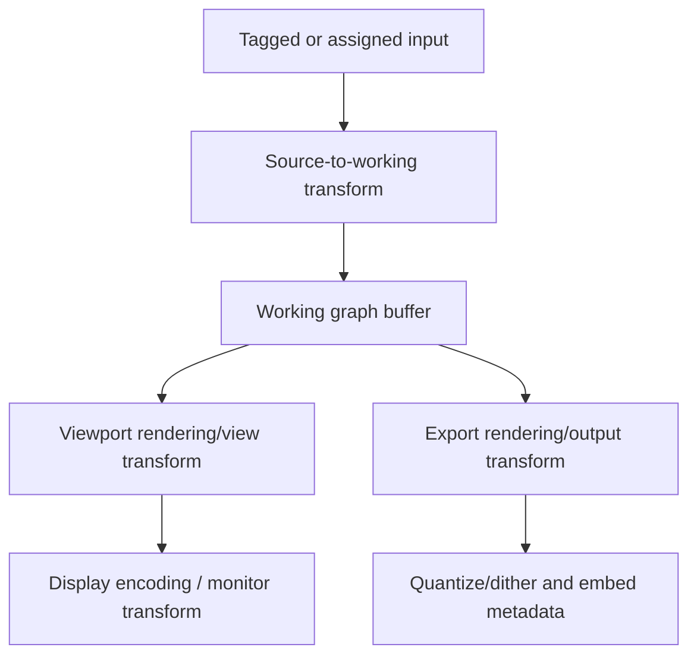

# 12 — Proposed Image, Value, and Wire Contract

Status: proposed architecture contract, not an implementation patch  
Ground-truth date: 2026-07-12

## Decision summary

Stack should stop treating “an OpenGL texture that can be sampled as RGBA” as the complete meaning of an image.

The future contract should separate:

1. **Logical value type:** color image, mask, scalar, vector, curve, depth, flow, spectrum, histogram, RAW, and so on.
2. **Semantic descriptor:** what the numbers mean—color encoding, scene/display state, alpha, range, channels, extent, sampling, units, provenance.
3. **Physical resource:** OpenGL texture/buffer format, allocation, packing, cache ownership, CPU/GPU location.
4. **View/output configuration:** how a working image is rendered for a monitor or encoded deliverable.

The semantic contract must not be hard-coded to ICC, ACES, or OpenColorIO. It should be expressive enough to map to all three:

- ICC for profile-aware consumer, photo, display, and print I/O.
- OpenColorIO for named production spaces, roles, views, and optimized transform execution.
- ACES as a rigorous scene-to-display architecture and optional standardized encodings.
- OpenEXR as a model for HDR channels, metadata, and distinct data/full windows.

## Why the current contract is insufficient

The audit verified that ordinary encoded PNG/JPEG RGB, RAW-derived scene-linear RGB, display-mapped linear RGB, masks packed as RGBA, generated numeric images, and spectrum-like data can all travel through coarse `Image` or `Mask` sockets. A multiply node can perform correct arithmetic while having no way to know whether it doubled scene light, squared-looking encoded brightness, multiplied a mask, or corrupted a frequency value.

This contract does not make simple nodes “smart.” It gives them enough information to preserve meaning and lets validation warn when a graph is suspicious.

## First-class logical value types

Recommended public type family:

| Value type | Meaning | Typical storage |
|---|---|---|
| `Boolean` | True/false condition | CPU/GPU scalar |
| `Integer` | Count, index, enum-like numeric value | CPU/GPU scalar |
| `Scalar` | Generic numeric value with optional unit/range | Uniform, buffer, constant texture when broadcast |
| `Vector2/3/4` | Generic vector, coordinate, color-like value only when tagged | Uniform/buffer |
| `Matrix3/4` | Linear/affine transform | Uniform/buffer |
| `Curve1D` | Domain + knots/spline/LUT + interpolation/extrapolation | CPU object + GPU LUT when evaluated |
| `LUT1D/3D` | Table plus domain/interpolation and semantic I/O contract | GPU texture + metadata |
| `ColorImage` | Colorimetric/color-bearing pixels | Texture/image buffer |
| `Mask` | Scalar coverage/selection field | Single-channel texture preferred |
| `DataImage` | Noncolor channels such as IDs, normals, generic measurements | Typed texture/image buffer |
| `CoordinateField` | Absolute coordinates or displacement vectors | Two-channel/typed texture |
| `FlowField` | Motion vectors with direction/time/confidence | Typed texture + temporal descriptor |
| `DepthField` | Depth/disparity with units and validity | Single-channel/typed texture |
| `ComplexSpectrum` | Complex frequency-domain values | Two-channel float/complex buffer |
| `Histogram/Statistics` | Bins, CDF, percentiles, moments, scalar/vector reductions | Structured buffer/CPU value |
| `ImageList/FrameSequence` | Ordered resources plus time/capture metadata | Collection handle |
| `Metadata/Profile` | ICC/OCIO/DNG/lens/camera or other structured context | Versioned CPU object/handle |
| `Raw` | Sensor-domain source/stage with calibration data | Existing specialized representation |

Using the same GPU format for two types is permitted. Storage equivalence never implies semantic equivalence.

## Image semantic descriptor

Every image-like edge carries an immutable descriptor derived from its source and upstream operations.

| Field group | Required fields | Notes |
|---|---|---|
| Resource meaning | `ColorImage`, `Mask`, `Data`, `Depth`, `Flow`, `Spectrum`, `Raw`; channel names/roles | Prevents color management from touching masks/normals/IDs |
| Channel model | Gray, RGB, RGBA, XY, XYZ, named custom channels; channel order | Do not infer roles from component count |
| Color identity | Stable color-space key plus configuration/profile identity; optional explicit primaries and white point | A name alone is not globally unique; preserve ICC blob/hash or OCIO config+space ID |
| Transfer/encoding | Linear, sRGB, named log, PQ, HLG, gamma value, custom curve, unknown | Never reduce to one `linear` Boolean |
| Reference/image state | Scene-referred, display-referred, picture/output-referred, data/noncolor, unknown | ICC/ACES/OCIO all distinguish roles/state in different ways |
| Luminance scale | Relative or absolute; reference white/peak/black when known | Required for HDR/display work; ordinary scene-linear may remain relative |
| Alpha | Absent/opaque, straight, premultiplied, unknown-legacy; alpha role | Also record the color domain in which premultiplication is defined |
| Numeric range | Nominal/legal range, signed/extended allowance, integer scaling, NaN/Inf policy | Nominal `[0,1]` is not an automatic clamp |
| Precision | Logical precision need and current physical storage | Enables warnings when half is insufficient |
| Spatial state | Width/height, full/display window, data window, origin, pixel aspect, coordinate convention | Separates canvas from populated pixels |
| Sampling defaults | Filter and border mode when the value represents a sampled image view | Individual sample/filter nodes may override explicitly |
| Temporal/view state | Frame/time, view/eye, duration where relevant | Needed for sequences and multi-view images |
| Provenance | Embedded, assigned, assumed/defaulted, converted, generated, legacy-unknown; source/profile/transform hashes | Makes guesses visible and reproducible |

### Physical resource descriptor

Keep implementation details separate:

- CPU/GPU location and ownership.
- OpenGL target/internal format/channel packing.
- Allocated extent and mip levels.
- Texture/sampler object or buffer handle.
- Cache key, byte size, lifetime, and synchronization state.
- Whether resource is materialized or virtual/fused.

A semantic `ColorImage` may be physically RGBA16F today and RGBA32F for a reduction-sensitive branch tomorrow without changing its logical color meaning.

## Recommended baseline processing policy

This proposal does not force one universal working space. Each project should name a working configuration. A practical first configurable default for migration may be scene-linear RGB using sRGB primaries/D65 because Stack’s RAW path already targets a similar state, but the contract must support other working primaries and encodings.

Baseline rules:

1. Ordinary tagged input is decoded at source precision and assigned its embedded color identity.
2. Untagged input follows a documented project policy and is marked **Assumed**, never **Embedded**.
3. Color conversion into the project working state is deliberate and recorded.
4. Float intermediates preserve negative and above-one values unless a node explicitly clamps/maps them.
5. Masks/data bypass color transforms by default.
6. Premultiplied linear-light color is preferred for compositing and spatial filtering.
7. RGB-only color edits on premultiplied data either use an explicitly alpha-aware formula or a documented guarded unpremultiply/edit/repremultiply boundary.
8. View/display processing remains separate from the working buffer.

## Input pipelines

### Tagged PNG/JPEG/TIFF-like input

```text
Decode at supported source bit depth
→ read embedded profile/color metadata and straight-alpha convention
→ produce source ColorImage descriptor
→ explicit/recorded source-to-working transform
→ optional premultiply in working linear light
→ graph
```

PNG supports 8- and 16-bit data and specifies unassociated alpha. Its color chunks/profile precedence should be respected. The current Stack path’s forced RGBA8 and metadata loss are not acceptable as the future contract.

### Untagged input

```text
Decode
→ apply project file rule/default assignment
→ mark descriptor provenance Assumed
→ display nonblocking warning/badge
→ optional explicit reassignment or source-to-working transform
```

An untagged file may still be processed. Permissiveness comes from visible assumptions, not pretending the state is known.

### RAW input

```text
Raw sensor + calibration metadata
→ linearization / black / white normalization
→ demosaic and sensor corrections
→ WB and calibrated camera transform
→ declared scene-referred ColorImage descriptor
→ graph
```

Source RAW metadata remains as provenance even after the pixel output becomes a normal color image. Calibration payloads no longer needed by ordinary nodes may stay attached through a source handle rather than bloating every edge.

## Working, view, and output separation



### Viewport

The viewport should retain the untouched working buffer and apply a selected view/display chain out of band:

- Optional creative look preview.
- Scene-to-display rendering/tone/gamut stage.
- Display-space/monitor encoding or ICC transform.
- UI status: `Buffer`, `View`, `Display`, and proof state.

Scopes choose explicitly whether they measure pre-view working values, rendered/display-linear values, or final encoded display values.

If a user wants to bake the view into the graph, they add an explicit View/Output Transform node whose output descriptor becomes display/output-referred.

### Export

Export requires:

- Destination file format and bit depth.
- Destination color space/profile and transfer.
- Rendering intent/proof policy when relevant.
- Tone/gamut/output transform when converting scene material.
- Alpha association expected by the format.
- Range/legalization policy.
- Dither/quantization policy.
- Embedded metadata/profile policy.

Correct order: transform → gamut/range policy → alpha association conversion → dither/quantize → encode/write matching metadata.

## Explicit transform nodes

Do not hide all transformations behind one ambiguous Convert node. Recommended primitives/families:

| Node | Changes | Preserves/does not imply |
|---|---|---|
| Transfer Decode | Encoded code values → linear-light values with same primaries/white | Does not change gamut/primaries |
| Transfer Encode | Linear-light → named encoding with same primaries/white | Does not tone-map scene HDR by itself |
| RGB Space Convert | Source primaries/white/reference → destination via a defined colorimetric transform | Must state adaptation/gamut policy |
| Chromatic Adapt | White-point adaptation using named model | Not creative temperature unless used deliberately |
| Premultiply | Straight → premultiplied | Does not change coverage |
| Unpremultiply | Premultiplied → straight with zero-alpha policy | Does not make color display-ready |
| Range Map/Clamp | Explicit numeric range change | Does not change color identity unless the operation invalidates a standard encoding |
| View Transform | Working scene → rendered/display-reference state | Does not necessarily perform target encoding unless declared |
| Display Encode | Display-linear target primaries → target signal/code encoding | Does not replace rendering/tone/gamut stage |
| ICC/OCIO Transform | Apply versioned processor from named source to destination | Records config/profile and processor hash |
| LUT Apply | Apply table/process list with explicit input/output descriptor | `.cube` semantics must be assigned; CLF may carry richer transform structure |
| Reformat/Resample | Change extent/sampling | Does not silently reinterpret color/alpha |

A friendly Color Transform compound may expose several stages, but its technical view must show them individually.

## Descriptor propagation

| Node behavior | Propagation rule |
|---|---|
| Generic Add/Multiply/Power | Preserve resource type and most spatial metadata; color-standard identity may become “modified/derived” when arbitrary nonlinear math invalidates a standard encoding; never invent a new color space |
| Exposure | Preserve color primaries/linear encoding and scene state; update provenance/range estimate |
| Curve | Preserve or intentionally change encoding only if the curve is a named transfer; arbitrary creative curve marks derived color state |
| Channel Split | Produce typed scalar/channel value with source channel role/provenance |
| Channel Combine | Require/declare channel roles and construct new descriptor |
| Mask operation | Preserve noncolor/data state; never apply color transform |
| Geometry/filter | Preserve color identity; update extent/data window/sampling provenance; validate alpha association |
| Color transform | Produce explicitly new color descriptor |
| Composite | Require compatible color/blend state or explicit conversion; produce declared alpha association and extent policy |
| Reduction | Output typed statistic carrying population region/domain/units |
| Unknown/external operation | Must declare which descriptor fields it preserves, changes, or invalidates |

`Unknown` is a legal field value. It is not equivalent to a match.

## Port requirements and diagnostics

Each input port declares:

- **Agnostic:** treats input as generic numbers.
- **Recommended:** works numerically elsewhere but warns on mismatch.
- **Strict:** promised result is undefined without the required state.

Examples:

| Connection | Diagnostic |
|---|---|
| sRGB-encoded color → generic Multiply | Allowed; informational only |
| sRGB-encoded color → Exposure EV | Warning; offer explicit Transfer Decode |
| Unknown color → ICC output transform | Hard error or blocking assignment because source identity is required |
| Straight RGBA → premultiplied-only blur | Warning or strict depending on node contract; offer Premultiply |
| Mask → Color Transform | Hard type error unless deliberately cast to data/color |
| Differing extents → Mix with no extent policy | Hard error; require align/canvas rule |
| Unknown `.cube` LUT semantics | Warning; require/offer input/output assignment rather than guessing filename |

See [14_Composition_and_Validation_Rules.md](14_Composition_and_Validation_Rules.md) for the full policy.

## Wire and viewport presentation

The full descriptor belongs in an inspector, not as permanent text on every wire.

Recommended compact wire badge:

```text
Color · Lin sRGB · Scene · PM · HDR
```

or for a mask:

```text
Mask · F16 · 0…1
```

Use progressive detail:

- Normal zoom: type color/icon only.
- Hover/selection: compact descriptor.
- Suspicious link: warning badge.
- Inspector: complete fields, provenance, transform history, range estimate and physical resource.

Viewport status example:

```text
Buffer: Scene-linear sRGB, RGBA16F, premultiplied, extended
View: Stack Default Rendering
Display: Monitor ICC / sRGB SDR
```

## Serialization, cache, and compounds

The descriptor is part of meaning and must participate in:

- Project serialization and versioning.
- Node/compound stable interface IDs.
- Cache fingerprints.
- LUT/profile/config dependency hashes.
- Copied presets and portable compounds.
- Undo/redo.
- Export reproducibility.
- Warning acknowledgement keys.

Changing a profile, transform version, alpha association, range policy, or extent must invalidate affected results even if pixel-source paths and slider values are unchanged.

Compound ports may constrain only the fields that matter. A generic arithmetic compound can be color-agnostic; an Exposure compound recommends scene-linear color; a camera transform strictly requires calibrated RAW/camera metadata.

## Transition from current Stack

### Legacy project loading

1. Load current generic Image outputs as `legacy/unknown` semantic descriptors.
2. Preserve current numerical behavior by default; do not silently linearize or reinterpret them.
3. Mark ordinary imported images as `Assumed legacy encoded` only when the legacy importer behavior is verified, and preserve the original legacy execution path for old projects.
4. Mark RAW-derived outputs from known audited stages with the strongest descriptor that can be proven.
5. Keep legacy Alpha Over as a versioned operator; new projects use corrected source-over.
6. Offer a migration assistant that inserts/assigns explicit transforms and previews differences.

### New projects

1. Require a project working/view/output configuration or choose a documented default.
2. Import with profile/bit-depth preservation.
3. Use corrected alpha/compositing and typed masks.
4. Display assumptions and warnings immediately.
5. Save exact profiles/config/transform versions or portable identifiers.

### Physical migration

RGBA16F can remain the common GPU working storage initially. The first architectural change is semantic, not necessarily a wholesale texture-format rewrite. Move masks to single-channel formats and use RG/float32/structured buffers when their logical types demand it.

## Required invariants and tests

### Descriptor invariants

- A `ColorImage` has either a known structured color identity or explicit Unknown.
- A `Mask` is noncolor and cannot accidentally receive a color transform.
- RGBA has explicit alpha association.
- A materialized resource’s physical channel capacity can represent its logical channel layout.
- Extents/windows are nonempty or explicitly Empty; origins and pixel aspect are valid.
- Named transforms/profiles/configs are versioned and resolvable.

### Reference tests

- Exact sRGB encode/decode breakpoint and extended-range vectors.
- Tagged/untagged 8/16-bit PNG import and profile precedence.
- ICC/OCIO source→working→source round trips within tolerance.
- Scene working→view→display reference pixels.
- PNG straight-alpha and EXR premultiplied I/O vectors.
- Premultiply/unpremultiply at alpha 0, tiny alpha, 0.5, and 1.
- Porter–Duff translucent source/backdrop cases.
- Negative/>1 preservation through neutral nodes.
- Viewport/export agreement before final quantization.
- Tile/ROI equivalence for filters and geometry.
- Cache invalidation when descriptors/profiles change.
- Legacy project snapshot tests.

## Open decisions that remain product choices

- Default project working primaries/encoding.
- ICC-only, OCIO-capable, or hybrid color engine integration strategy.
- Default straight versus premultiplied internal boundaries for color-only edits.
- SDR/HDR display targets and Windows monitor-profile integration.
- How much source profile data is embedded in project files versus referenced by hash.
- Default untagged-image assumption.
- Strictness of warnings for encoded-space editing.
- Backward compatibility duration for defective legacy formulas.

The contract makes those choices explicit; it does not pretend the repository or standards choose them automatically.

## Primary sources

- [ICC.1:2022 profile specification](https://www.color.org/specification/ICC.1-2022-05.pdf)
- [W3C PNG Third Edition](https://www.w3.org/TR/png-3/)
- [W3C CSS Color 4](https://www.w3.org/TR/css-color-4/)
- [W3C Compositing and Blending](https://www.w3.org/TR/compositing-1/)
- [OpenColorIO configuration concepts](https://opencolorio.readthedocs.io/en/latest/guides/authoring/authoring.html)
- [ACES system overview](https://docs.acescentral.com/background/overview/)
- [ACES Output Transforms](https://docs.acescentral.com/system-components/output-transforms/)
- [OpenEXR Technical Introduction](https://openexr.com/en/latest/TechnicalIntroduction.html)
- [OpenEXR Standard Attributes](https://openexr.com/en/latest/StandardAttributes.html)
- [Common LUT Format](https://docs.acescentral.com/clf/specification/)
