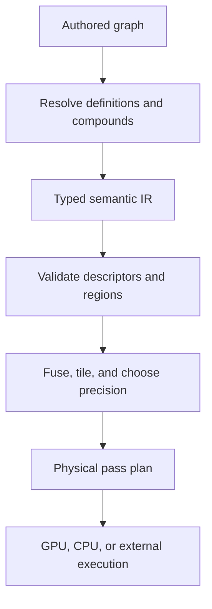

# Composable Node Architecture Research

Status: architecture research and recommendation, not an implementation specification  
Stack ground-truth date: 2026-07-12  
External-research date: 2026-07-12

## Main conclusion

The “math Legos” model is viable, but the visible node graph cannot also be a literal list of GPU passes.

Stack should let users author exact mathematical relationships from small, typed operations. A separate compiler/lowering layer should turn that authored meaning into an efficient execution plan. Compatible pointwise operations can become one shader; neighborhood, geometry, reduction, RAW, FFT, and iterative operations become specialized stages; compound nodes can retain a stable human-facing interface while their internal graph is expanded or replaced by an equivalent optimized implementation.

This separation preserves all three goals:

- **Transparency:** users can inspect formulas, domains, descriptors, and compound definitions.
- **Convenience:** familiar high-level tools can expose carefully chosen controls rather than hundreds of wires.
- **Performance:** one tiny math node does not necessarily allocate one full-size texture and issue one fullscreen pass.

The returned audit makes this separation urgent. Stack currently renders each normal node into a separate full-canvas `GL_RGBA16F` target, has no general fusion or target pool, and retains persistent cached textures without a byte budget. At 3840×2160, one RGBA16F target is about 63.3 MiB before driver overhead. A fine-grained primitive library placed directly on that execution model would multiply passes and memory while still sending ordinary encoded RGB and RAW scene-linear RGB through the same untyped `Image` socket.

The right first product is therefore not hundreds of nodes. It is a semantic value contract and a small compiler architecture capable of making those nodes truthful and affordable.

## The model: three graphs, not one

Stack should distinguish three representations.

### 1. Authored graph

The graph a user edits. It contains named primitive nodes, convenience nodes, compound instances, visible conversions, masks, and explicit outputs. It preserves layout, comments, exposed controls, user intent, and stable IDs.

This graph defines **what** should be computed. It should not promise one draw call per node.

### 2. Semantic intermediate representation

A typed, normalized operation DAG produced after resolving definitions and validating descriptors. It contains small mathematical expressions and explicit nonpointwise operators without Dear ImGui layout or node-class-specific payload assumptions.

This representation is where Stack can:

- resolve overloads and broadcasts
- propagate color/range/alpha/extent descriptors
- inline compound graphs
- constant-fold uniform expressions
- eliminate dead branches
- identify pointwise expression regions
- preserve source maps back to authored node/port IDs
- state exact barriers where a result must be sampled, reduced, cached, inspected, or converted

### 3. Physical execution plan

The backend-specific schedule: generated GLSL programs, texture formats, render/compute passes, CPU or external jobs, ROI requests, tiles, temporary allocations, cache points, synchronization, and readback/output stages.

This graph defines **how** a particular target executes the semantics. It can change with GPU capabilities, preview scale, debug mode, or optimizer improvements without changing the saved mathematical graph.

The source map must survive every stage. A shader error, invalid pixel, allocation failure, or slow pass should point back to the authored nodes that produced it, even when ten primitive nodes have fused into one program.

## Research pattern 1: MaterialX definitions, graph implementations, and flattening

MaterialX separates a node's public definition from implementations. A `NodeDef` describes the typed interface; an implementation can be source code or a `NodeGraph`. Graph-based implementations connect the definition's interface to internal nodes. MaterialX also supports flattening graph-based nodes into an equivalent graph for processing/code generation.

Primary sources:

- [MaterialX Specification](https://github.com/AcademySoftwareFoundation/MaterialX/blob/main/documents/Specification/MaterialX.Specification.md)
- [MaterialX official API documentation](https://materialx.org/docs/api/)
- [MaterialX project](https://materialx.org/)

### Lesson for Stack

Stack needs distinct objects for **definition**, **instance**, and **implementation**.

- The definition owns the stable interface and semantics.
- An instance owns its connections and parameter overrides.
- An implementation supplies an internal graph, generated expression, specialized shader, CPU code, or external backend.

Flattening should be a compile operation, not destructive authoring behavior. Stack should retain the compound boundary in the saved graph, lower a resolved copy into semantic IR, and preserve a mapping from lowered operations to the compound instance and internal nodes. “Expand for editing” is a separate user action that can create an independent graph copy.

This lets a high-level Exposure node have a stable interface even if its implementation changes from a small internal graph to fused GLSL. It also prevents a compound's private node IDs and layout from becoming accidental public API.

## Research pattern 2: OpenFX clip and region contracts

OpenFX image effects declare input/output clips and negotiate properties such as components, bit depth, premultiplication, and other clip preferences. Its actions distinguish the output region of definition, the input regions needed for a requested output region, the render window, temporal frames needed, and identity/bypass behavior.

Primary sources:

- [OpenFX documentation](https://openfx.readthedocs.io/en/main/)
- [OpenFX image-effect actions](https://openfx.readthedocs.io/en/main/Reference/ofxImageEffectActions.html)
- [OpenFX image-effect reference](https://openfx.readthedocs.io/en/main/Reference/ofxImageEffectReference.html)
- [Academy Software Foundation OpenFX repository](https://github.com/AcademySoftwareFoundation/openfx)

### Lesson for Stack

An image node contract is larger than `texture in → texture out`.

Each image operator should be able to answer:

1. What output bounds/data window can it produce?
2. For an output ROI, what region of each input does it need?
3. Does it need other frames, views, metadata, or the entire image?
4. Can it declare identity for particular parameters?
5. What precision, components, alpha association, and render scale does it support?

A pointwise operation maps output ROI to the same input ROI. A radius-`r` blur expands it by its support. A geometric transform inverse-maps the output region and enlarges it for the reconstruction filter. A histogram requests the entire relevant data region. A temporal denoiser requests named neighboring frames. These declarations make correct tiling, lazy evaluation, and cache reuse possible.

ROI must not be conflated with a mask. ROI answers “which pixels must be evaluated or fetched?” A mask answers “how strongly does this operation affect the visual result?”

## Research pattern 3: Halide algorithm versus schedule

Halide's central design separates the image-processing algorithm from its schedule. The algorithm states the mathematical functions. The schedule chooses storage, compute placement, tiling, vectorization, parallelism, and whether intermediate functions are inlined, computed near a consumer, or materialized. Different legal schedules are intended to preserve the algorithm's result while trading memory, locality, recomputation, and parallelism.

Primary sources:

- [Halide: Decoupling Algorithms from Schedules for High-Performance Image Processing](https://people.csail.mit.edu/jrk/halide12/halide12.pdf)
- [Halide scheduling tutorial, part 1](https://halide-lang.org/tutorials/tutorial_lesson_05_scheduling_1.html)
- [Halide scheduling tutorial, part 2](https://halide-lang.org/tutorials/tutorial_lesson_08_scheduling_2.html)
- [Halide official documentation](https://halide-lang.org/docs/)

### Lesson for Stack

The mathematical node graph should not encode resource lifetime accidentally. A connection means “this result is used here,” not “allocate a persistent full-canvas texture here.”

The planner may:

- inline cheap pointwise expressions into consumers
- fuse compatible pointwise chains
- recompute a small expression at two consumers instead of storing a huge raster
- materialize a shared expensive result once
- tile a neighborhood pipeline with halos
- separate a reduction into partial and final stages
- choose separable or specialized implementations that satisfy the same contract
- select half or full float according to proven precision requirements

Stack does not need to reproduce Halide's language or scheduler. It should adopt the architectural separation: **semantic function first, execution schedule second**.

## Research pattern 4: OpenImageIO ROI and image-data rules

OpenImageIO uses explicit regions of interest with half-open spatial and channel ranges, and its image model distinguishes the data window from the full/display window. `ImageBufAlgo` functions accept ROIs so operations can restrict work and describe output behavior without pretending every image begins at `(0,0)` or occupies the entire display canvas.

Primary sources:

- [OpenImageIO ImageBuf documentation](https://openimageio.readthedocs.io/en/latest/imagebuf.html)
- [OpenImageIO ImageBufAlgo documentation](https://openimageio.readthedocs.io/en/latest/imagebufalgo.html)
- [OpenImageIO image I/O API and ImageSpec](https://openimageio.readthedocs.io/en/latest/imageioapi.html)
- [OpenImageIO project](https://openimageio.org/)

### Lesson for Stack

Stack should standardize one region object and one canvas/data-window model across nodes, the renderer, cache, preview, and export.

The region should include channel span, use half-open coordinates, and distinguish `all`, empty, known finite, and unknown/global states. An image should retain logical full bounds separately from pixels that contain valid data. This prevents today's silent normalized resampling into one reference canvas and prepares Stack for crops, transformed bounds, overscan, multiple native resolutions, and partial tiles.

Sampling outside the data window also needs a named policy—constant/black, clamp, mirror, wrap, or invalid—rather than whatever a texture happened to be configured to do.

## Research pattern 5: professional groups and digital assets

Professional node systems consistently expose a deliberate public interface around an internal graph:

- Blender node groups expose group input/output sockets; instances refer to a shared node tree, and the interface is edited separately from internal wiring.
- Nuke Groups/Gizmos wrap internal node networks and expose promoted user controls for reuse.
- Houdini digital assets treat the network as a reusable operator definition and use namespacing/version conventions to manage multiple definitions.

Primary sources:

- [Blender node groups manual](https://docs.blender.org/manual/en/latest/interface/controls/nodes/groups.html)
- [Blender `NodeTreeInterface` API](https://docs.blender.org/api/current/bpy.types.NodeTreeInterface.html)
- [Foundry Nuke: creating Gizmos](https://learn.foundry.com/nuke/content/comp_environment/configuring_nuke/creating_gizmos.html)
- [SideFX Houdini digital assets](https://www.sidefx.com/docs/houdini/assets/index.html)
- [SideFX operator type namespaces and versions](https://www.sidefx.com/docs/houdini/assets/namespaces.html)

### Lesson for Stack

A compound is a small API, not merely a rectangle around selected nodes. Its inputs, outputs, exposed parameters, defaults, units, and promised behavior must be stable and versioned. Internal nodes may change without breaking instances only when the public semantics remain compatible.

Stack should support both shared instances and an explicit **Make Unique/Unpack** workflow. Copy/paste presets remain useful, but they are not a substitute for a shared definition with dependency, version, migration, and missing-definition behavior.

## Typed semantic values

The semantic IR should not route everything through textures. It needs values such as:

- uniform Boolean, integer, scalar, vector, and matrix
- per-pixel scalar/vector/color fields
- coverage mask and alpha values
- coordinate and displacement fields
- curve/ramp and LUT resources
- image collections and frame sets
- histogram/table/reduction values
- metadata, color profile, camera calibration, and display descriptors
- Raw stages and specialized handles

Uniform values and fields must be distinct even if broadcasting is supported. A constant scalar can become a uniform in a fused shader. A scalar field is sampled per pixel. A histogram is not an image. A Raw source is not generic RGB.

Each value carries semantic qualifiers relevant to its type. Image/color values carry color, range, alpha, extent, and sampling descriptors. Scalars may carry units such as EV, degrees, pixels, normalized coordinates, or percent. Matrices declare source and destination spaces where applicable.

This is how Stack can remain “dumb” in the useful sense. A `Multiply` operator need not infer exposure or insert a conversion. Its type and range behavior are explicit; a separate semantic analyzer can warn when the result is suspicious in context.

## Intermediate operation classes

The compiler should lower nodes into a small number of capability classes.

### Pointwise expression

One output sample depends only on corresponding input samples and uniform values. Arithmetic, comparisons, channel swizzles, matrices, curves/LUTs, explicit transfer functions, and many grading operations fit here.

These are candidates for expression fusion.

### Sample/resample operation

The output evaluates an input at derived coordinates. Resize, rotate, warp, displacement, crop/canvas, and explicit sample operations fit here. The contract includes coordinate system, inverse mapping, reconstruction filter, extent mapping, and boundary mode.

### Neighborhood operation

The output depends on a bounded support around each location. Convolution, blur, sharpen, edge, morphology, median, and local statistics fit here. The contract provides a halo/ROI mapping and precision requirements.

### Reduction/global analysis

The output is a scalar, vector, histogram, table, or small resource derived from a region. These operations require staged reduction and may prevent purely local tile evaluation.

### Multipass/iterative operation

The algorithm owns repeated stages, a pyramid, recurrence, propagation, FFT sequence, optimization, or content-adaptive passes. It must declare working resources, convergence/fixed-iteration policy, and cancellation points.

### Specialized/external operation

RAW development, calibrated camera operations, model inference, plug-ins, CPU rasterization, file I/O, and device/display output can retain specialized backends. They still participate through typed inputs/outputs, descriptors, ROI, diagnostics, and cache contracts.

These classes are compiler capabilities, not necessarily browser families. A familiar `Clarity` compound may lower to reduction, neighborhood, and pointwise stages.

## Pointwise fusion

Pointwise fusion is the enabling technology for a large primitive library in Stack.

A compatible chain can be fused when:

- every operation is pointwise for the same sample location
- extents and coordinate mappings match
- input/output descriptors are compatible with the promised sequence
- precision requirements can be satisfied by one stage
- no operation requires neighborhood access, derivatives unavailable in the chosen path, global state, temporal state, iteration, or external execution
- there is no user-requested materialization/debug/cache boundary
- generated-program limits and compile-cost budgets remain acceptable

The compiler converts the expression DAG to typed SSA-like values, folds constants, removes dead expressions, performs safe common-subexpression reuse, and emits one GLSL program. A mask blend can often be part of that expression rather than a second full-image pass.

Fusion should stop or make a costed choice at:

- image source/upload and final view/output
- resampling or extent change
- neighborhood/ROI boundary
- reduction/global result
- RAW, FFT, CPU, external, or iterative stage
- required precision/format conversion
- output explicitly previewed or inspected
- persistent cache checkpoint
- large fan-out where recomputation costs more than materialization
- shader size/register-pressure/compilation budget

Fan-out is not automatically a texture boundary. A cheap expression may be duplicated into two fused consumers; an expensive shared branch may be rendered once. This is a scheduling decision, not a change to graph semantics.

Debugging remains inspectable. When the user previews an internal primitive, Stack can compile a temporary plan that materializes that result. The normal plan need not keep every intermediate texture alive.

## Region planning, tiling, and locality

For each lowered operation the planner asks for a requested output region and recursively derives input requirements:

- pointwise: same region
- blur/morphology: output region plus parameterized halo
- resample: inverse-mapped source bounds plus filter support
- composite: corresponding regions from all aligned inputs
- crop/canvas: intersection/mapping according to explicit windows
- reduction: entire declared analysis region
- iterative/global content-adaptive operator: declared global or staged requirement

The physical planner can then tile only when these mappings prove correctness. It should avoid the current split where ordinary preview, RAW workspace preview, tiled preview, and fresh full-resolution export have meaningfully different precision/resource paths.

Preview may use an explicit proxy/render-scale contract, but output semantics must say which parameters scale with resolution. A 10-pixel blur, a normalized displacement, and a camera-lens calibration do not scale in the same way.

## Compound definition model

### Definition

A compound definition should contain:

- globally stable definition UUID
- namespace and human-readable name
- exact semantic version and content hash
- typed input/output ports with stable port UUIDs
- port requirements and descriptor transformations
- exposed parameter schema
- internal authored graph, if graph-defined
- one or more implementations and target/capability constraints
- documentation, canonical formula/decomposition, and examples
- reference-test identifiers and numerical tolerances
- migration functions from supported earlier versions
- dependency list with pinned or constrained versions

Port names are labels; connections bind to stable port UUIDs. Renaming `Strength` must not disconnect a project. Removing or changing the meaning of that port is a versioned breaking change.

### Instance

An instance should contain:

- instance UUID
- exact resolved definition UUID/version/hash
- connections by stable port UUID
- parameter overrides and exposed-input bindings
- optional implementation preference that does not change semantics
- saved fallback/embedded definition policy for portability
- UI layout state, which is not part of semantic identity

An instance does not clone internal nodes. Editing a shared definition updates instances only according to explicit version-resolution policy.

### Nesting and recursion

Compounds may contain compound instances. Direct or indirect recursive definition dependency should be rejected unless Stack later introduces a deliberately bounded iteration construct. Ordinary image dependency cycles remain prohibited.

### Version rules

A practical semantic-version policy is:

- **Patch:** implementation, documentation, or performance changes within the same promised output semantics and tolerance; no interface change.
- **Minor:** additive compatible ports/parameters with defaults that preserve existing instance results.
- **Major:** removed/retyped ports, changed defaults that affect existing instances, changed formula/order/domain, corrected legacy behavior that changes pixels, or changed descriptor contract.

Bug fixes are not automatically patch releases. Correcting today's Alpha Over formula changes pixels and therefore requires a new semantic version plus an explicit migration choice.

Saved projects should resolve exact versions by default. A library may advertise a newer compatible version, but update is an intentional project action with a migration report and difference preview. If a definition is missing, Stack should load a typed unresolved instance and offer to locate, embed, replace, or unpack it—never silently fall back to an unrelated generic layer.

### Migrations

A migration is a deterministic transformation from one definition/interface version to another. It may:

- remap stable ports
- insert explicit conversion nodes
- transform parameter values/units
- preserve a legacy formula mode
- replace a definition with a new compound graph
- emit warnings for choices that cannot be inferred

Every migration needs structural tests and image/reference tests. Migration history must be recorded in the project.

## Three kinds of high-level node

Not every familiar control should pretend to be an editable pile of elementary nodes.

### Transparent graph compound

The internal graph is the exact implementation. It can be opened, copied, made unique, or unpacked. The optimizer may flatten/fuse it during lowering.

Examples: a precisely defined Exposure compound, channel mixer, split tone, or simple vignette.

### Graph-defined semantics with optimized equivalent

A canonical internal graph defines behavior, while a specialized implementation is permitted if it matches reference outputs within declared tolerance. The inspector can show both the canonical graph and the physical implementation chosen.

Examples: separable Gaussian blur, curve evaluation via a sampled LUT, or a compound pointwise grade emitted as one shader.

### Opaque specialized operator

The operation requires metadata, recurrence, dynamic analysis, external code, or an algorithm that would be dishonest or impractical to expose as simple nodes. Stack documents its contract, stages, inputs, and outputs without fabricating an editable decomposition.

Examples: RAW demosaic/develop stages, FFT engine, sophisticated denoise, profile-managed display output, and future model-based tools.

Inspectability means exposing the real contract and the real level of decomposition—not claiming that all computation is reducible to the same public node granularity.

## Exposed parameters and UI

The current Stack UI and serialization are node-class-specific, so compounds cannot safely expose arbitrary inner fields by memory path or payload name. Exposed controls need a declarative schema.

Each exposed parameter should define:

- stable parameter UUID
- label and technical name
- type, units, default, hard validity domain, and suggested UI range
- widget hint: slider, drag, numeric field, toggle, combo, color control, curve, file/resource picker, matrix, kernel, or direct viewport control
- precision/step behavior
- documentation and search aliases
- mapping to an internal input or adapter expression
- animation/keyframe policy
- whether it may be connected as a graph input
- descriptor effects and invalidation behavior

“Promote parameter” should create this interface entry deliberately. It should not expose every internal knob. The compound author chooses a small coherent interface and may organize it into sections. Advanced users can enter the internal graph without forcing ordinary users to navigate it.

Direct image manipulation remains another editor for a parameter: dragging a curve point, sampling a hue, moving a transform handle, or painting a mask updates the same typed value schema.

## Inspectability and execution inspection

Stack should offer two distinct views:

1. **Definition view:** the authored/canonical internal graph, formulas, domain assumptions, exposed controls, and version.
2. **Execution view:** fused groups, materialized targets, pass class, ROI/halo, texture format, cache status, timing, and source-node mapping.

This prevents two misleading extremes: hiding all math behind friendly controls, or showing an optimized shader as if its temporary implementation details were the only meaningful definition.

The existing Graph Performance overlay can evolve into execution inspection, but per-node/pass GPU timers, object labels/debug groups, memory accounting, and compiler source maps are needed before it can explain fused work reliably.

## Cache, resources, and determinism

Separate semantic identity from physical cache identity.

A semantic fingerprint should include definition/version/hash, parameters, input semantic fingerprints, descriptors, extent/time/view, and declared external resources. A physical cache key additionally includes target backend, precision/format, ROI/tile, proxy scale, implementation version, and relevant compiler options.

The renderer needs:

- transient target pooling and lifetime analysis
- aliasing when values are dead
- a byte-budgeted LRU for persistent results
- deliberate checkpoints rather than one texture per authored node
- cancellation between physical stages and tiles
- separate handling for deterministic and nondeterministic operators
- diagnostics for cache-invalidating metadata or external-resource changes

Changing only the schedule should not change promised results beyond declared floating-point tolerance. Preview proxies or alternative approximate implementations must be visibly identified and cannot silently become export behavior.

## Testing the math-Legos promise

The architecture is only trustworthy if optimized and inspectable forms agree.

Required suites:

- CPU reference formula versus generated pointwise GPU shader
- unfused versus fused expression output
- canonical compound graph versus optimized implementation
- full-frame versus tiled/ROI output, including borders and odd data-window origins
- half versus float precision thresholds
- range and NaN/Inf property tests
- straight/premultiplied alpha and Porter–Duff reference fixtures
- tagged color import, working conversion, view, and output fixtures
- descriptor propagation and warning/error golden graphs
- definition serialization, missing dependency, nested compound, version resolution, and migration
- preview/export parity for the same declared quality/scale contract
- repeatable memory and pass-count benchmarks

The returned audit verified structural tests but found no GPU formula, color, alpha, golden-image, or import/export semantic suite. Those gaps must be closed before Stack labels a fused primitive, compound, or migration as equivalent.

## Phased recommendation for Stack

### Phase 0 — preserve and measure current behavior

- Freeze representative legacy projects and output images.
- Add GPU debug callback/object labels, per-pass timing, target byte accounting, and exact-float pixel inspection.
- Version known incorrect or misleading behaviors instead of silently changing them.
- Add baseline tests for ordinary input, RAW, alpha, viewport, and export.

### Phase 1 — establish semantic contracts

- Adopt the proposed image-buffer/value descriptor.
- Choose normative working color, transfer, scene/display, range, alpha, and output behavior.
- Separate full/data windows and explicit sampling/border rules.
- Tag old projects `legacy/unknown`; do not reinterpret them.
- Implement graph diagnostics before adding many new primitives.

### Phase 2 — first-class values and unified definitions

- Add scalar/vector/matrix/curve/LUT/coordinate/histogram/metadata types.
- Replace Mask-as-every-scalar overloading gradually.
- Unify registry and hard-coded catalog metadata behind one definition schema.
- Make parameters declarative enough for generic ports and future compound exposure.

### Phase 3 — semantic IR and pointwise fusion

- Lower a small vetted primitive set to typed expression IR.
- Generate fused GLSL with source mapping, constant folding, and explicit precision.
- Materialize previews on demand rather than caching every authored node.
- Add unfused/fused equivalence and performance tests.
- Introduce transient pooling and persistent cache budgets.

### Phase 4 — executable compound definitions

- Add definition/instance storage with stable UUIDs and exact versions.
- Support graph-defined compounds, nesting without recursion, promoted parameters, Make Unique, and Unpack.
- Resolve and flatten compounds only in lowered IR.
- Add dependency packaging, missing-definition UI, version selection, migrations, and difference preview.

### Phase 5 — region-aware specialized stages

- Standardize ROI, halo, extent, render-scale, and data-window propagation.
- Add reusable sampler, separable convolution, reduction, and pyramid infrastructure where justified.
- Bring RAW, frequency, CPU/external, scopes, preview, and export under the same typed diagnostic/planning contract without forcing them into pointwise IR.

### Phase 6 — expand the public library

- Publish a deliberately small primitive browser using the compact taxonomy.
- Build tested high-level compounds for familiar tools.
- Mark each high-level node as transparent graph, optimized-equivalent, or opaque specialized.
- Add more primitives only when their semantic definition, fusion/schedule behavior, UI, and reference tests are complete.

## Final architectural rule

In Stack, a node should promise a mathematical or algorithmic result—not a draw call, not a vague editing intention, and not an accidental texture format.

The authored graph is the explanation. The semantic IR is the precise contract. The execution plan is an optimization. Compound nodes are versioned interfaces. Conversions that change meaning remain visible. With those boundaries, simple math can genuinely become reliable, editable high-level image processing instead of a larger collection of opaque sliders or an unmanageable chain of full-frame passes.

