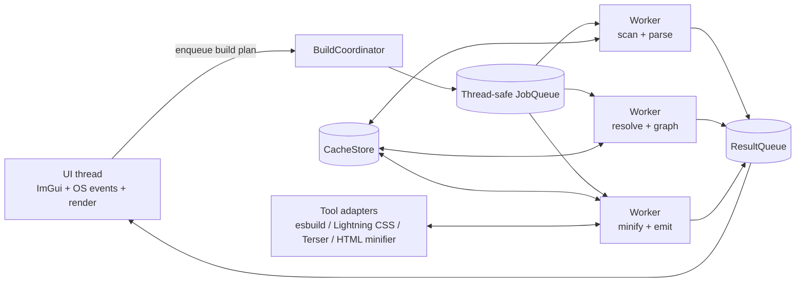
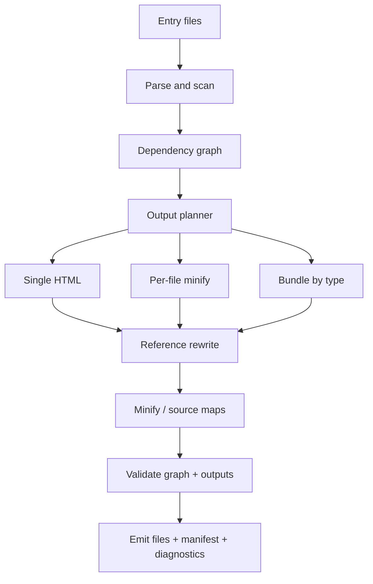

# Truth Source for a C++ Desktop Bundler and Minifier

## Executive summary

Yes. A cross-platform C++ desktop application can implement an interactive bundler/minifier with a Dear ImGui front end, background workers, and all three requested output modes: a single self-contained HTML file, per-file minification, and combine-by-type bundles. The critical constraint is architectural: keep all ImGui state and rendering on the UI thread, and move filesystem work, parsing, graph construction, minification, subprocess execution, and hashing onto worker threads that communicate back through thread-safe queues or immutable result objects. Dear ImGui explicitly documents that its API is not thread-safe around its global context pointer, while standard C++ facilities such as `std::jthread`, `std::condition_variable`, and `std::atomic` are well-suited to a cooperative background-job model. citeturn19search3turn19search6turn27view2turn27view3turn27view4

The right mental model is not “string concatenation with a UI,” but “a build system with a dependency graph and rewrite engine.” HTML, CSS, and JavaScript all have real grammars and edge cases that make regex-only rewriting brittle: HTML has base URLs, `srcset`, and many URL-bearing attributes; CSS has `url()` and `@import` with ordering and conditional semantics; JavaScript has static imports, dynamic `import()`, workers, `importScripts()`, import maps, and URL construction patterns around `import.meta.url`. A regex pass may still be useful as a pre-filter for candidate tokens, but authoritative rewrite decisions should come from parser or tokenizer output. citeturn26view0turn26view2turn26view3turn26view4turn26view5turn26view6turn26view7turn38search8turn36search0turn36search1turn36search5turn24view4turn22view7

The most practical high-confidence implementation strategy is hybrid. Use C++ for orchestration, UI, caching, diagnostics, and output planning; use best-in-class language tooling for transformation. For CSS, Lightning CSS is especially strong because it provides parsing, bundling of `@import`, minification, warnings, and source maps in one tool. For JavaScript bundling, esbuild is the strongest default choice because it handles bundling, minification, CSS, source maps, and emits a machine-readable metafile. For JS-only minification when you need more compression-sensitive behavior or persistent name mangling, Terser remains valuable. For HTML minification, `minify-html` and `html-minifier-terser` are the clearest options. For JSON I/O and compact serialization inside the C++ app, `nlohmann/json` is a straightforward choice. citeturn20view3turn20view4turn37view2turn21view0turn21view3turn39view0turn39view1turn39view2turn22view0turn22view1turn35view0turn35view1

Single-file output is achievable for statically knowable references and inline-friendly assets. Data URLs are standardized, include an explicit media type, and can carry either percent-encoded text or base64 content. Non-JavaScript `<script type="...">` blocks can safely carry inert data such as JSON or shader text. But these mechanisms also impose real constraints: data URLs have practical size limits in browsers, top-level `data:` navigation is restricted, and modern browsers treat `data:` documents as opaque origins. In practice, that means “inline everything” should be policy-driven, not unconditional. Fonts and small images often inline well; very large media files usually should not. citeturn24view6turn24view7turn37view7turn24view5turn40view0turn40view2turn40view3

The hardest engineering problems are not the UI and not the minifier calls. They are reference discovery, path resolution, output-path planning, and behavior preservation. Special attention is required for `<base>`, responsive image attributes such as `srcset`, CSS conditional imports and layers, document-only import maps, worker URL resolution, `fetch()` base rules, `importScripts()` rules in classic workers, symlink normalization, Windows reserved filenames, and case sensitivity differences between filesystems on Windows, macOS, and Linux. Any “truth-source” build document should therefore define these semantics up front and treat them as compatibility rules rather than ad hoc behavior. citeturn38search8turn26view7turn38search3turn26view4turn20view3turn26view0turn36search1turn36search5turn24view4turn31view1turn26view9turn27view5turn32view3

## Scope, goals, and build modes

The build document should define the product goal as: **take one or more entry files, build a dependency graph across HTML, CSS, JS, and text assets, then emit deterministic outputs for one of three modes while preserving browser behavior where static analysis can prove correctness**. That framing is important because the platform semantics differ by reference kind. For example, `<link href="main.css">`, ``, CSS `url()`, CSS `@import`, static ESM `import`, dynamic `import()`, workers, `fetch()`, and import maps do not all resolve against the same base or under the same rules. citeturn26view5turn26view6turn26view3turn26view4turn26view1turn26view2turn36search1turn36search5turn26view0

The supported file taxonomy should be explicit from the start. The safest split is: **first-class parsed graph nodes** (`.html`, `.css`, `.js`, `.mjs`), **structured text assets** (`.json`, `.txt`, `.frag`, `.vert`, `.glsl`, other configured text extensions), and **opaque assets** (images, fonts, audio, video, WASM, etc.). Structured text assets do not need browser-standard parsers inside the bundler; they mainly need MIME assignment, embedding policy, and a predictable way to be exposed to the runtime when bundled. HTML and CSS force support for opaque assets because `src`, `srcset`, `<source>`, `poster`, and CSS `url()` all commonly reference binary files. citeturn38search0turn24view5turn37view7turn26view6turn26view7turn38search5turn38search6turn38search13turn26view3

| Build mode | Output shape | Best use | Core rewrite rule | Recommended status |
|---|---|---|---|---|
| Single HTML | One `.html` file with inline CSS/JS and optionally embedded assets | Portable handoff, demos, documentation snapshots, kiosk-style artifacts | Replace statically resolvable refs with inline blocks or data URLs; preserve unresolved dynamic refs with warnings | Core feature |
| Per-file minify | Same file layout, minified files beside originals or in `dist/` | Lowest risk behavior preservation | Keep graph shape; emit minified siblings and rewrite URLs to emitted targets | MVP feature |
| Bundle by type | HTML entry plus merged CSS bundle(s), JS bundle(s), optional text-asset bundle/manifest | Production builds with caching and shared bundles | Group nodes by kind and entry scope, then rewrite entry references to bundle outputs | Second-wave feature |

A rigorous truth-source should also define what **not** to promise. Dynamic runtime references are not universally statically knowable. Literal `import("./a.js")` is analyzable; `import("./" + name + ".js")` usually is not. `fetch("data.json")` from document code resolves differently from `fetch("data.json")` inside a worker. Import maps apply to module specifiers in documents, but not to `<script src>` and not to workers. This means the tool needs a first-class concept of **unresolved-but-allowed edges**, driven by warnings and user override rules rather than silent guessing. citeturn26view2turn36search5turn24view3turn26view0

## Architecture and threading model

The core architecture should separate the app into five subsystems: **UI**, **build coordinator**, **job execution**, **graph and cache storage**, and **tool adapters**. In practical class terms, that usually means something like `AppState`, `BuildCoordinator`, `JobQueue`, `GraphStore`, `Resolver`, `HtmlProcessor`, `CssProcessor`, `JsProcessor`, `AssetEmbedder`, `CacheStore`, and `DiagnosticStore`. If you keep these boundaries clean, most hard behavior becomes testable without the UI. The UI should become a consumer of state snapshots rather than the owner of messy build logic. This separation matches Dear ImGui’s threading limitations and the standard C++ concurrency model. citeturn19search3turn27view2turn27view3turn27view4

The thread model should be conservative. The UI thread owns the Dear ImGui context, event polling, rendering, and frame-local state. A build coordinator on the UI thread collects settings and enqueues build plans. Worker threads perform parsing, hashing, graph expansion, file reads, and external minifier invocations. A result queue returns immutable build messages—progress updates, diagnostics, partial graph snapshots, and final artifacts metadata—to the UI. Workers must never mutate ImGui state directly. That keeps the interface responsive while still allowing substantial parallelism during scanning and transformation. citeturn19search3turn19search6turn27view2turn27view3turn27view4



A simple queue built on `std::mutex` and `std::condition_variable` is a better starting point than a lock-free queue. The standard primitives are well-understood, efficient enough for this workload, and easier to reason about when cancellation, progress reporting, and error propagation matter more than absolute queue throughput. If the pipeline later grows into a real task DAG with substantial intra-build fan-out, Taskflow becomes attractive; if queue contention itself becomes measurable, a specialized queue such as `moodycamel::ConcurrentQueue` is a reasonable upgrade. But both should come after a working, testable standard-library implementation. citeturn27view3turn27view4turn28view5turn28view4

### Thread-safe queue sketch

The implementation should use cooperative cancellation and “message passing, not shared mutation” as its default rule.

```cpp
struct Job {
    JobId id;
    JobKind kind;
    BuildContext ctx;
};

class JobQueue {
public:
    void push(Job job) {
        std::lock_guard<std::mutex> lock(m_);
        q_.push_back(std::move(job));
        cv_.notify_one();
    }

    bool try_pop(Job& out, std::stop_token st) {
        std::unique_lock<std::mutex> lock(m_);
        cv_.wait(lock, [&] { return stopping_ || !q_.empty() || st.stop_requested(); });
        if (stopping_ || st.stop_requested()) return false;
        out = std::move(q_.front());
        q_.pop_front();
        return true;
    }

    void stop() {
        std::lock_guard<std::mutex> lock(m_);
        stopping_ = true;
        cv_.notify_all();
    }

private:
    std::mutex m_;
    std::condition_variable cv_;
    std::deque<Job> q_;
    bool stopping_ = false;
};
```

`std::jthread` is a good default for workers because it auto-joins and carries a stop token. The UI frame loop can poll a result queue every frame and update progress bars, graph panes, and diagnostics panes from snapshots. Logging should be asynchronous and structured; `spdlog` is a practical fit if you want thread pools, queue-backed async loggers, and preserved ordering with one log worker. citeturn27view2turn27view3turn22view9turn35view5

## Dependency graph and reference rewriting

The dependency graph should be treated as the product’s source of truth. Every node needs at least: canonical filesystem identity, logical URL identity, file kind, hash, parse result, emitted output mapping, and diagnostics. Every edge needs: source node, target specifier, resolved target if any, original span, reference kind, base URL context, and policy (`inline`, `bundle`, `copy`, `external`, `ignore`, `unresolved-warning`, `error`). This is the minimum needed to support all three output modes without rewriting logic becoming tangled. The graph also becomes the basis for incremental builds, “why is this included?” UX, and stable diagnostics. citeturn21view3turn20view3turn32view3

### Resolution contexts

The single most important design decision is to record **resolution context per edge**, not per file type in the abstract.

| Context | Example | Base rule | Why it matters |
|---|---|---|---|
| HTML document URL | `<link href="main.css">` | Document base URL, affected by `<base>` | Same HTML file can resolve differently if `<base>` changes |
| CSS stylesheet URL | `url("../fonts/a.woff2")` | Stylesheet location | CSS references are relative to the stylesheet, not the HTML document |
| JS module URL | `import "./mod.js"` | Current module URL | ESM references follow module resolution rules |
| Document-global script runtime | `fetch("data.json")` in page script | `document.baseURI` | Not the same as module or worker scope |
| Worker script context | `importScripts("dep.js")`, `fetch("x.json")` in worker | Worker entry URL / worker location | Different from page context |
| Import map context | `import "lib/foo"` in module script | Import map, document only | Does not apply to `<script src>` or workers |

These rules are not optional compatibility details. `<base>` changes all relative URLs in the document; CSS `url()` and `@import` are valid absolute, relative, blob, or data URLs; ESM import maps affect static and dynamic module specifiers in documents; worker constructor URLs resolve relative to the current HTML page; `importScripts()` URLs resolve relative to the worker entry script; and `fetch()` uses `document.baseURI` in window contexts and worker location in workers. citeturn38search8turn26view3turn26view4turn26view0turn36search1turn24view4turn36search5

### Easy cases and hard cases

| Scenario | Difficulty | Recommended handling |
|---|---|---|
| `<link href="main.css" rel="stylesheet">` | Easy | Parse HTML, resolve against document base, emit CSS edge |
| `<script src="app.js">` | Easy | Parse HTML, resolve against document base, preserve module/classic semantics |
| `` | Easy | Resolve asset edge; inline as data URL only if policy allows |
| CSS `url("../fonts/a.woff2")` | Easy | Parse CSS tokens; rewrite relative to emitted stylesheet or inline |
| CSS `@import "theme.css"` | Easy | Inline or bundle using CSS-aware bundler; preserve order |
| `<base href="/docs/">` | Hard | Process before all later document-relative ref resolution |
| `srcset="a.png 1x, b.png 2x"` | Hard | Use `srcset` parser logic, not naive split-on-comma |
| `<link rel="preload" imagesrcset="...">` | Hard | Treat as image candidate list, not plain URL |
| JS `import("./mod.js")` with literal string | Medium | Static edge if literal |
| JS `import("./" + name + ".js")` | Hard | Warning plus override rule; not statically safe |
| `new Worker("worker.js")` | Medium | Resolve against current page URL, not current module URL |
| `new URL("./asset.txt", import.meta.url)` | Medium | Static edge if the left operand is literal |
| `fetch("data.json")` | Hard | Base depends on runtime context; only rewrite when context is known |
| `importScripts("dep.js")` | Medium | Classic-worker-only rule; resolve against worker entry script |
| Import map + bare specifier imports | Hard | Parse import map first and apply only in valid document/module contexts |

HTML image candidate attributes are a classic place where regex breaks down because `srcset` is a comma-separated grammar with descriptors, not just “a string containing URLs.” CSS `@import` is also structurally constrained: it must come before other rules except `@charset` and `@layer`, and bundlers need to preserve conditional semantics. JavaScript is harder still because literal-module patterns are tractable, but string composition and template expressions are runtime behavior, not build-time structure. That is why the truth-source should declare: **only literal, parser-confirmed references are auto-rewritten; all others need warning-driven override workflows**. citeturn26view7turn38search3turn26view4turn20view3turn26view2turn36search0turn36search1turn24view4turn36search5

### Scanning and graph construction algorithm

The scan stage should be deterministic and context-aware.

```text
build_graph(entry_files, mode, rules):
  graph = new Graph()
  pending = queue(entry_files with root_context)

  while pending not empty:
    item = pending.pop()
    node = graph.get_or_create_node(item.path, item.context)

    if cache.hit(node):
      node.load_cached_parse()
    else:
      content = read_file(node.path)
      node.kind = classify(node.path, content, rules)
      parser = parser_registry.for_kind(node.kind)
      node.refs = parser.extract_references(content, item.context, rules)
      node.hash = hash(content)
      cache.store(node)

    for ref in node.refs:
      if ref.scheme in {http, https, mailto, tel, blob, javascript}:
        graph.add_external_edge(node, ref)
        continue

      target = resolver.resolve(ref, node, graph, rules)

      if target.resolved:
        edge = graph.add_edge(node, target.node, ref)
        if edge.is_static():
          pending.push(target.node)
      else:
        graph.add_diagnostic(node, unresolved_warning_or_error(ref))
```

### Rewrite algorithm

The emit stage should plan outputs first, then rewrite against output identities.

```text
emit(graph, mode):
  plan = make_output_plan(graph, mode)

  for node in graph.topological_order():
    content = node.original_content

    for edge in node.outgoing_edges_in_source_order():
      switch mode:
        case SINGLE_HTML:
          replacement = inline_or_data_url(edge, plan)
        case PER_FILE_MINIFY:
          replacement = relative_url(node.output, edge.target.output)
        case BUNDLE_BY_TYPE:
          replacement = bundle_reference(node, edge, plan)

      content = replace_span(content, edge.span, replacement)

    content = minify_if_needed(node.kind, content, plan)
    write_output(node.output, content)
```

### Bundling-mode semantics



## Parsing and minification stack

The strongest recommendation is to split the stack into **analysis parsers** and **transformation tools**. Parsers tell you what edges exist and where they are in source text. Transformation tools do heavy optimization. The reason to do this is practical: a parser good enough for safe rewrites is not necessarily the best minifier, and the best minifier is not always the easiest library to embed into a C++ binary. Because of that, a C++ “controller + adapters” architecture is usually more maintainable than attempting to implement spec-grade HTML/CSS/JS transforms natively from scratch. citeturn22view7turn34view5turn20view7turn20view8turn37view2turn22view0

### Parser and reference-analysis options

The table below deliberately distinguishes between “good for extraction” and “good for full transform.” Where the reviewed official page did not expose a license inline, the cell is marked **verify in repo** instead of guessing.

| Domain | Option | Runtime | License | Maturity signal | Strengths | Weaknesses | Integration |
|---|---|---:|---|---|---|---|---|
| HTML | parse5 | JS / Node | MIT | High | WHATWG-compliant, actively released, proven in large projects | Requires JS runtime or subprocess boundary | Medium |
| HTML | tree-sitter-html | C grammar/runtime | MIT | Medium | Fast incremental parsing, great for extraction/editor use | Not a browser-grade DOM/tree-construction substitute | Medium |
| HTML | Gumbo | C | verify in repo | Low for greenfield | Small native footprint | Repository archived in 2026 | Low |
| CSS | Lightning CSS | Rust / CLI / lib | MPL-2.0 | High | Parser, bundler, minifier, source maps, warnings in one stack | Not C++ native; likely CLI/FFI integration | Medium |
| CSS | libcss | C | MIT | Stable | Native C API, tolerant parser, low memory | Smaller tooling ecosystem than Lightning CSS | Low |
| CSS | tree-sitter-css | C grammar/runtime | MIT | Medium | Good extraction speed and incremental parsing | Not a full CSS transformer | Low |
| CSS | CSSTree | JS | MIT | High | Detailed AST, spec-aware lexer/walker/generator | JS runtime boundary | Medium |
| JS | tree-sitter-javascript | C grammar/runtime | MIT | Medium | Good literal-edge extraction for imports and URL patterns | Not a full optimizer or bundler | Low |
| JS | Acorn | JS | MIT | High | Small and fast parser | JS runtime boundary | Low |
| JS | Meriyah | JS | ISC | High | Stable, performance-focused, production use signal | JS runtime boundary | Low |
| JS | QuickJS | C engine | verify in sources used here | Medium | Embeddable engine, modules supported | More engine than parser; transform stack still needed | Medium |

This comparison is synthesized from official docs and repo metadata for parse5, tree-sitter HTML/CSS/JS, Gumbo, Lightning CSS, libcss, CSSTree, Acorn, Meriyah, and QuickJS. citeturn34view5turn22view6turn23view4turn20view8turn20view7turn23view0turn22view5turn23view1turn23view2turn23view3turn22view4

### Minifier and bundler options

| Tool | Scope | Runtime | License | Maturity signal | Pros | Cons | Best use |
|---|---|---:|---|---|---|---|---|
| esbuild | JS bundling + JS/CSS minify + source maps | Go / CLI / API | verify in sources used here | High | Extremely fast, emits metafile, handles CSS too | Less configurable than Terser for some JS compression cases | Default JS bundler |
| Terser | JS minification | JS | verify in sources used here | High | Mature JS minifier, module mode, source maps, name cache | Not a bundler; JS runtime boundary | JS-only minification and final squeeze |
| Lightning CSS | CSS bundling/minify/source maps | Rust / CLI / lib | MPL-2.0 | High | One stack for CSS parse, bundle, minify, maps | Non-native integration boundary | Default CSS pipeline |
| minify-html | HTML minification | Rust + bindings | MIT | High | Fast, handles invalid HTML and templates, can minify embedded JS/CSS | Integration path depends on binding/CLI choice | Default HTML minifier |
| html-minifier-terser | HTML minification | JS | MIT | High | Highly configurable and well-tested | Options are conservative and mostly off by default | Compatibility-focused HTML minifier |
| clean-css | CSS minification | JS | MIT | Mature but maintenance mode | Known behavior, easy to integrate | Maintenance mode | Legacy compatibility option |
| CSSO | CSS minification | JS | verify in sources used here | Mature | Structural CSS optimizations | JS runtime boundary | Alternative CSS minifier |
| SWC minifier | JS minification | Rust / JS ecosystem | verify in sources used here | Mixed | Fast minifier | Bundling path is being dropped in v2; not a default bundler choice | Niche/follow-on |

The most evidence-backed combination for a C++ orchestrator is: **esbuild for JS bundling**, **Lightning CSS for CSS**, and **minify-html** or **html-minifier-terser** for HTML. Terser is worth keeping as an optional adapter because it supports module-aware minification, source maps, and persistent `nameCache` state across invocations. SWC’s minifier can be useful in JS ecosystems, but SWC’s own docs now advise against depending on its built-in bundling path for the future. citeturn37view2turn21view3turn39view0turn39view1turn39view2turn39view3turn20view8turn20view3turn20view4turn34view0turn22view1turn22view2turn22view3turn37view0turn37view1

### Recommended default stack

For a cross-platform desktop bundler/minifier, the highest-confidence default stack is:

- **Core app:** C++20, `std::filesystem`, `std::jthread`, `std::condition_variable`, `std::atomic`
- **UI:** Dear ImGui docking branch
- **JSON/config:** `nlohmann/json`
- **Logging:** `spdlog`
- **HTML analysis:** parse5 subprocess or tree-sitter HTML for extraction; consider native HTML parser later if you want deeper in-process ownership
- **CSS:** Lightning CSS adapter
- **JS:** esbuild adapter for bundling and graph metadata; Terser adapter for optional final-pass minification
- **HTML minify:** `minify-html` first, `html-minifier-terser` as compatibility fallback
- **Hashing/cache:** metadata short-circuit with `last_write_time` and `file_size`, content digest with BLAKE3 when needed

That stack keeps the C++ application responsible for policy and state while delegating spec-heavy transforms to strong upstream tools. citeturn27view2turn27view3turn32view3turn35view0turn35view1turn22view9turn20view1turn37view2turn39view1turn20view8turn22view0turn22view1turn30search0turn30search12turn30search1turn30search13

## Build pipeline, caching, validation, and security

Incremental builds should use a two-tier cache. The first tier is cheap file metadata: `last_write_time`, file size, and path identity. The second tier is a content hash. A practical strategy is: if size and mtime are unchanged, reuse the cached parse result; if either changes, recompute a BLAKE3 content hash and invalidate downstream graph nodes only when the digest changes. BLAKE3 is especially suitable because its official implementation emphasizes speed, parallelism, and incremental/streaming behavior. The emitted cache should store not just transformed bytes, but parse artifacts, extracted references, warnings, and an input-to-output provenance record. citeturn30search0turn30search12turn30search1turn30search13

Source maps should be part of the default design for CSS and JS outputs. ECMA-426 standardizes the source map format for JavaScript, WebAssembly, and CSS; DevTools documentation from major browser tooling shows why they matter for debugging transformed and minified sources. Lightning CSS can generate source maps and accept input maps; Terser returns maps from its API; esbuild supports source map generation and emits a JSON metafile that is very useful for graph validation and UX. For HTML assembly itself, use a separate internal provenance manifest rather than pretending there is a browser-standard HTML source-map story. citeturn37view6turn24view9turn37view5turn20view4turn39view0turn21view3

Diagnostics should be structured, not textual. Each diagnostic should carry a code, severity, file, span, resolution context, original specifier, final decision, and a remediation hint. That lets the UI group issues by file, by output mode, or by risk. If you adopt esbuild for JS bundling, its structured logging controls and message formatting APIs are a useful model for your own diagnostics UX. If you adopt Lightning CSS, keep its errors and warnings intact rather than flattening them into generic “minify failed” text. citeturn33view0turn33view2

A rigorous truth-source should explicitly define **user override and mapping rules**. These should include: path aliases, MIME overrides, “always inline,” “never inline,” “externalize,” “treat as text,” “treat as binary,” “ignore dynamic warning for this callsite,” and optional custom loaders for special patterns such as shader text. Without this rule system, you will either over-special-case the codebase or fail on real projects that use conventions outside standard web syntax. Import maps are a good conceptual precedent for declarative remapping, even though they only apply to document module specifiers and do not cover all bundler use cases. citeturn26view0

### Test matrix and validation projects

| Test project | Purpose | Must validate |
|---|---|---|
| Minimal static site | Baseline HTML/CSS/JS refs | Per-file minify and single-file HTML produce equivalent render |
| Responsive image site | `srcset`, `<picture>`, preload image hints | Candidate-list parsing and rewrite correctness |
| CSS-heavy site | `@import`, media queries, layers, fonts via `url()` | Top-of-file rules, conditional bundle semantics, path rewrites |
| ESM app | Static imports, dynamic imports with literals | Graph construction and code-splitting policy |
| Worker app | `new Worker()`, module worker, classic worker + `importScripts()` | Correct URL bases and worker-specific diagnostics |
| Fetch-driven app | `fetch("data.json")` in page and worker | Different base handling and unresolved dynamic warnings |
| Import-map app | Bare specifiers in module scripts | Import-map ordering and document-only scope |
| Shader/text asset app | `.frag`, `.vert`, `.txt`, `.json` assets | Data-block or registry embedding strategy |
| Filesystem torture set | Symlinks, mixed case, reserved Windows names | Normalization, loop handling, safe output names |
| Broken project corpus | Missing files, malformed CSS/JS, invalid HTML | Diagnostics quality and graceful degradation |

Those test projects should be executed in CI on at least Windows, macOS, and Linux, because path separators, reserved names, case sensitivity, and symlink behavior differ materially across platforms. Windows is particularly important because filenames are usually case-insensitive by default and reserved characters and names require special handling; macOS often uses case-insensitive APFS by default but supports case-sensitive APFS too; Linux path resolution semantics and symlink-loop behavior differ in important ways. citeturn31view1turn26view9turn27view5

### CI and build steps

The build should be standardized with CMake presets. `CMakePresets.json` and `CMakeUserPresets.json` give you a reproducible way to share configure, build, test, and workflow settings across developers and CI. Use `FetchContent` for smaller source dependencies you intentionally vendor, and a package manager such as vcpkg when you want a broader cross-platform dependency catalog. Tests should be registered with `add_test` and run through `ctest`; CI should use a matrix strategy to cover the major target OSes. citeturn29search0turn29search1turn29search11turn23view6turn23view7turn27view7turn27view8turn27view6

Validation should include sanitizers and fuzzing. AddressSanitizer is a strong default for native memory safety bugs, and libFuzzer is well-suited to parser, resolver, and rewrite entry points that consume arbitrary file bytes. Good fuzz targets include HTML/CSS/JS reference extraction, path canonicalization helpers, `srcset` rewrite functions, and any custom text-asset embedding logic. Unit and integration tests can use GoogleTest or Catch2; performance measurements can use Google Benchmark, with one benchmark suite for cold builds and another for warm incremental builds. citeturn23view8turn23view9turn35view2turn35view4turn35view3

### Security concerns

The build document should treat security as a product requirement, not a packaging afterthought. First, filesystem inputs can become a path traversal problem if user-provided specifiers are normalized incorrectly or allowed to escape the project root. The safe rule is: resolve with canonical or weakly canonical logic, keep all writes within a configured output root, and refuse traversals that escape allowed roots after normalization. Also defend against symlink cycles and weird platform-specific names. citeturn28view0turn28view1turn32view3turn27view5turn31view1

Second, supply-chain risk is real because this design depends on third-party libraries or tools. The secure default is pinned versions, reproducible CI, checksums or attestations for vendored binaries, and a dependency review policy. NIST’s SSDF and OWASP guidance both point toward tamper resistance, vulnerability response, and supply-chain controls as core software-production practices rather than optional hardening. citeturn28view2turn28view3

Third, inlining has web-security implications. Data URLs are useful, but they are opaque in some contexts, have browser length limits, and are not a magic replacement for origin-aware resource loading. Single-file builds that need realistic browser behavior should usually be previewed over a local HTTP server, not through top-level `data:` navigation. Likewise, worker script loading and `importScripts()` have explicit security caveats, and untrusted script URLs should never be auto-approved by the tool. citeturn40view0turn40view2turn40view3turn24view1turn24view4

## UX flows and implementation roadmap

The UI should expose the build graph and policy decisions, not just a “Build” button. The minimum useful screen set is: **Project**, **Entries**, **Build Mode**, **Graph**, **Overrides**, **Diagnostics**, and **Outputs**. The Project screen selects roots and output dirs. Entries chooses one or more HTML/CSS/JS entry files. Build Mode selects single HTML vs per-file vs type bundles. Graph shows nodes and edges with filters by kind and status. Overrides lets users define alias rules, embed policies, MIME overrides, and “accept unresolved” exceptions. Diagnostics is a searchable structured log. Outputs shows emitted files, source maps, and bundle size summaries. This is the UI your users need when a real project fails in a non-obvious way. citeturn21view3turn33view0

### Suggested implementation order

| Pass | Goal | Deliverables | Effort |
|---|---|---|---|
| MVP foundation | Prove architecture | Dear ImGui shell, background queue, config model, diagnostics store, filesystem scanner, per-file minify mode for HTML/CSS/JS with no deep rewriting | Medium |
| Static graph | Make the tool useful | HTML/CSS/JS parsers or adapters, edge model, output planner, graph UI, unresolved-ref diagnostics | High |
| Safe rewrite core | Handle normal projects | `<link>`, `<script src>`, ``, CSS `url()` and `@import`, static JS imports, literal dynamic imports | High |
| Single HTML | Deliver the marquee feature | Inline CSS/JS, data-URL asset embedding, JSON/text/shader embedding policies, source-map and provenance manifest strategy | High |
| Bundle by type | Add production build mode | CSS bundle planning, JS bundle planning, manifest outputs, emitted-hash naming | High |
| Hard cases | Raise compatibility ceiling | `<base>`, `srcset`, preload image hints, import maps, workers, `importScripts()`, `fetch()` context handling, override rules | High |
| Incremental and CI | Make it fast and trustworthy | Cache store, warm builds, CMake presets, matrix CI, sanitizers, fuzzers, benchmark suite | Medium |
| Polish | Make it shippable | Undo/redo for settings, build profile presets, drag-and-drop, richer graph visuals, preview server, documentation | Medium |

### Recommended milestones

**Milestone one** should end with a responsive desktop app that can scan a project, build a graph, and run per-file minification without freezing the UI. Do not ship single-file HTML before this milestone is stable.

**Milestone two** should add safe rewrite of the easy static cases and a graph viewer that can explain every emitted edge. If the tool cannot answer “where did this URL come from and why was it rewritten this way?”, it is not ready for hard cases.

**Milestone three** should add single-file HTML mode for the graph subset you can prove statically: HTML references, CSS references, static module imports, and configured text assets.

**Milestone four** should add type bundling and caching, then tackle worker/import-map/fetch corner cases only after the test corpus is in place.

**Milestone five** should focus on trust: CI, sanitizers, fuzzers, deterministic outputs, reproducible dependency policy, and documentation.

### Open questions and limitations

- **License completeness for a few candidate tools:** in the official pages retrieved for this report, some projects did not surface license metadata inline. Those cells are marked “verify in repo” instead of guessed.
- **JS static-analysis scope:** the build document still needs a project-level policy for partial evaluation. For example, should template literals with constant-foldable expressions be treated as static?
- **Embedding boundary:** the document should settle whether external tools are invoked as subprocesses, linked as native libraries, or wrapped behind a service boundary. That is a product-level choice with implications for portability, packaging, and reproducibility.
- **Preview environment:** if users are expected to validate single-file outputs that rely on browser fetch/origin behavior, a built-in preview server is usually a better default than asking them to open files manually. citeturn24view1turn40view0turn40view3

## Bottom line

The strongest truth-source conclusion is this: **build the product as a graph-based C++ orchestrator, not as a monolithic in-process parser/minifier.** Keep Dear ImGui on the main thread, use worker threads for all heavy lifting, adopt parser-aware reference extraction, define resolution contexts formally, and delegate language-heavy transforms to specialized upstream tools. If you do that, all three requested modes are feasible and maintainable. If you skip the graph, skip the override system, or try to parse HTML/CSS/JS with ad hoc regexes, the project will work on toy inputs and fail on real ones. citeturn19search3turn27view2turn22view7turn26view0turn26view4turn36search5turn37view2turn20view8turn22view0